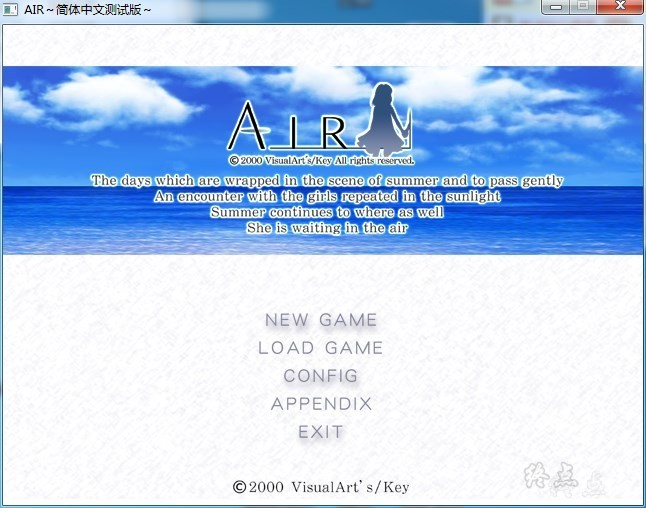
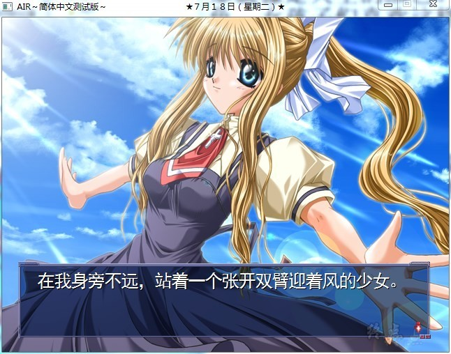
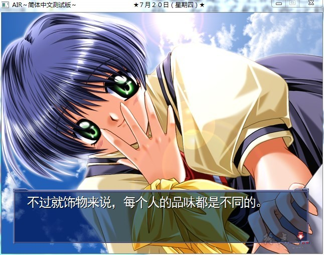
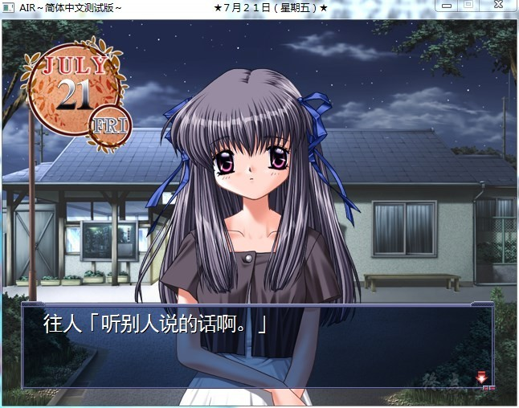

# **剧情简介**

夏天，在靠近海边小小的街道上，一位青年从公共汽车站下车了 ，青年一直在旅行中，这样的小镇他无心久留，在赚足了路费后，他会去那些更繁华的地方，他的旅伴是母亲留给他的小小的人偶，他不用手接触，人偶就能动起来，从母亲那里继承了这种魔法。
靠着表演人偶维生，他的旅途才一直能继续着，青年给孩子们表演着人偶戏，然而，简陋的人偶无法吸引孩子们，没有得到报酬的他，无力地站在夏天的烈日下，迷迷糊糊地睡着了……

就在这条海边的街上，青年和命运中的少女相遇了……

那就像是天空的颜色。透明而执着地蔚蓝着。对爱来说，没有什么数不清的颜色。
女孩子们喜欢这样幸福地微笑。她们用自己的方式信仰着天空。
佳乃，观铃……

诅咒。命运。爱。旅人。交织在一起，于是变成一根寄托着希望的白色羽毛。
于是就这样不由自主地留下了眼泪，为爱，为幸福，为她们和他们的一切努力。
每个人都应该看一看。AIR，属于所有有梦想的人的，青空。

## **Key社 三大催泪弹 之一**

**请使用[IDM](https://www.123pan.com/s/jJprVv-3tMsH)进行下载，使用最新版[winrar](https://www.123pan.com/s/jJprVv-dtMsH)进行解压（非常重要）。**

**解压密码为终点（简体汉字）。**

**添加10%恢复记录，防止网盘抽风损坏。**

