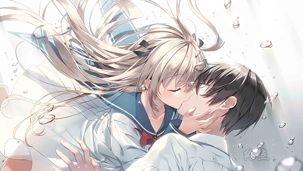

# **游戏简介**

**在不远的未来，海平面原因不明地急速上升,导致了地表多数都沉入海中。**

**小时候因为事故而失去一条腿的少年・斑鸠夏生，厌倦了都市的生活，移居到了海边的乡村小镇。**

**曾经身为海洋地质学家的祖母留给他的、就只有船、潜水艇还有债务。**

**夏生为了取回“失去的未来”，与迷之讨债人凯瑟琳一起，潜海前往据说保存着祖母遗产的海底仓库。**

**在那里，他遇到了一位沉睡在如同棺材一般装置中不可思议的少女――亚托莉。**

**她是一位构造精密到与人类别无二致，而又丰富感情的机器人。**

**从海底被打捞起来的亚托莉如是说道。**

**「我想完成主人留给我的最后的命令。　在此之前，我会成为夏生先生的腿！」在一个逐渐沉入海中的平和小镇，少年和机器人少女的难忘夏日就这么开始了——**

**Steam官方中文版，有能力请支持正版补票**

**[Steam地址](https://store.steampowered.com/app/1230140/ATRI_My_Dear_Moments/)**

**游戏为终点论坛自购，转载请注明出处**

**FrontWing×枕联合制作的新作，全年龄作品，自带中文**

**2020-7-3更新官方ver1.2版本，修正错字等问题**

**2021-12-16更新1.3版本**

**请使用[IDM](https://www.123pan.com/s/jJprVv-3tMsH)进行下载，使用最新版[winrar](https://www.123pan.com/s/jJprVv-dtMsH)进行解压（非常重要）。**

**解压密码为终点（简体汉字）。**

**添加10%恢复记录，防止网盘抽风损坏。**

