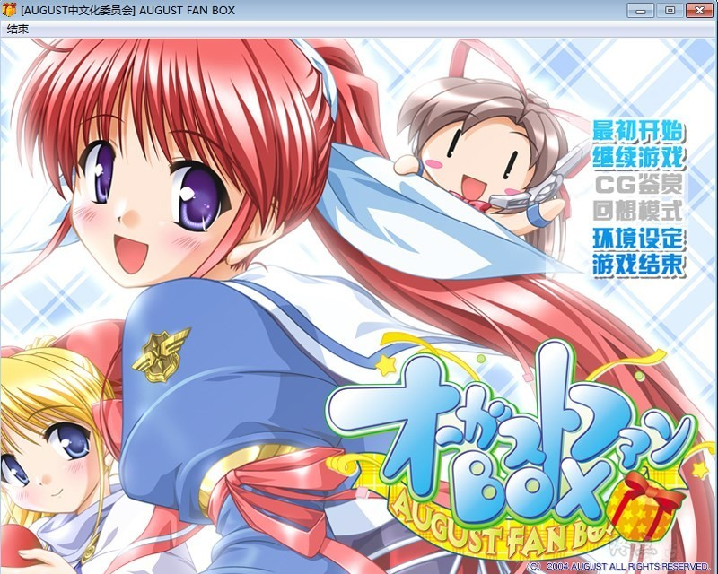
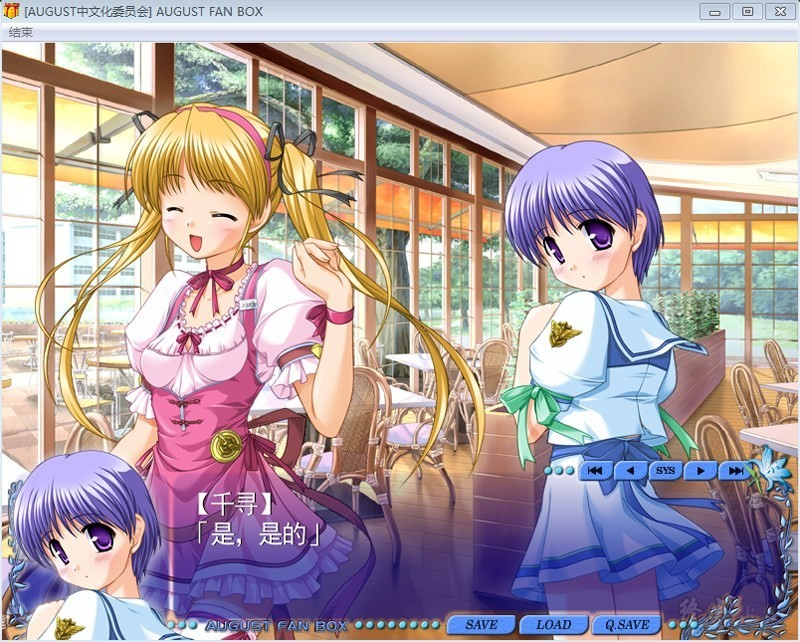
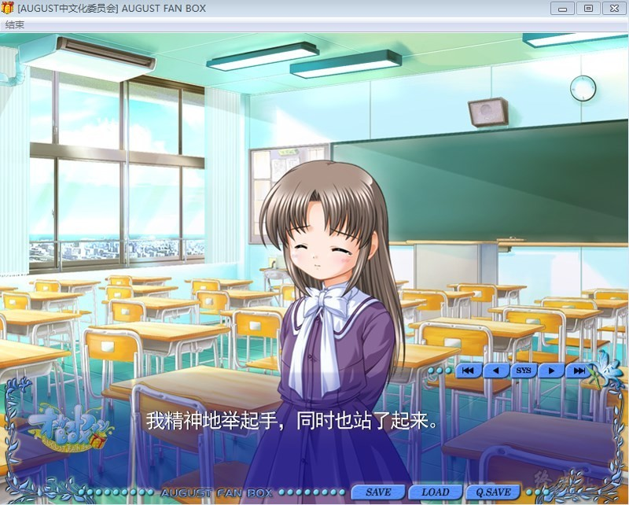
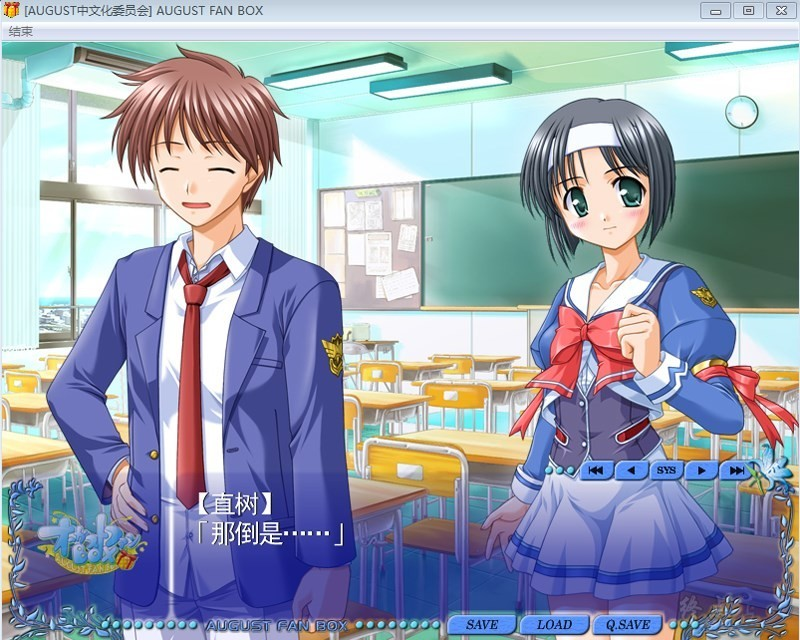

# **游戏简介**

august在04年发售的集合其当时所有作品的fandisk，是个集合了バイナリィ?ポット、Princess Holiday（公主假日）、月は東に日は西に（东月西阳）这三款作品中全部角色的乱斗性质作品。

同时也收录了女主角们的后日谈、篇外篇故事等。以及东月西阳里不可攻略的班长秋山文緒的新故事。

同时附带了一些小品游戏。收录了三部作品的详细资料（全部角色介绍等）还有壁纸、屏保、系统音。

同捆特典中赠送了设定资料集和图片手稿。还有历代作品的原声BGM。

# **内容介绍**

1：《Princess Holiday》中，以莉蒂茜亚，希露菲为主角展开的番外篇故事。——《悠然宁静的王国午后》

2：《夜月东升 暮日西沉》中，女主角天崎美琴的AfterStory。——《涉垣家的宴酣之时》

3：《夜月东升 暮日西沉》中，第二女主角藤枝保奈美的AfterStory。——《点絮樱飞三月暮》

4：《夜月东升 暮日西沉》中，次要角色秋山文绪的专线特别故事。——《穿上弓道服的她》

5：《夜月东升 暮日西沉》中，以涉垣茉理为主角，其余主要女性角色全登场的喧闹十足、激动人心的特别故事。——《黑暗中的奔跑者》

6：《Ｂｉｎａｒｙ ｐｏｔ》的后日谈。主要叙述Ｗｏｒｌｄ崩坏后的数月，主人公和从前的伙伴们因一个机会再次欢聚一堂的故事。——《魂牵梦萦的街角》

7：《夜月东升 暮日西沉》中的主要女性角色，结＆恭子组合，因为时空转移装置操作失误，飞往《Princess Holiday～回转苹果亭的一千零一夜～》的故事舞台——森夫尼亚王国的穿越故事。——《远在天边的国度》

8：《夜月东升 暮日西沉》中的主要女性角色，涉垣茉理的服务型番外短篇。——《大哥、哥哥大人、哥哥》

9：《夜月东升 暮日西沉》中的带有特别服务性质的一个追加故事。最近，莲华寮流传着某个不轨男子于深夜在这里游荡的奇怪情报……——《黑色瞳孔的入侵者》

10：《Princess Holiday》的主要女性角色，蕾洁露的特别故事。在如今苹果亭已经完全被莉蒂主导的情况下，实力超群、经验丰富的她又该如何行动呢……——《苹果亭的变化》

11：《夜月东升 暮日西沉》的主要女性角色，茉理＆千寻为大家回答玩家寄来的提问的专栏故事。——《你问我答莲美台学园》

12：以AUGUST历代作品问答游戏为线索展开的一个三作作品中角色互相穿越的奇幻故事。——《热爱眼前的这些不合理吧》

13：包含了AUGUST全系列人物、背景CG，制作捏他等内容的作品介绍。——《AUGUST历代作品编年史》

14：以《Princess Holiday》中女主角莉蒂茜亚的穿越为线索展开的麻将游戏。——《PrincessPONday》。

15：《Binary pot》体验版。

16：《Princess Holiday》体验版。

17：《夜月东升 暮日西沉》体验版。

18：AUGUST全系列人物系统音+壁纸+屏保

19：AUGUST特别纪念版音乐。

AUGUST中文化委员会的作品
[汉化原帖](http://bbs.seikuu.com/thread-112670-1-1.html)

**请使用[IDM](https://www.123pan.com/s/jJprVv-3tMsH)进行下载，使用最新版[winrar](https://www.123pan.com/s/jJprVv-dtMsH)进行解压（非常重要）。**

**解压密码为终点（简体汉字）。**

**添加10%恢复记录，防止网盘抽风损坏。**

