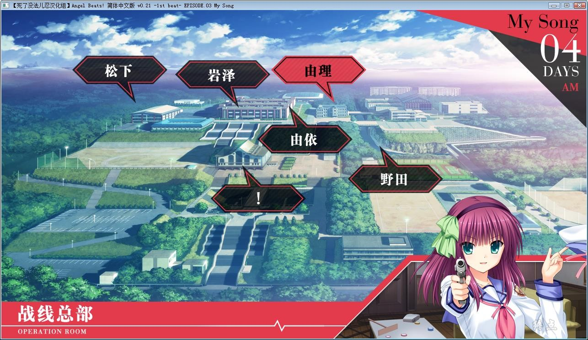
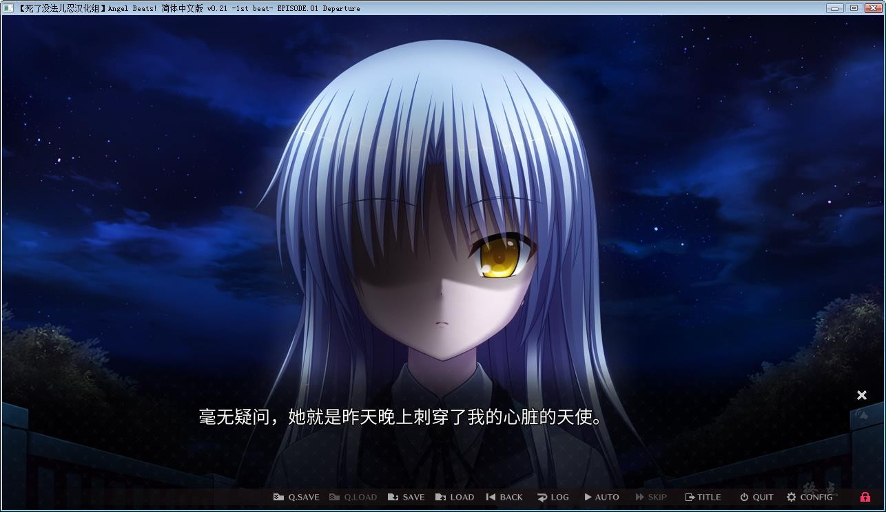

# **游戏简介**

（来自2DFan）

舞台为死后的世界。向命运反抗的少年少女们的物语——  因某个理由迎来了死亡的少年·音無、他于死后世界的学校里邂逅了名为“ゆり”的少女。 她是与强加给人们荒唐不经的人生的神抗争的“死后世界战线”的领袖、并且每日每夜都在进行着激烈的战斗。  而阻挡在她们面前的是、一名被称为神的使者“天使”的可爱少女。  失去了生前的记忆、对在这个死后的世界发生的事情一无所知的音無感到困惑无比。

**死了没法儿忍汉化组 汉化作品
详情请看 [汉化发布帖](https://t.bilibili.com/479724636962281305?tab=2) [正式发布帖](https://t.bilibili.com/484257519683465805?tab=2)**

**请使用[IDM](https://www.123pan.com/s/jJprVv-3tMsH)进行下载，使用最新版[winrar](https://www.123pan.com/s/jJprVv-dtMsH)进行解压（非常重要）。**

**解压密码为终点（简体汉字）。**

**添加10%恢复记录，防止网盘抽风损坏。**

