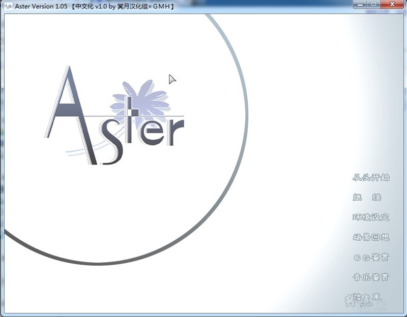
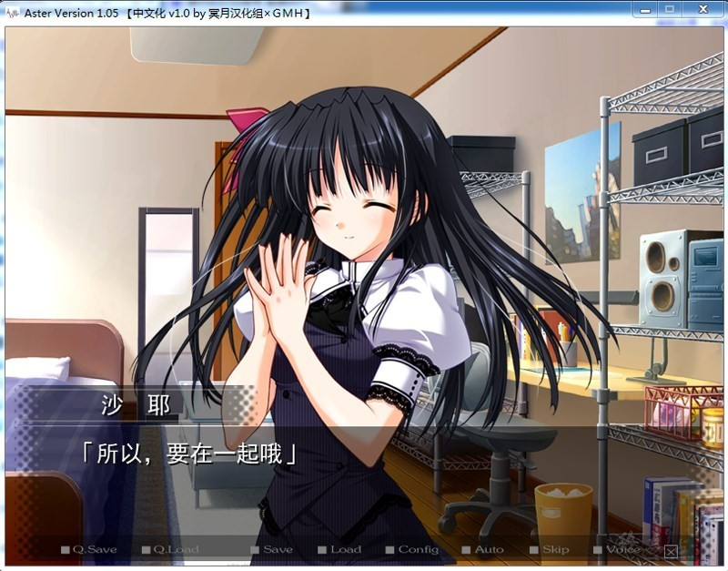
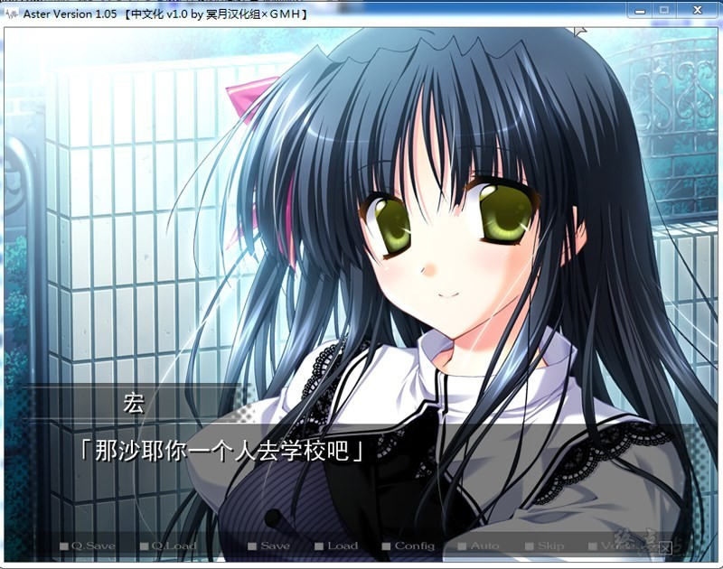
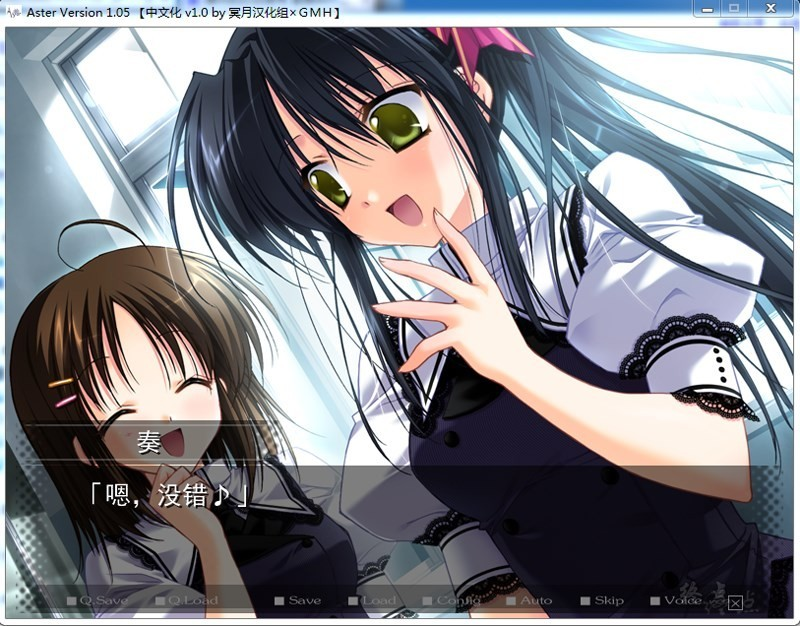

# **游戏简介**

**以青梅竹马的少年少女为主轴所描写的，温柔而伤感的戏剧性小说！**

**RusK最新作，以青梅竹马的少年少女为主轴，描绘了细微的心理变化，透着淡淡忧伤的恋爱故事。**

**将旧作「カラフルBOX」「君と恋して结ばれて」的舞台中的街道作为舞台，编写了这两部作品4年后的世界里的崭新故事。因为成长了的过去的女主角们也和本篇有很大的关联，使玩过，「カラフルBOX」「君と恋して结ばれて」的玩家也能更多的得到"乐趣"！**

**而且这次的同捆特典是「カラフルBOX」「君と恋して结ばれて」普通版!使不知道旧作的玩家，也毫无疑问地能够更加的投入到「Aster」的世界中去！**

# **故事介绍**

**位于晴坂市北部的北稜学园附属校。**

**这个故事，就是以北棱学园付属校的3个少年少女为中心所展开。**

**主人公・榊宏、青梅竹马柚月沙希还有其孪生姐姐沙耶。从他们第一次来到北棱，已经到了第二个夏天了。期末考试也结束了，漫长的假期临近了。夏日开始了，3人的感情交织着，关系向着青梅竹马之上在一步步发展着。不久，这段感情和关系又暂时划上了句号。**

**夏去秋来，在即将到达冬季的一天。那应该已经平定下来的思念，却因为一件意外而发生了改变。从这里，故事开始了。**
**本故事即是描绘宏、沙希、沙耶这3人感情发展的故事。虽没有奇迹。但是仍有希望存在。**

**请使用[IDM](https://www.123pan.com/s/jJprVv-3tMsH)进行下载，使用最新版[winrar](https://www.123pan.com/s/jJprVv-dtMsH)进行解压（非常重要）。**

**解压密码为终点（简体汉字）。**

**添加10%恢复记录，防止网盘抽风损坏。**

