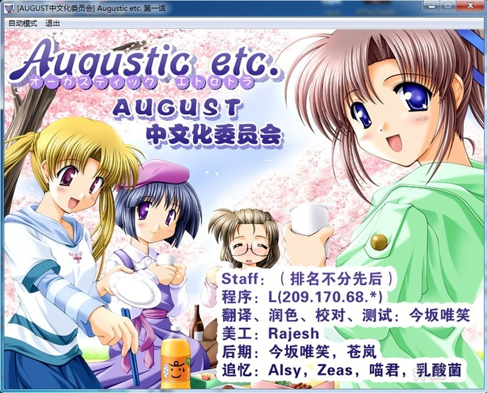
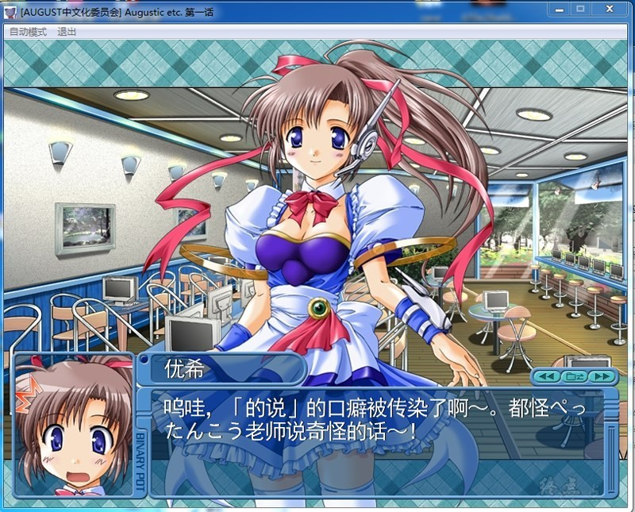
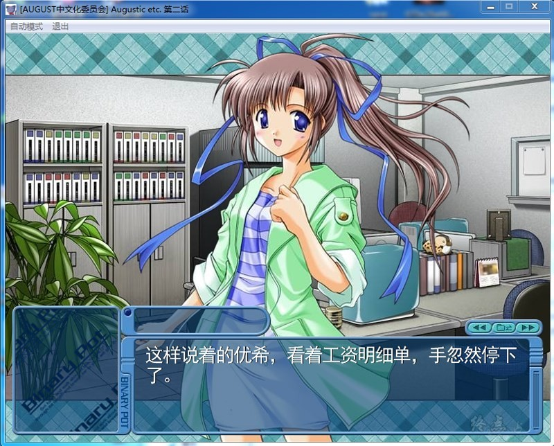
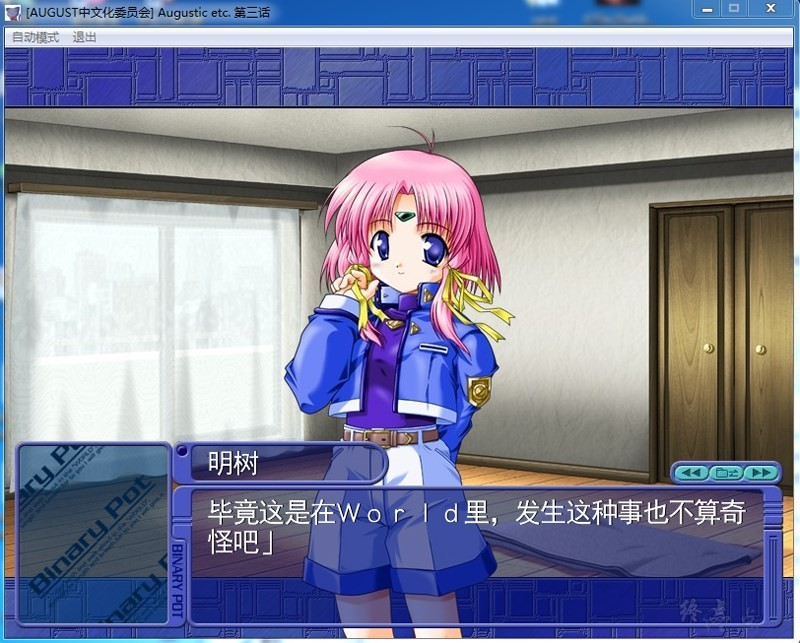

『Augustic.etc.』是日本PC游戏公司AUGUST在日本美少女游戏杂志《TECH GIAN》上，于2002年9月至2003年1月同捆发售的Fandisk向美少女游戏。日文名为：《オーガスティックエトセトラ》，正式汉化译名为：《Augustic.etc.》

　　本作为AUGUST公司在处女作《Binary•pot》升级档发布时开始以连载的形式，和《TECH GIAN》同捆发售，贯穿第二作《Princess Holiday～回转苹果亭的一千零一夜～》（公主假日）的发售前后，在连载了6个月（共6期）后完结。全篇包含了AUGUST前两作ZC现的人物，未出现的人物，以及特约嘉宾等，以后日谈，番外篇，访问谈，问答游戏等多样的形式展开，合计25个小故事，对《Binary•pot》及《公主假日》的剧情进行了补充和完善，同时也增进了玩家和游戏的互动。

　　本作中同时同捆了《Princess Holiday～回转苹果亭的一千零一夜～》的广播剧以及音声特典。

　　作为一个纯Fandisk向的作品，本作对于没有玩过AUGUST前两作的玩家来说，会有许多无法理解的地方，但对于Fans群体来说，却是包含了大量在本篇中得不到的故事和隐藏信息。非常值得一玩。

AUGUST中文化委员会的作品
[汉化原帖](http://bbs.seikuu.com/thread-129391-1-1.html)

**请使用[IDM](https://www.123pan.com/s/jJprVv-3tMsH)进行下载，使用最新版[winrar](https://www.123pan.com/s/jJprVv-dtMsH)进行解压（非常重要）。**

**解压密码为终点（简体汉字）。**

**添加10%恢复记录，防止网盘抽风损坏。**

