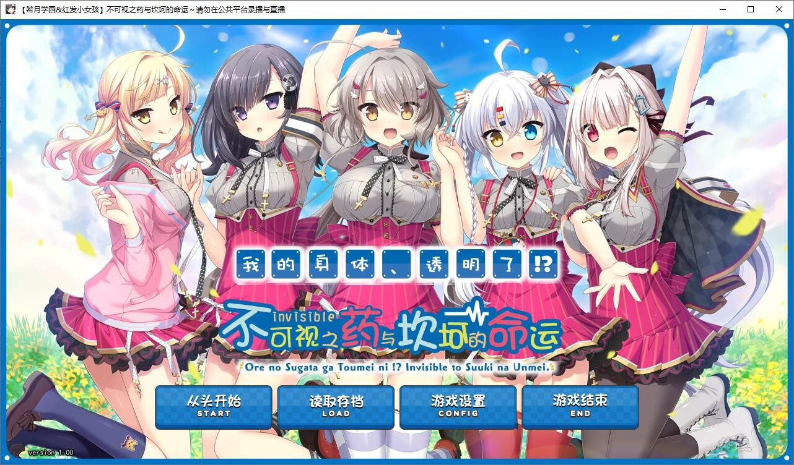
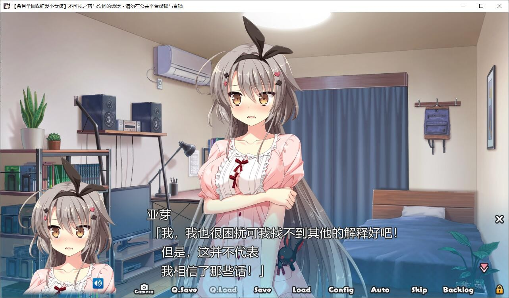
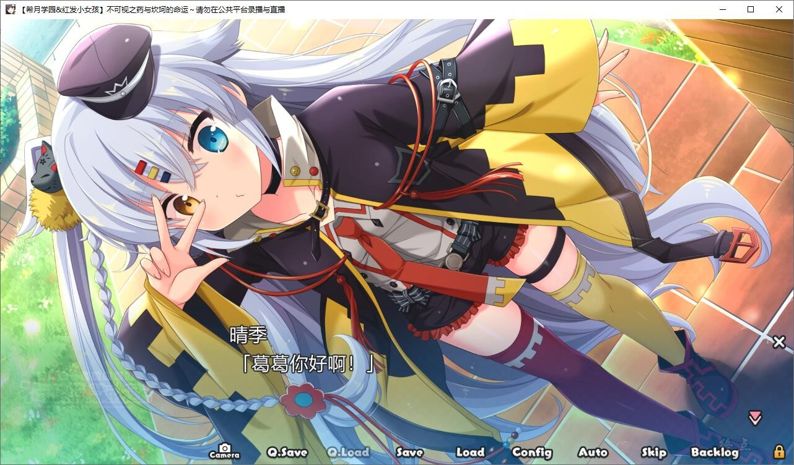
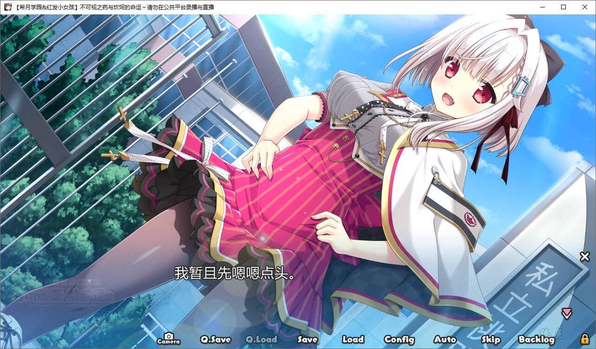
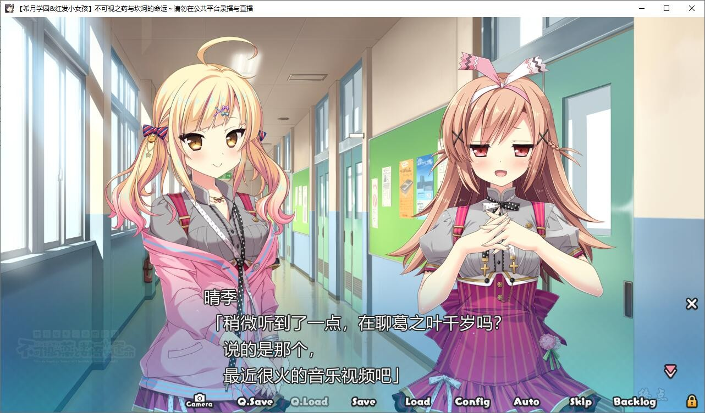
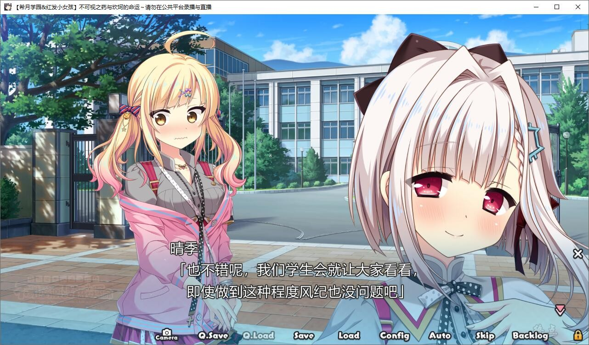
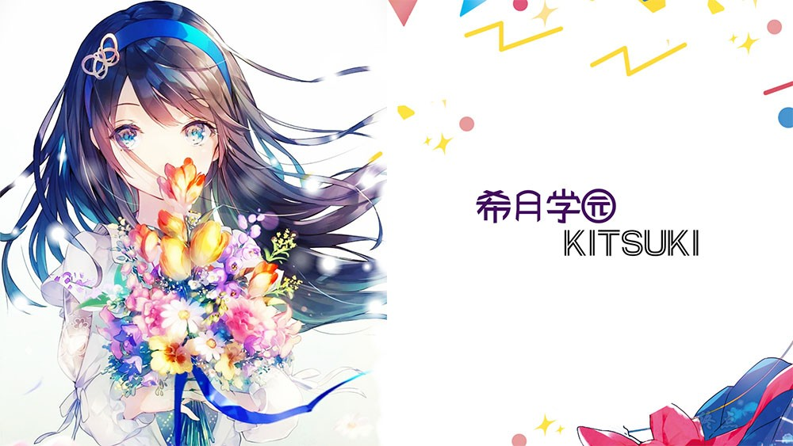
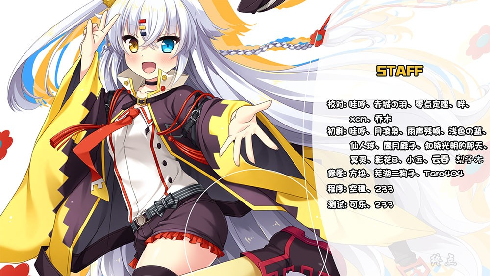

# 故事介绍

“严守用法用量，正确地成为透明人吧！”

主人公・待雪晴季目前正在看着虚拟网络偶像的视频，

然而节目气氛一转，不知怎的就成了面向观众的抽奖活动，

而奖品则是——

“奖品是能实现一~切愿望的特殊权利哦！”

晴季姑且还是报了个名，而结果却竟然中选！

而偶像本人也发来了信息。

“现在就去你那哦，请多关照♪”

不一会儿门铃便响了起来，而门外的正是网络虚拟偶像・葛之叶千岁，

她旋即将一份谜之药物递到了晴季手上。

“那、那个、这是……？”

“说白了！就是喝了会变成透明人的药哦！

Yeah！”

“稍后让我听听感想哦~！”千岁说罢留下一副灿烂的笑容便转身离去。

而晴季抱着怀疑的心情服用了药物后，居然真的在镜中看不见自己了！

于是乎，晴季便立刻决定闯入最近总是对自己表现冷淡的堂妹・亚芽正在洗澡的浴室。

当他尽情地观赏着那副可口诱人的躯体之时——

“喜欢、哥哥（兄さん）”

晴季不意间听到了这个告白而冲动之下触碰了亚芽的身体的瞬间！

自己的身体居然显形了！

虽然马上就陷入了对方的怒骂中，然而此时就已经和打情骂俏没什么区别了~

而晴季随后也和亚芽一同确认起透明药的使用方法……

■效果：身体透明化

■用量：1天1剂

■注意：如果接触到人体的话效果就会解除
每天都在寻找着有趣事物的晴季为此十分高兴，这不正是有趣且刺激的事情么。

而亚芽则在一旁极力劝说他要好好做人。
这便是这样一个不时会惹恼堂妹以及学园里的人却又快乐无比的青春灵异喜剧物语（！？）

（介绍来自2dfan）

希月学院&红发小女孩，汉化组的汉化作品，详情请看汉化原帖

[汉化原帖](https://www.bilibili.com/read/cv13947422)

**2021-11-11 更新汉化修正，解决了跳出问题**

**2021-11-12 更新汉化修复版v1.1，建议下载最新版,获得更好的体验**

**请使用[IDM](https://www.123pan.com/s/jJprVv-3tMsH)进行下载，使用最新版[winrar](https://www.123pan.com/s/jJprVv-dtMsH)进行解压（非常重要）。**

**解压密码为终点（简体汉字）。**

**添加10%恢复记录，防止网盘抽风损坏。**

