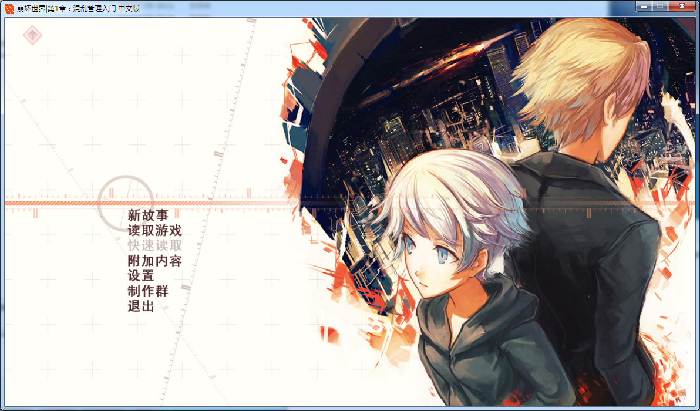
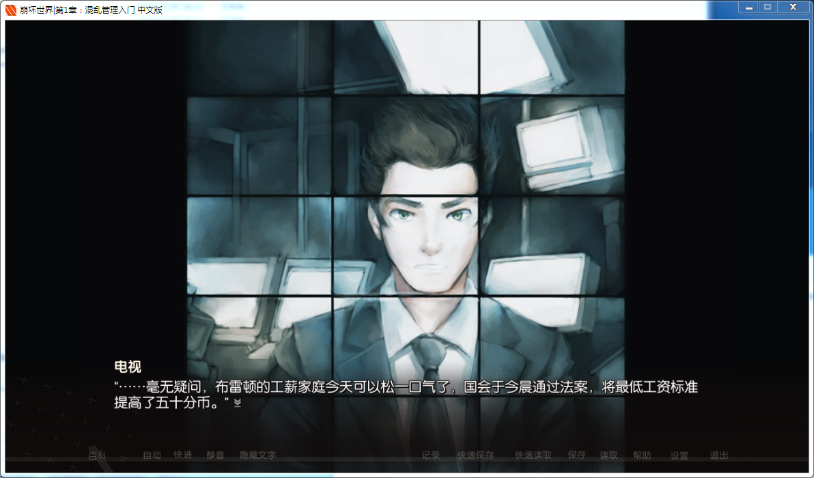
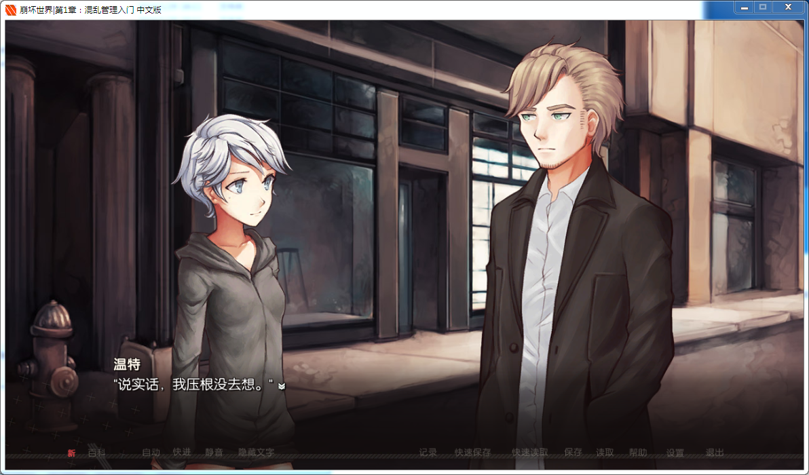
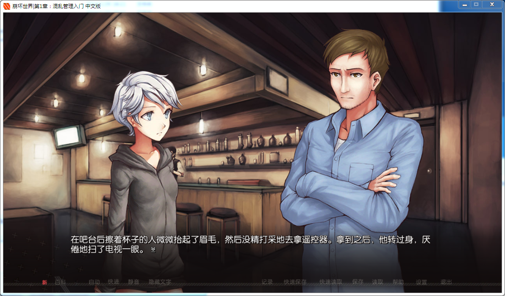

# **游戏简介**

**由Dischan制作的一款日式风格的文字冒险类游戏。**

**游戏的故事发生在一个乌托邦的世界中，有着一所名为“Mediātōrum”的学校，由独立的“协调人”组成，他们能够解决“其他世界”的混乱情况。**

**玩家扮演的是14岁仍在实训阶段的学生妹Winter Harrison，她对“其他世界”难以把握**，**也漠不关心，却一不小心卷入到了协调人的漩涡中。**

**本款游戏内容为第一章，我们将跟随主角一起学习如何管理“混乱”，女主角的第二次任务（本章重点内容）也将展开。**

**请使用[IDM](https://www.123pan.com/s/jJprVv-3tMsH)进行下载，使用最新版[winrar](https://www.123pan.com/s/jJprVv-dtMsH)进行解压（非常重要）。**
**解压密码为终点（简体汉字）。**
**添加10%恢复记录，防止网盘抽风损坏。**