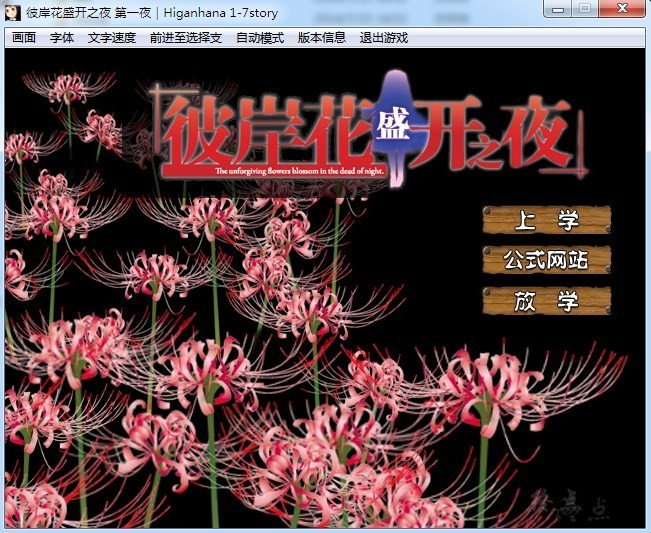
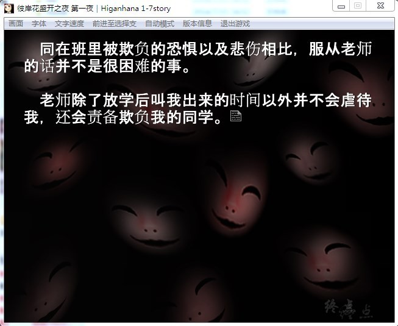
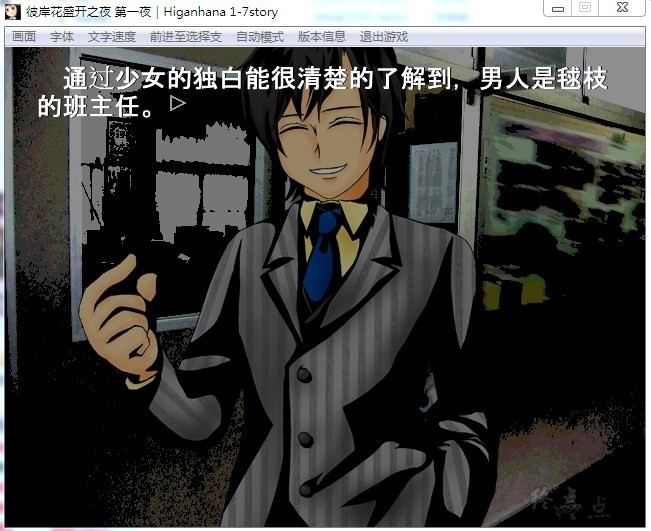
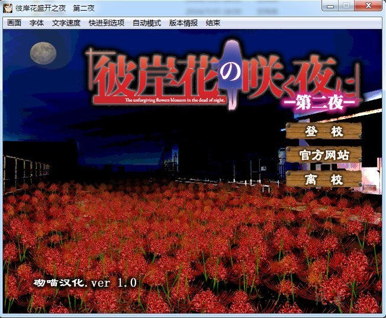
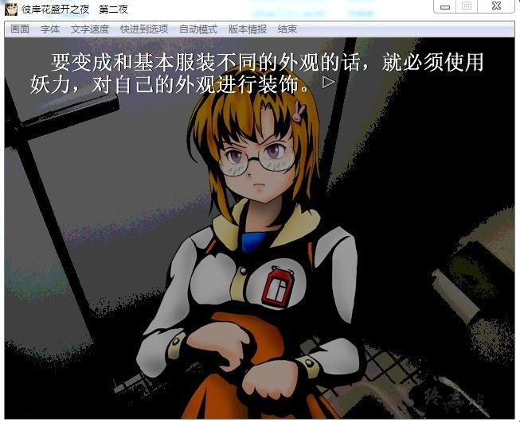

# 游戏简介

在学校中经常可以听到一种叫做“校园七大不可思议”的怪谈现象，而在『彼岸花盛开之夜』之中，除了会出现传说中定番的七大不可思议之外，龙骑士07额外给予了校园的第八种不可思议现象下了定义，如果七大不可思议的现象都是由妖魔鬼怪所引起的话，那么这第八种不可思议的怪现象就是流传于孩子们口中的「牢骚先生」……

以校园“八大”不思议为主题，展现给读者一个个残酷的物语。

龙骑士07于2011年4月1日愚人节当天在其制作日记中宣布，《彼岸花盛开之夜》将作为《海猫鸣泣之时》的下部正统新作(短篇的形式)。并于C80公布第一夜的作品。

美丽又残酷的校园第八怪谈────

遭受同学霸凌及老师凌辱的森谷毬枝向校园七大不可思议中的「保健室半夜起舞的彼岸花」人偶娃娃，祈求它杀害所有欺负她的人。

在旧校舍的厕所被老师欺凌的毬枝，
其哭泣声被偶然来旧校舍厕所的学生听到，逐渐演变成第八个校园传说……

此时彼岸花出现在她面前，毬枝下定决心要成为第八个校园传说中的妖怪，

却在如愿前被老师杀害，老师利用第八个校园传说，引发学生恐慌，

便自诩为厕所中的妖怪，意外地与死去的毬枝竞争校园第八不可思议的位子…

**请使用[IDM](https://www.123pan.com/s/jJprVv-3tMsH)进行下载，使用最新版[winrar](https://www.123pan.com/s/jJprVv-dtMsH)进行解压（非常重要）。**

**解压密码为终点（简体汉字）。**

**添加10%恢复记录，防止网盘抽风损坏。**

