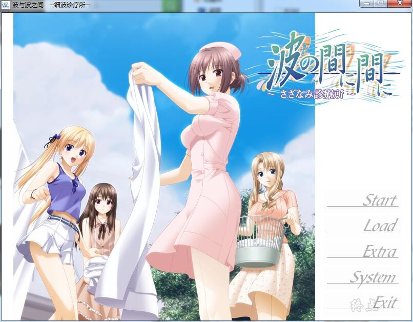
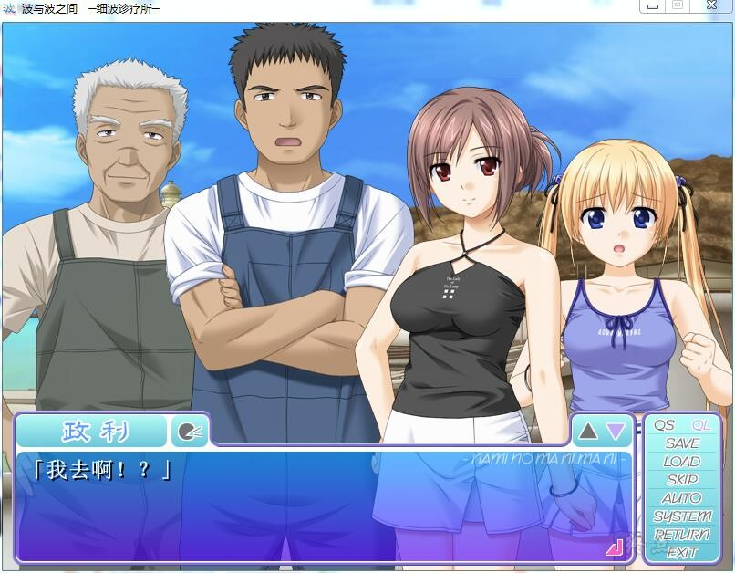
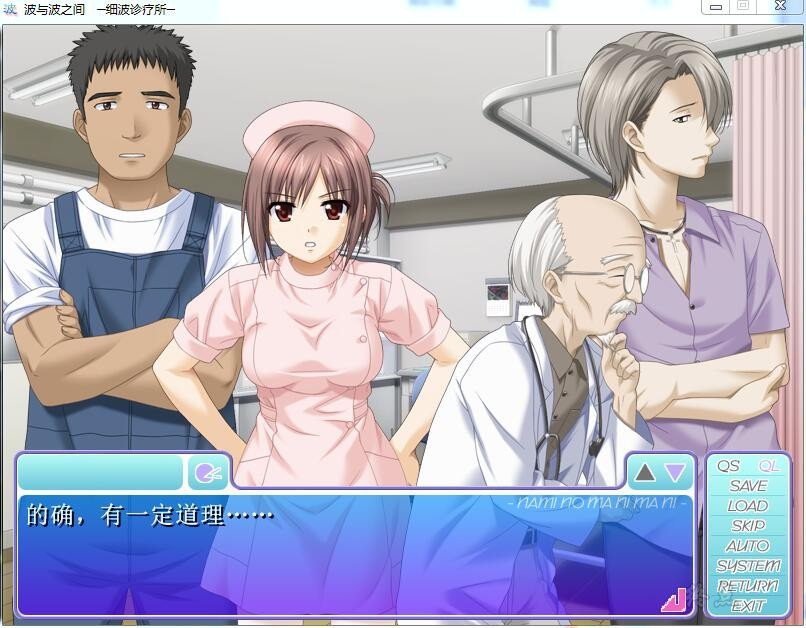
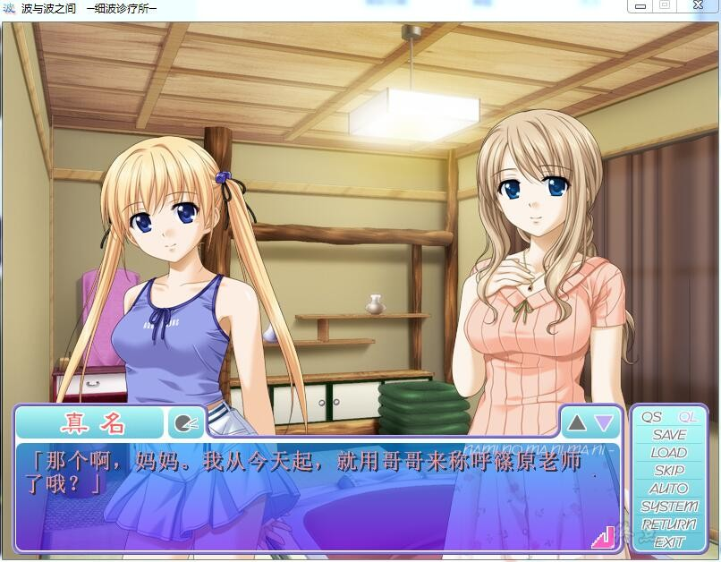
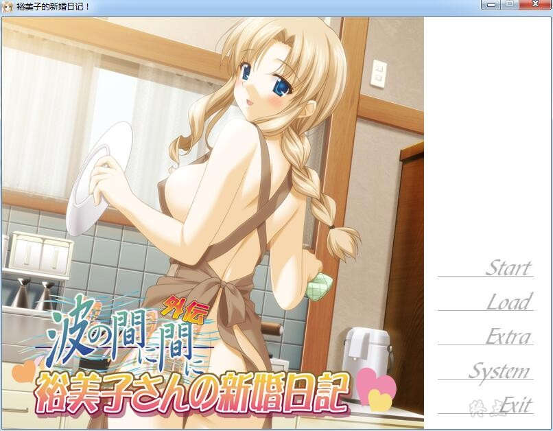
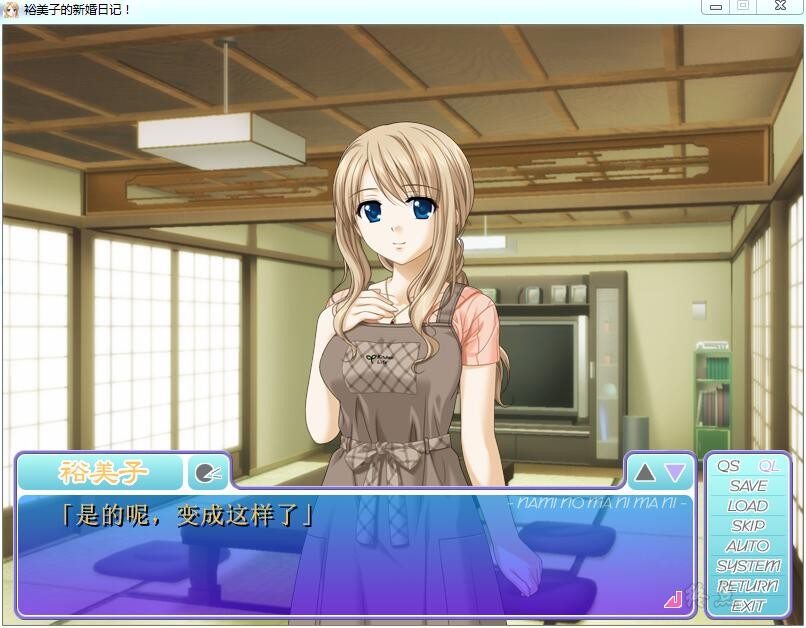
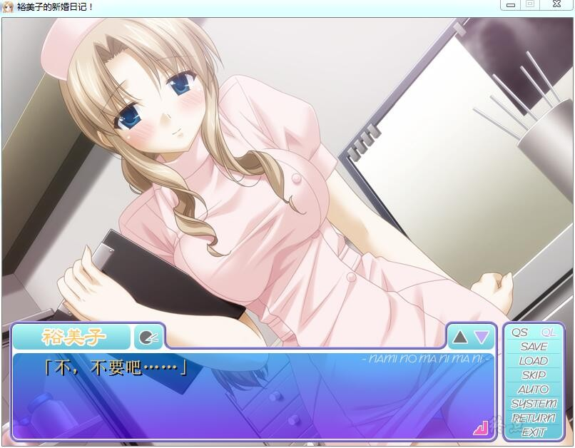

# 故事简介：

9月下旬、是大陆上开始吹起秋风的时间。

然而南方的孤岛「神来島」，依旧一片盛夏景象。

在这样的一个时间内，十年后岛上的诊疗所终于会来一个医师的消息，让岛上居民议论纷纷。

然而出现的新医师「篠原修太郎」……

却是个废材兼软骨头的、自称「我只不过是个退学生」的男人。

寄居在向井医师那里的他的女儿、寡妇「裕美子」，是个贤良和善的美人……刚好是修太郎理想中的女性！向井的女儿「真名」也很亲近他，与岛上的渔夫「政利」还有邮递员「隼人」关系也好起来，诊疗所的工作也变得顺利。

但是，只要一与岛上诊疗所的护士、严厉正经的「清瀬理恵」见面，两人总是会马上吵架。

在这样的某一天，试炼来拜访修太郎了。

向井医师说要将诊疗所的诊病交给修太郎，而自己则要出去海外研修一个月左右。

岛民也抱着不安，然而虚张声势的修太郎断言「没问题！」。

从那以后日子开始变得忙乱。

除了平和以外什么都没有的这个神来島的和暖生活。

在这里，修太郎向一位女性表达了自己的心意。

身负着岛上唯一的医师的责任……尽管不怎么行，但他仍会努力去做好。

里想奈骑士团汉化作品，选项没有汉化，
应该是纯爱吧，详情看下面的汉化原帖

[汉化原帖](http://tieba.baidu.com/p/4884543500)

**请使用[IDM](https://www.123pan.com/s/jJprVv-3tMsH)进行下载，使用最新版[winrar](https://www.123pan.com/s/jJprVv-dtMsH)进行解压（非常重要）。**

**解压密码为终点（简体汉字）。**

**添加10%恢复记录，防止网盘抽风损坏。**

