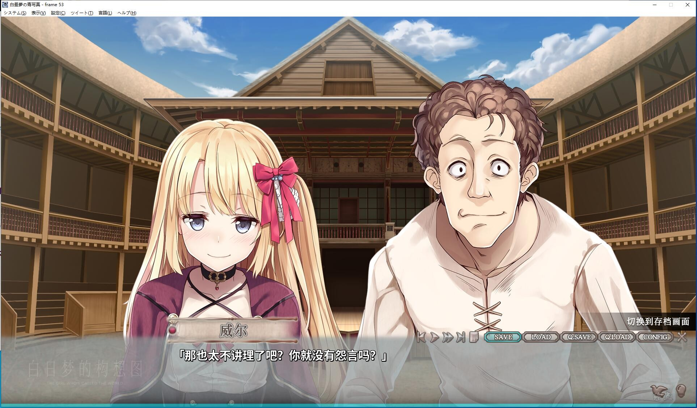

## Steam版为全年龄

## 官中移植版，官方文本移植到日版本体

# **游戏简介**

海斗醒来时，发现自己失去了记忆。

他不知道自己身处于何处，甚至连自己是谁都想不起来。

白色的房间里，唯一的家具就是两张床。

除了海斗之外，房间里还有一位机器般毫无感情的少女——世凪。

海斗被告知，自己的梦正被记录下来，这份纪录能拯救世凪。

而这一切，都是失去记忆前的自己安排好的。

他决定与世凪一同潜入梦的世界。

当三个梦皆迎来悲伤的结局之际，海斗也将重拾过去的记忆。

[STEAM地址](https://store.steampowered.com/app/1607200/_/)

steam版本为终点论坛自购

如有能力，还请支持正版，感谢花葬的馈赠

**游戏为全年龄，阉割版本，目测没补丁**
**2022-2-16更新 steam版本更新**

\---------------------------------------------------------------------------------
**2022-2-13日，更新官中移植版，官方文本移植到日版本体**

[**发布地址**](https://bbs.9shenmi.com/read.php?tid=932190&sf=5b3)
[**项目地址**](https://github.com/Dir-A/Hakuchuumu_CN_Patch)

全年龄追加的那些，还原版目测没有

**2022-2-13更新beta1.1补丁**

**2022-2-14更新beta1.3补丁**

**请使用[IDM](https://www.123pan.com/s/jJprVv-3tMsH)进行下载，使用最新版[winrar](https://www.123pan.com/s/jJprVv-dtMsH)进行解压（非常重要）。**

**解压密码为终点（简体汉字）。**

**添加10%恢复记录，防止网盘抽风损坏。**

