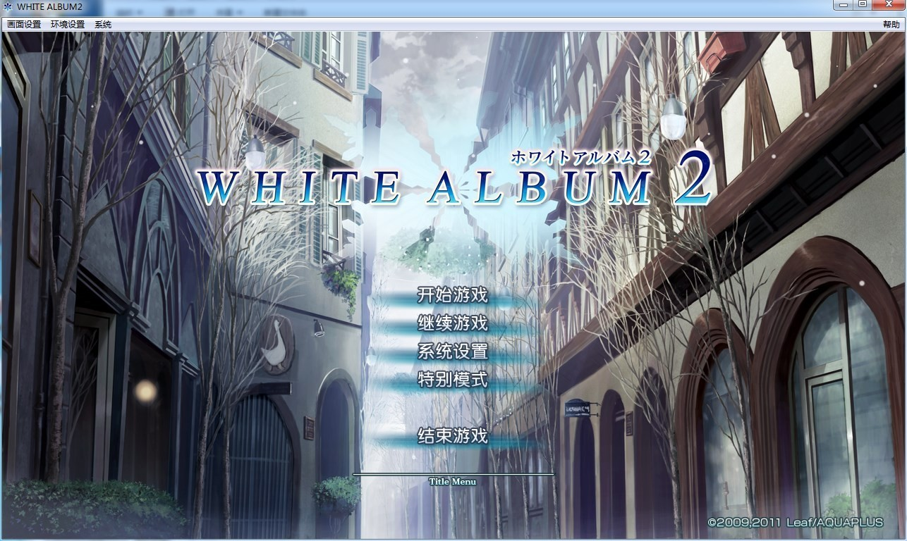
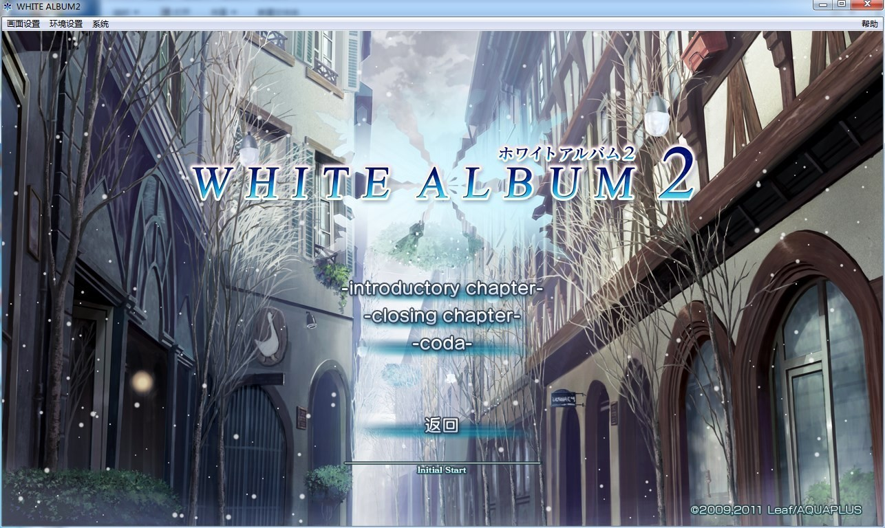
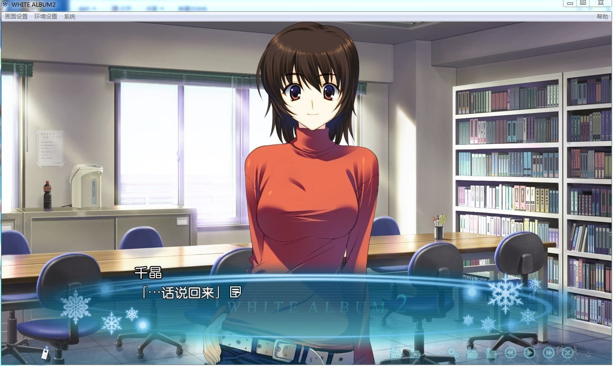
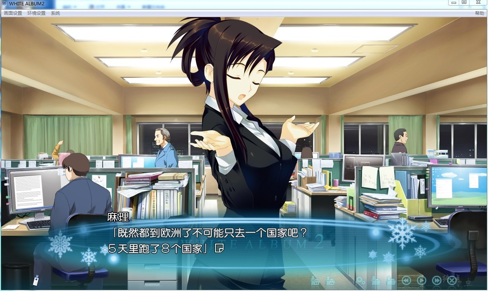
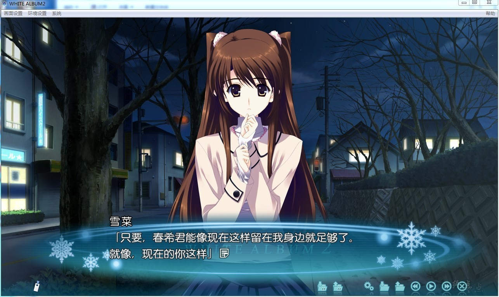
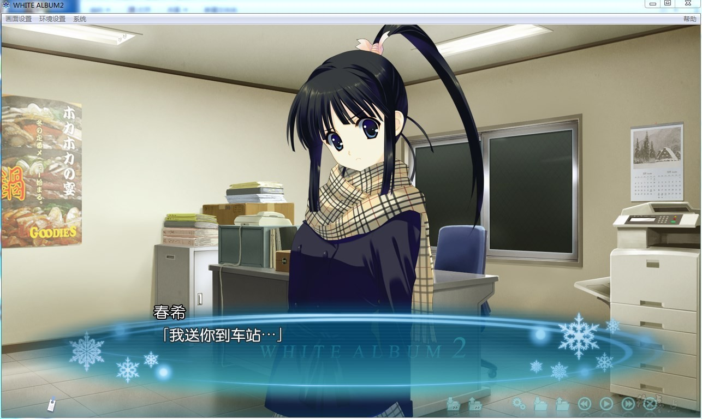
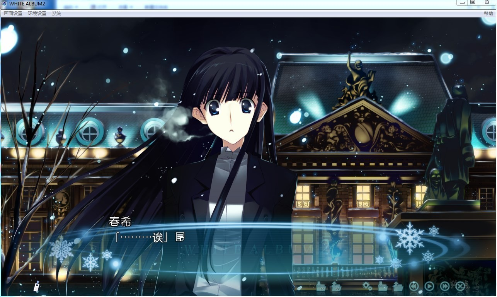

# 游戏简介

## 序章

寒冷的风中，传来一阵歌声——

黄昏中，那歌声就像在唱和音乐室里我弹奏的吉他。

也像在唱和隔壁教室里那不知是谁在弹奏的钢琴。

来自屋顶的歌声，犹如清脆的铃音般清澈高亢，

它让我们原本凌乱的三种旋律紧紧联系到了一起。

一切的开始都在这个晚秋。

彼时彼刻，是谁恋上了谁？

无论是谁都付出了全心全意。

无论是谁都在以坚强意志向前。

无论是谁都一心一意地，很纯粹地、坦诚地——

想要在内心深处结合，获得无可替代的瞬间。

所以在那时，谁爱上了谁。

是一步也不能迟疑的恋爱。

而后的冬天——从天而降的积雪，掩盖了所有的罪。

不久的春天——所有的惩罚，都与积雪的融化一同降临。

## 终章

在寒风中颤抖之时、听到了歌声——

在傍晚的校园里，在无人在的食堂里，在孤寂的校舍窗边。

三年前被冰封的那首歌曲。

被热情突然迫动，点缀着纯粹的思念，欺瞒的歌曲逐渐溶化在夜里。

那时，三人一起的冬天已经远去，

一个人和另一个人的季节却在循环往复。
后续，就在这样的晚秋。

那个时候似要撕裂的羁绊的丑陋伤痕尚未干却，

但是伴随着有什么将要改变的预感中，开始了。

寂寞的两首旋律，互相吸引而再伤害彼此，
因此，新的旋律被召集来了。

不久，新的冬天即将到来。

不能和那个人在一起、而另一个人也已不在的冬天。

“白色相簿”什么的，已经无所谓了。

因为已经不再有歌，值得去唱了。

传达不了的恋情，已经不需要了。

因为已经不再有人，值得去爱了。

**2020-12-9  资源被封，重新压制（度盘）**

**2022-6-26 更新语音字幕补丁，[转载地址](https://github.com/nxs7/WA2-CHS-Subtitle-Patch)**

**2023-3-21 更新语音字幕补丁0.3版本**

**请使用[IDM](https://www.123pan.com/s/jJprVv-3tMsH)进行下载，使用最新版[winrar](https://www.123pan.com/s/jJprVv-dtMsH)进行解压（非常重要）。**

**解压密码为终点（简体汉字）。**

**添加10%恢复记录，防止网盘抽风损坏。**

