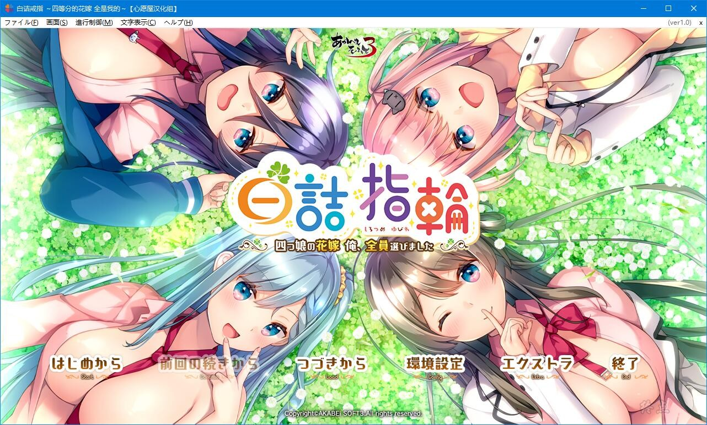
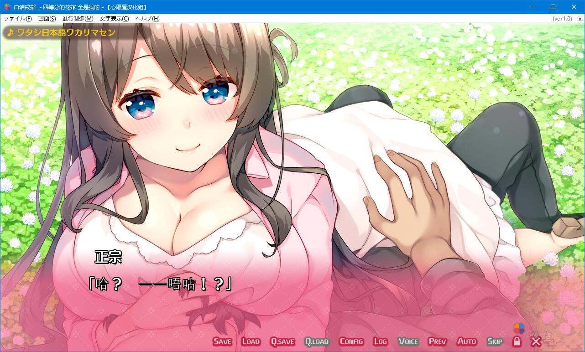
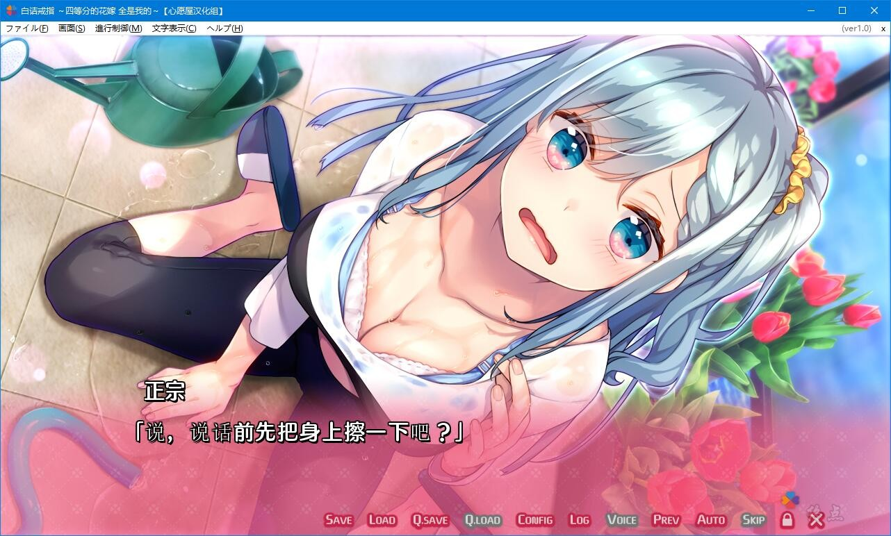
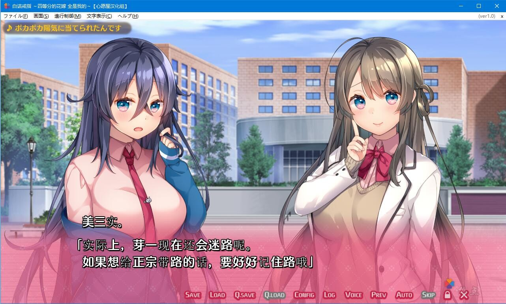

# 故事介绍：

主人公·正宗一个人生活的时候很多。

由于父母经常出差不在家，他相当向往家族团聚在一起的生活方式。

这样的他，小时候有过一次，因为父母出差把他寄宿到亲戚家的情况。

在那里，他跟未来会成为自己人生伴侣的四个女孩相遇了。

喜欢撒娇且善于照顾人的长女·芽一。

善于关心人却容易害羞的次女·二葉。

喜欢玩游戏，类似损友的三女·美三実。

天真烂漫且喜欢运动，充满活力的四女·四花。

对于平时总是一个人生活的正宗而言，那是宝贵的2年时光。

时光匆匆，升至2年级生的春天。

由于父母海外出差，再次跟四个女孩住在一起。

连『家人』再会的高兴都未感受到的刹那间，主人公就被变为『女性』的她们迫近而来。

「哈啊~哈啊~。不好意思，妹妹们给你添麻烦了呢。要是可以就让我来负责到底吧！」

「喂！等等！？到底什么意思啊！？」

小时候被主人公迷得神魂颠倒的女主角们，全员都对他抱有好感，而且是时隔十年的再会的状态。

这样的五个人住在一个屋檐下，又会发生怎样的故事呢……。

（介绍来自2dfan）

**心愿屋汉化组的汉化作品**

2021-2-2  更新V2汉化版本

**请使用[IDM](https://www.123pan.com/s/jJprVv-3tMsH)进行下载，使用最新版[winrar](https://www.123pan.com/s/jJprVv-dtMsH)进行解压（非常重要）。**

**解压密码为终点（简体汉字）。**

**添加10%恢复记录，防止网盘抽风损坏。**

