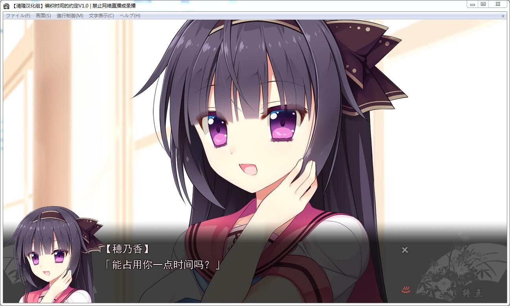

# **游戏简介**

同心爱之人度光阴。

人很难独自一人活下去。每个人都需要着谁、相互扶持着彼此。

但、实际上永远在一起又是多么的难。

无法在需要之人左右的痛楚。创造自己的安身之所的艰难。

本作就是以孕育这种“羁绊”的珍贵与艰难之处为主题的纯爱物语。

与可爱女主角们度过的欢乐日常、在重视可以安然轻松地欣赏作品的风格下、将打动人心的情感剧致于您。

邂逅之季已过的5月。

時坂颯人与女儿·みりあ来到了乡下的温泉街。

在这里两人为寻求可以住宿工作的地方而到访温泉旅馆“草壁庵”。

颯人能使用一个魔法。

但却绝不是便利之物——

那就宛如是证明了颯人的时间是无价值一般。

工作是唯一能让自己的时间产生价值的方法。

所以颯人很喜欢工作。

不久他便开始了边在“草壁庵”工作、边去上学的生活。

在学校里的崭新邂逅。

草壁庵之中貌美如花的若女将·美咲。

于学园之中却是印象不一致的少女。

与这样的美咲的共同生活。

从迟迟而来的邂逅里萌生出了新的羁绊——

清隆汉化组的汉化作品，注意汉化会被杀毒拦截

详情请看下面的汉化原帖

[汉化原帖](http://tieba.baidu.com/p/4998391609)

**请使用[IDM](https://www.123pan.com/s/jJprVv-3tMsH)进行下载，使用最新版[winrar](https://www.123pan.com/s/jJprVv-dtMsH)进行解压（非常重要）。**
**解压密码为终点（简体汉字）。**
**添加10%恢复记录，防止网盘抽风损坏。**