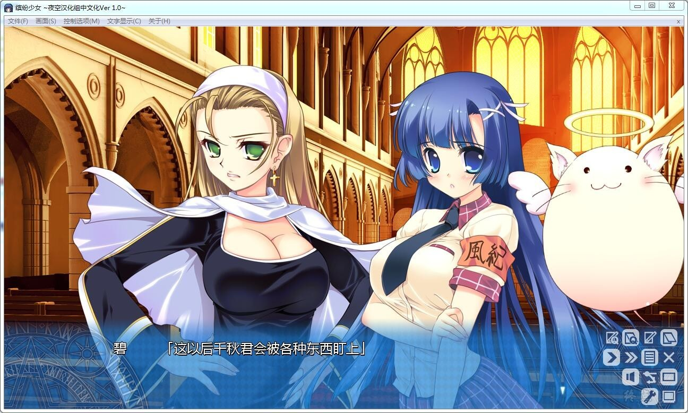

# 故事简介

用爱和魔法保护亲爱的你！

暗地里威胁着人类的生活的存在——恶魔，
以及驱除这些恶魔的存在——魔法少女，总是在历史的背面不断进行着战斗。

然而她们在使用魔法的过程中会不断积累污秽，背负着总有一天会成为恶魔的宿命。

到了现代——

就读于聖月光学園的千秋紅葉（ちあき くれは），因为与桜宮碧（さくらみや あおい）的相遇，而觉醒为能够通过接触而解除魔法少女的污秽的圣人。

被紅葉相救而保住了性命的、校园偶像的黑发美少女 桜宮碧。

为了保护青梅竹马紅葉、与魔剑订下契约的 一ノ瀬花夏（いちのせ はなつ）。

为了与紅葉见面、而从过去时空跳跃而来的神秘人造人 アルスマキナ。

为了要让紅葉净化而来的、金发吸血鬼 ヴァーミリオンヴェーラライホネン。

觉醒为圣人的紅葉，背负上了不断被恶魔或其他存在所注视的命运。

然而因为4个魔法少女的活跃，他也成了连恶魔也无法轻易左右的存在。

被性格完全不同的全部魔法少女们喜欢并展开热烈攻势的紅葉。

『蒼穹のデュランダル』『紅蓮のレーヴァンティン』『白銀の人造人間』『黄金の吸血鬼』

对于拥有五光十色的魅力的魔法少女们的未来，紅葉能否继续挽救下去呢？

夜空汉化组的作品

[汉化原帖](https://bbs.sumisora.net/read.php?tid=11065922)（权限）

**请使用[IDM](https://www.123pan.com/s/jJprVv-3tMsH)进行下载，使用最新版[winrar](https://www.123pan.com/s/jJprVv-dtMsH)进行解压（非常重要）。**

**解压密码为终点（简体汉字）。**

**添加10%恢复记录，防止网盘抽风损坏。**

