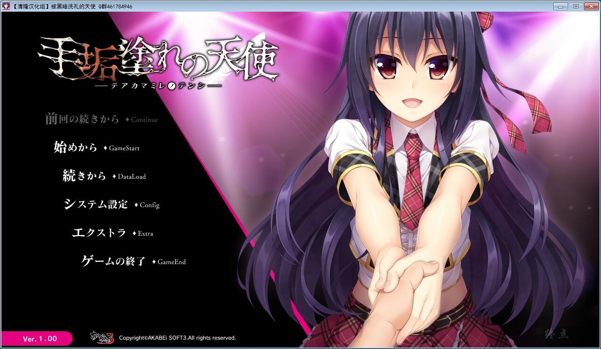
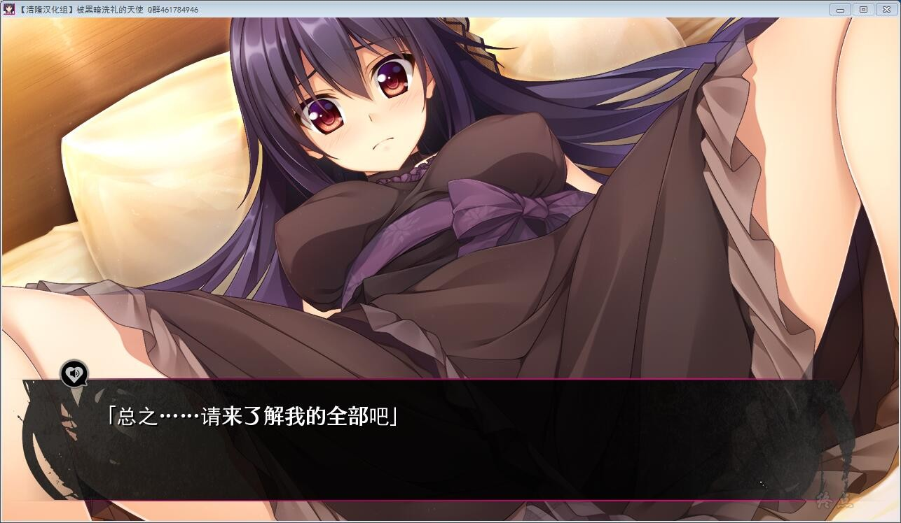
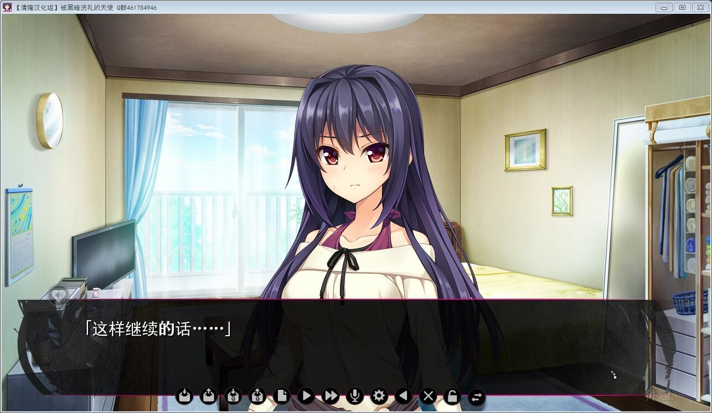
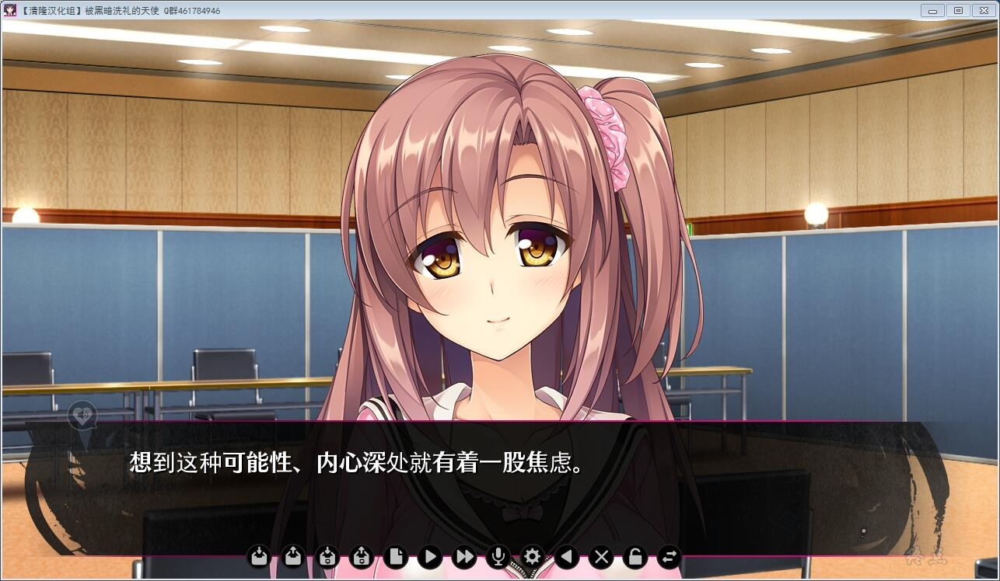
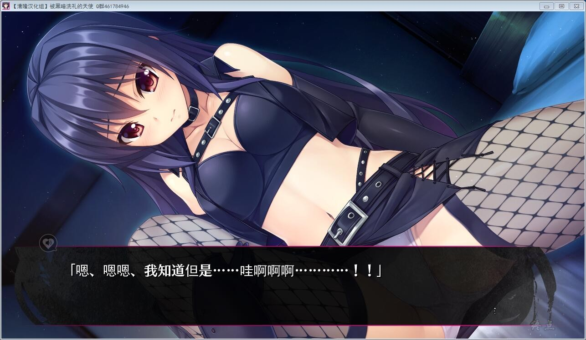
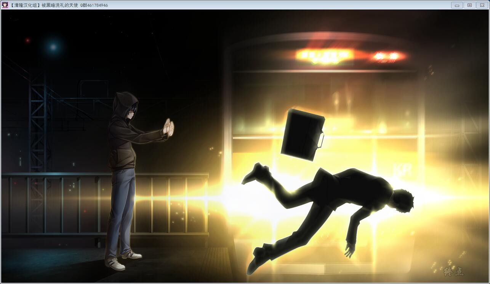

# 故事简介：

站在舞台上沐浴聚光灯而闪闪发光的偶像——

以新人偶像出道，如月嶺衣奈实现了儿时的梦想，成为了向往已久的偶像。

不过，她目前的现状，依然处在被到处使唤，做着不起眼的工作，距离她梦想中舞台的道路依然遥远。

自以为和同一事务所的当红偶像并无差距，对此深表不满的嶺衣奈，直接找到了事务所的制作人，和他进行谈判。

制作人看着毫不掩饰愤怒与焦躁的嶺衣奈，没有兴致的只给出一句回复：
“给你个机会，后面就看你自己了。”

被赶出来的嶺衣奈对制作人的这句话感到莫名其妙。

在还没想明白的状态下被带到了自己想都不敢想的高级酒店里的豪华餐厅之中。

在那里等候着的，是一个某知名企业的男高管。换上了靓丽的晚礼服，承受着饿狼般的视线。

为了登上光辉的舞台，现在必须要做些什么。

于是，她抱着献出自身的决心，走上了“偶像”的道路。

清隆汉化组的作品

[汉化原帖](http://bbs.seikuu.com/thread-155966-1-1.html)

**请使用[IDM](https://www.123pan.com/s/jJprVv-3tMsH)进行下载，使用最新版[winrar](https://www.123pan.com/s/jJprVv-dtMsH)进行解压（非常重要）。**

**解压密码为终点（简体汉字）。**

**添加10%恢复记录，防止网盘抽风损坏。**

