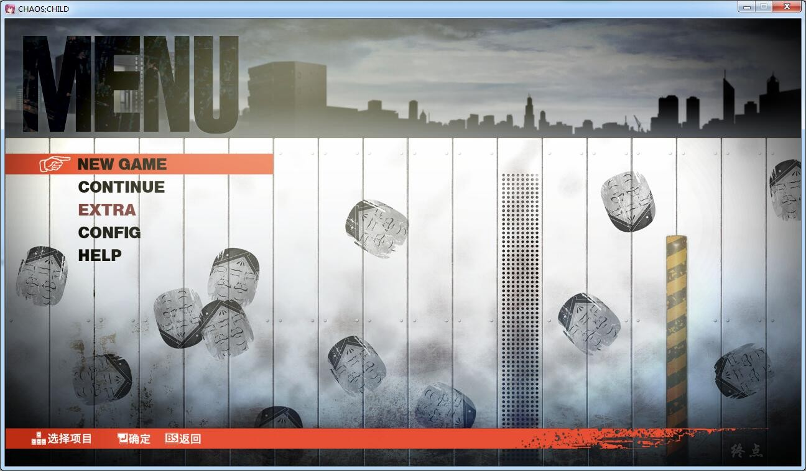
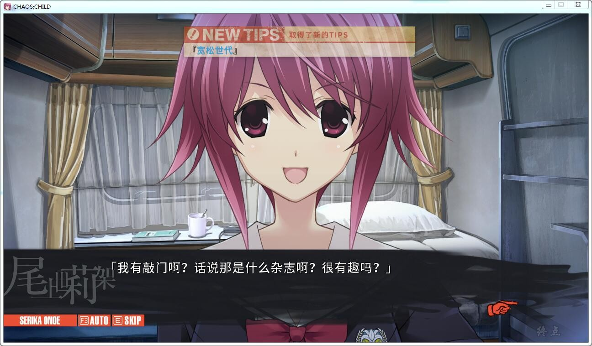
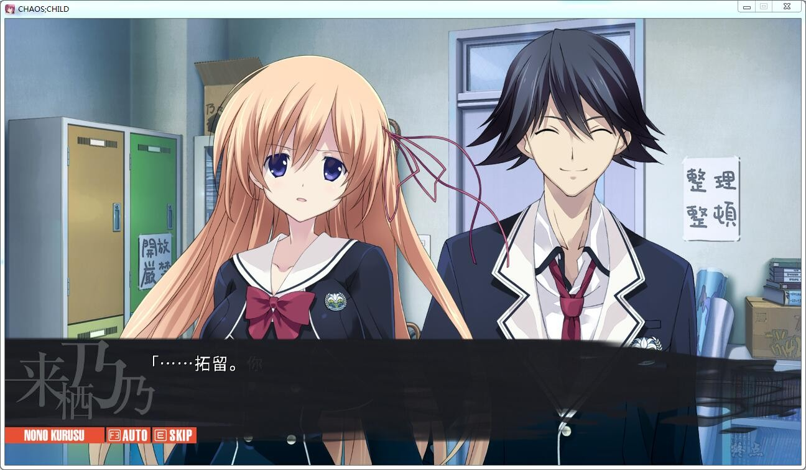
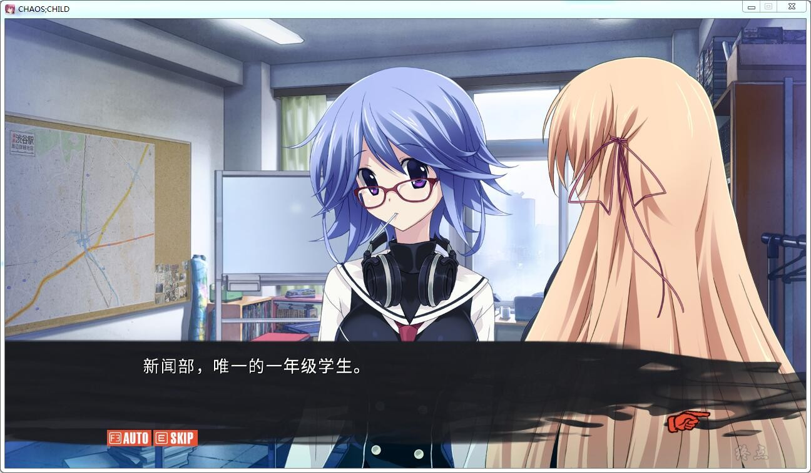
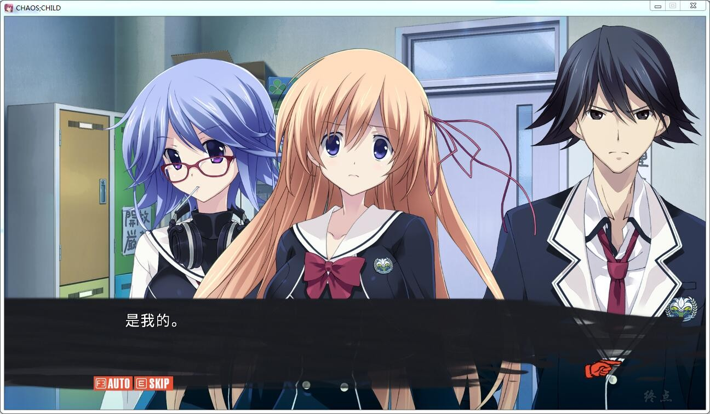

搬运自终点论坛，发表于2018-10-12 04:42

因为汉化组不让制作汉化硬盘，所以各位补丁+日文硬盘食用吧

启动要注意，Launcher_ch.exe，只有1080P视频汉化了

补丁安装时间比较长，请耐心等待，不要无响应就给关了

科学社的作品
[汉化原帖](http://tieba.baidu.com/p/4957962904)

[日文硬盘](https://bbs.zdfx.net/thread-9837-1-1.html)
[汉化补丁](http://tieba.baidu.com/p/4983552973)(2.5版本）

**请使用[IDM](https://www.123pan.com/s/jJprVv-3tMsH)进行下载，使用最新版[winrar](https://www.123pan.com/s/jJprVv-dtMsH)进行解压（非常重要）。**

**解压密码为终点（简体汉字）。**

**添加10%恢复记录，防止网盘抽风损坏。**

