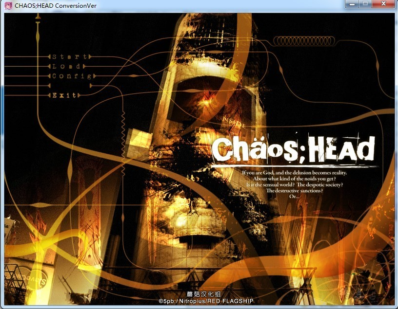
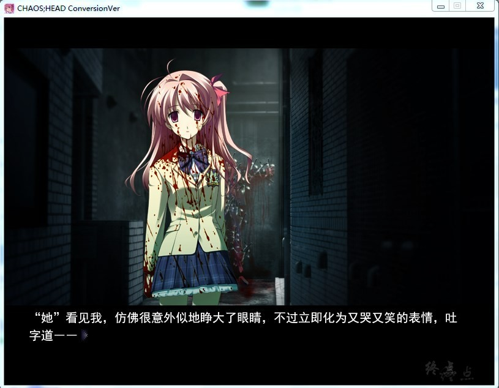
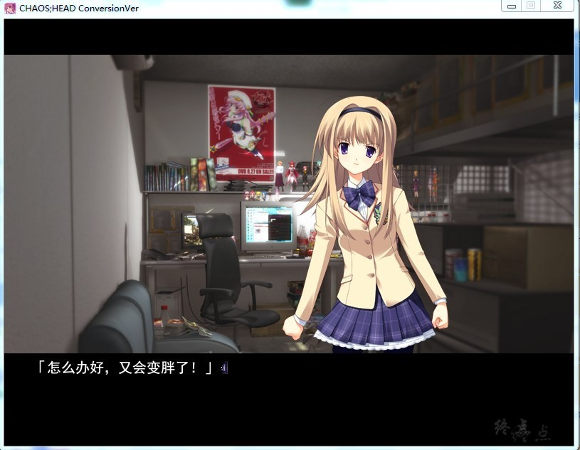
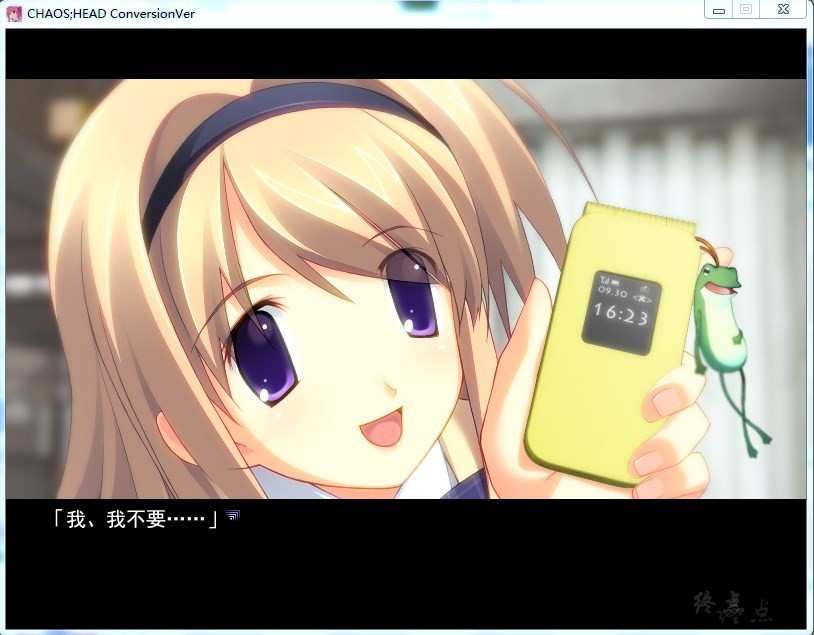
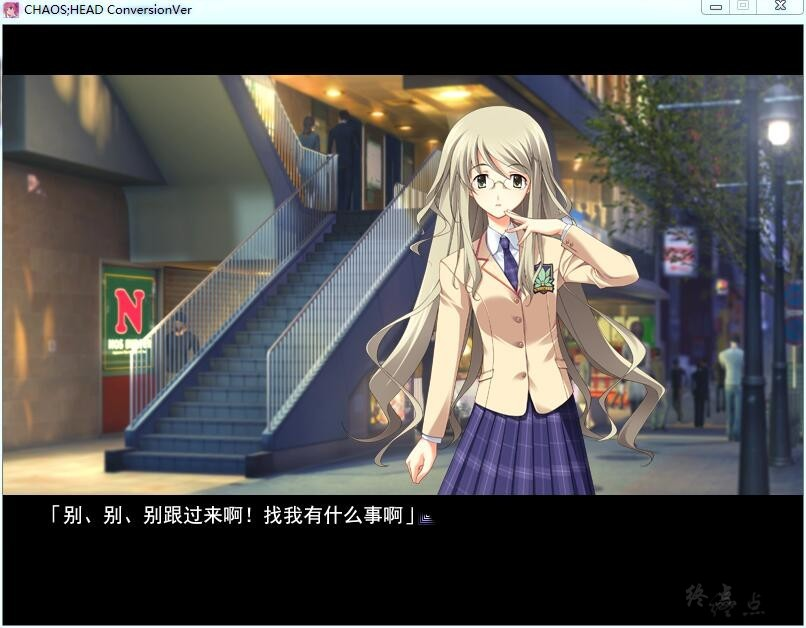
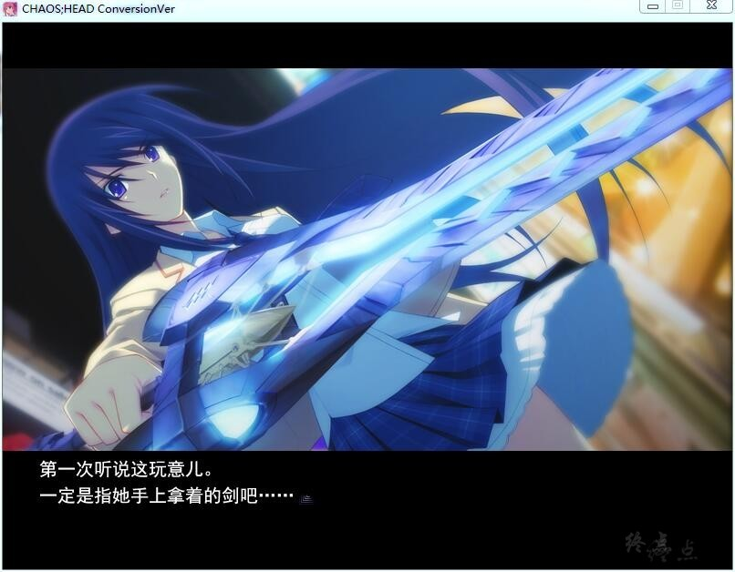
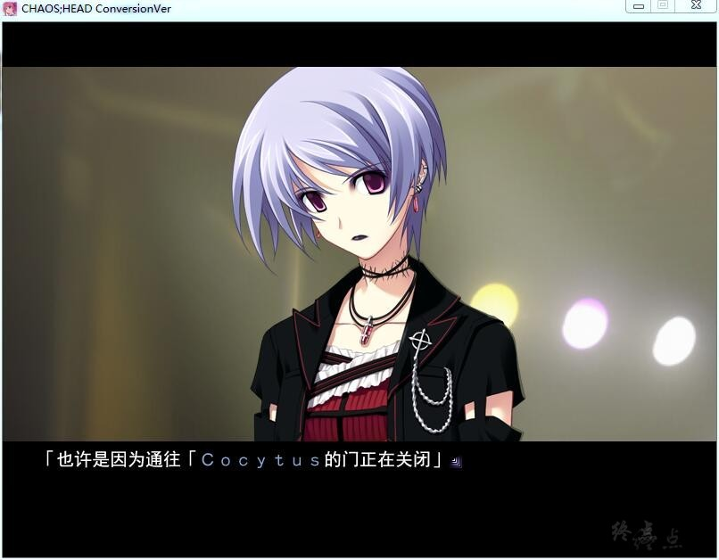
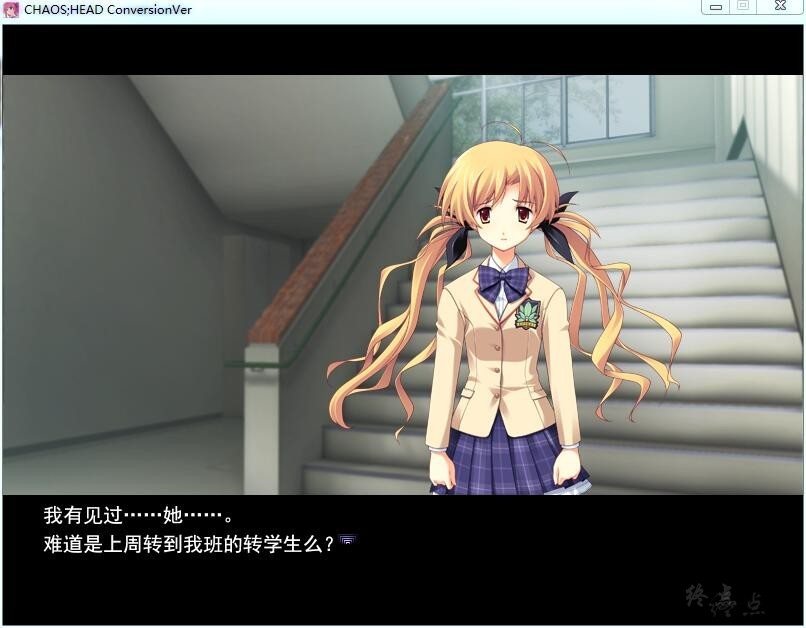

# 游戏剧情

声称“对三次元没有兴趣”， 住在名为“基地”（Base）的集装箱房子里，过着被大量的美少女人形环绕的生活，距离家里蹲只有一步之遥的高二学生，这就是作品的男主角——西条拓巳。

在他居住的涩谷地区发生了名为“新生一代的疯狂（通称：New Gene）”的连续猎奇杀人事件，在网络和电视中连日成为热门话题。某日，拓巳同平时一样在网上聊天时，遇到了一位自称“将军”的人。他给出的超链接所指向的图片，竟然仿佛预言了下一次的“New Gene”事件。翌日，拓巳目睹了凄惨的事件现场，而且受害者正是按照预言之中的方法被杀。

拓巳的安稳日子中渐渐出现了猎奇事件的阴影。

蘑菇汉化组的作品

**请使用[IDM](https://www.123pan.com/s/jJprVv-3tMsH)进行下载，使用最新版[winrar](https://www.123pan.com/s/jJprVv-dtMsH)进行解压（非常重要）。**

**解压密码为终点（简体汉字）。**

**添加10%恢复记录，防止网盘抽风损坏。**

