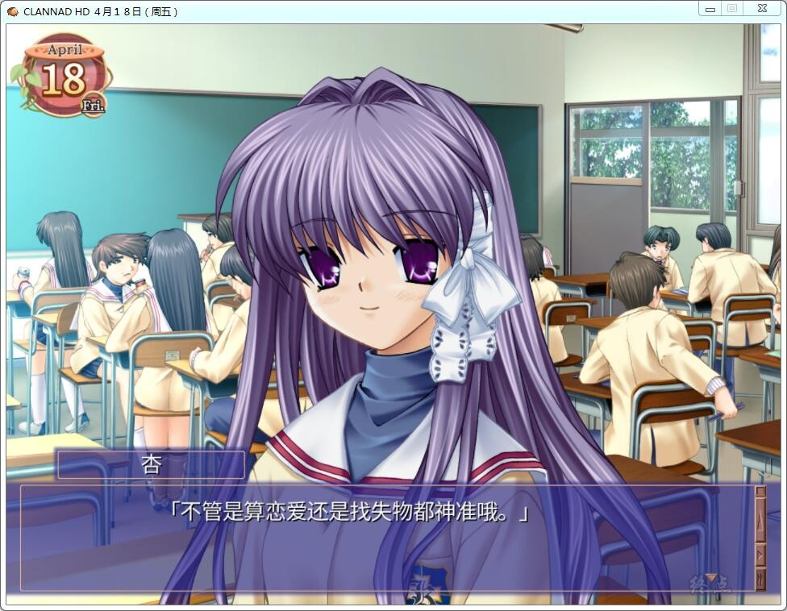

# 原版汉化

# Steam官中

# 游戏简介

在某个小镇，主角冈崎朋也因为家庭的因素成为不良少年，一直与春原阳平为伍，

在光坂高校过着潦倒的生活，但冀望终有一天能够离开所在的小镇。

某年4月14日，他在学校坡道前发现了一个止步不前的女孩，

在朋也认识了这个名为“古河渚”的女孩后，他的生活开始有了重大的变化。

学园篇为主角和女主角们之间所发生的事件，

After story为主角在学校毕业之后，

以及家庭生活，其中还关联著“幻想世界”，

CLANNAD就是由这三个要素所组成的故事。

2019-03-05  原版汉化，重新压制，解决名字乱码和无语音问题

2019-10-17  更新Steam官方中文版

2019-12-19  Steam版本更新修正补丁，解决BGM停止和中文修正

2020-11-28  资源被封，重新压制（度盘+微云）

2021-5-26  steam官中更新

Steam官方中文版，有能力请支持正版补票

**[Steam地址](https://store.steampowered.com/app/324160/CLANNAD/)**

Steam版本为论坛自购，转载请注明出处。

Key社早期 三大催泪弹之一

区别：Steam版本为HD版，画质较原版做了提升。

2个版本都整合到了这帖，网盘里请自行选择下载

[steam 版本中日双字幕补丁（未测试）](./steam%20版本中日双字幕补丁（未测试）/)

**请使用[IDM](https://www.123pan.com/s/jJprVv-3tMsH)进行下载，使用最新版[winrar](https://www.123pan.com/s/jJprVv-dtMsH)进行解压（非常重要）。**

**解压密码为终点（简体汉字）。**

**添加10%恢复记录，防止网盘抽风损坏。**

