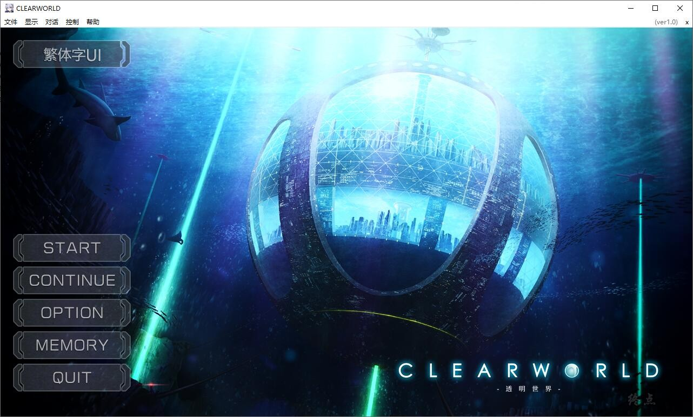
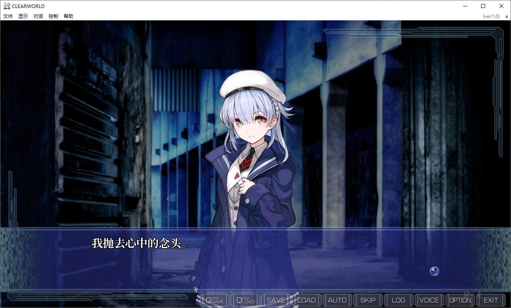
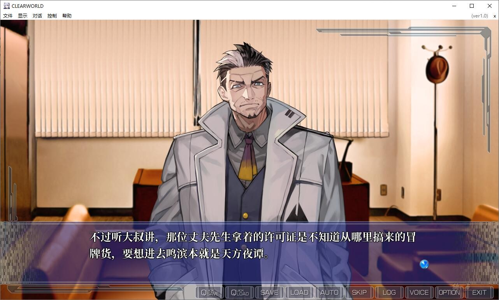
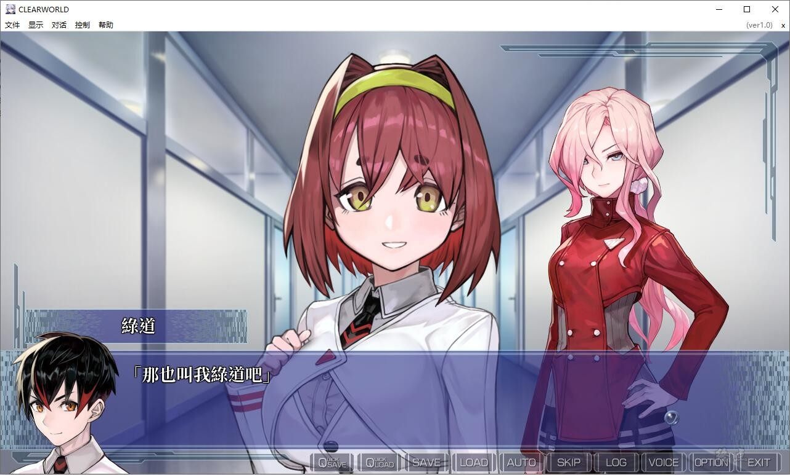

# 序言：

２０３５年――

巨型全球企业“贝恩斯莱姆”于海底发掘出了未知的能源资源，

在全世界掀起了新能源的发掘潮流。

人类在无穷无尽的新能源上投入了无数资源，历尽约十年，

聚集起全球最尖端的技术，缔造出了十一座乐园。

人们纷纷想要入住其中，然而只有被选中之人方可定居。

于是大多数人只能怀抱着对理想乡的憧憬，和过去一样生活。

２０４７年――

在可远眺一座乐园，却没有享受到多少好处的一处城市里，

祇园寺绿道担任着叔父的侦探事务所的助手工作。

某一天他接到了一桩寻人的委托。之后
在灯火阑珊的港口仓库里，与一位不可思议的少女相遇了。

游戏为终点论坛自购，转载请注明终点论坛，谢谢配合

如有能力，还请支持正版

[Steam地址](https://store.steampowered.com/app/1494860/CLEARWORLD/)

**请使用[IDM](https://www.123pan.com/s/jJprVv-3tMsH)进行下载，使用最新版[winrar](https://www.123pan.com/s/jJprVv-dtMsH)进行解压（非常重要）。**

**解压密码为终点（简体汉字）。**

**添加10%恢复记录，防止网盘抽风损坏。**

