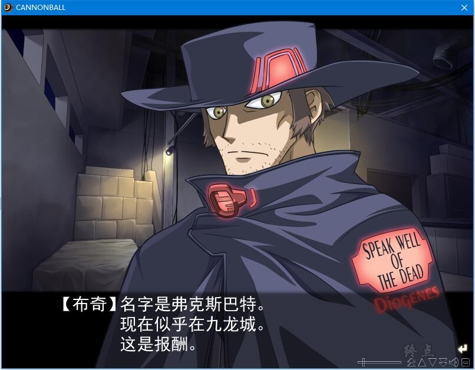

# 游戏简介

個性的な球形のマシンが競い合う、命がけのレース「キャノンボール」は、過酷な宇宙に生きる人々に、夢と大きな興奮を与える、セイファート銀河最大のイベントである。

優勝者には莫大な報酬、あるいは不老不死が約束されていた。

複数の惑星の軌道上と地表をコースにえらび、予選を突破したマシンの乗り手15名のクラウンたちが、その力と誇りをぶつけあわせる。

さらにレースは、戦争にあけくれる惑星国家における[屏蔽]戦争の場でもあった。

交易惑星ジェノバのスラム街を根じろとする、運び屋の青年フィリオ・ロッシの元に、超国家企業ユニオンの使者が突如おとずれる。

使者は、暗殺者フォックスバットをナビゲーターにすえて、キャノンボールへ出場するように迫る。
　　
―――その瞬間、フィリオの熱情に火がともり、冒険のグリーンフラッグは振りおろされた。

**r514783 个人汉化系列26th**

**详情请看** [汉化发布帖](http://blog.sina.com.cn/s/blog_96ad75660102yor4.html)

**Liar-soft 2003年发售的作品，内置中文攻略，其他信息看汉化说明吧**

**请使用[IDM](https://www.123pan.com/s/jJprVv-3tMsH)进行下载，使用最新版[winrar](https://www.123pan.com/s/jJprVv-dtMsH)进行解压（非常重要）。**

**解压密码为终点（简体汉字）。**

**添加10%恢复记录，防止网盘抽风损坏。**

