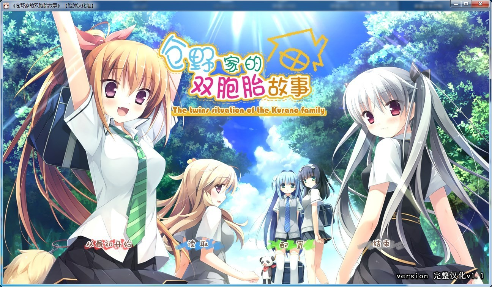

# 游戏简介

经营着咖啡店「苹果派」的苍野家，是拥有3对双胞胎、总共8人的大家族。

?最年长的双胞胎是，いずみ和みこと。

乖巧的优等生长女，和学习苦手但是体育万能的次女。

?第二对双胞胎是，智花（ともか）和和哉（かずや）。

扮演吐槽角色的常识人三女，和比起父亲更被家族依靠的长男（主人公）。

?第三对双胞胎是，弥恵（やえ）和絵麻（えま）。

家事万能的大和抚子四女，和受到大家溺爱的、猫一样的五女。

虽然父母经常吵架，大家每天仍然过着以「苹果派」为中心的幸福生活。

但是——在暑假前的一天，一直在灼热化的父母的争吵中，这次却是向要离婚而发展了!
母亲这一边要求领养的是，和哉和姐妹五人中的一人。

"要和弟弟（欧尼酱）一起过上性福生活的人，是我!!!"

赌上和最喜欢的长男一起幸福生活的未来，苍野家五人姐妹的「主人公争夺战」，拉开了帷幕——

脸肿汉化组的作品

[汉化原帖](https://tieba.baidu.com/p/3593124311)

**请使用[IDM](https://www.123pan.com/s/jJprVv-3tMsH)进行下载，使用最新版[winrar](https://www.123pan.com/s/jJprVv-dtMsH)进行解压（非常重要）。**

**解压密码为终点（简体汉字）。**

**添加10%恢复记录，防止网盘抽风损坏。**

