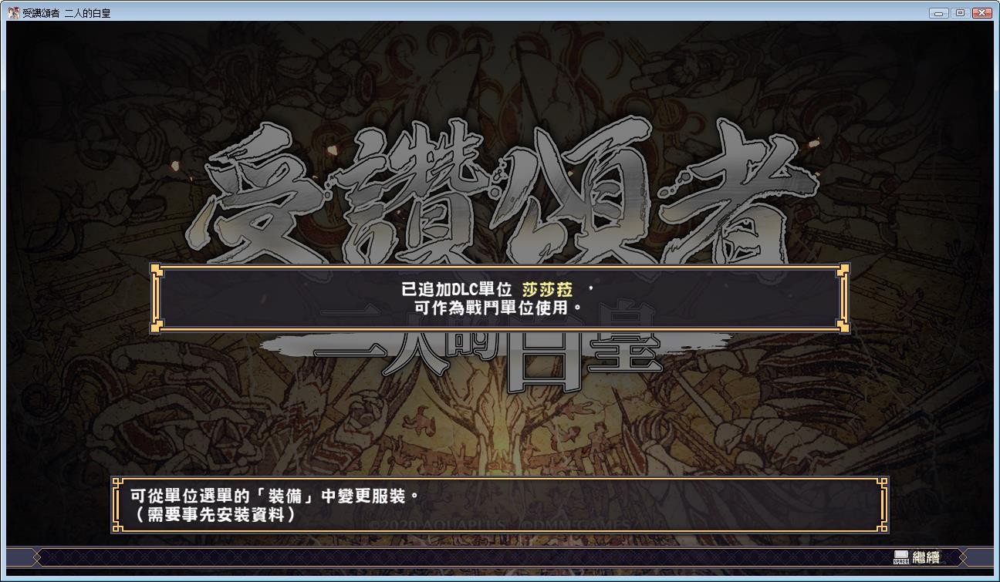

# 【关于《二人的白皇》】

《传颂之物》系列完结编！

大和与图斯库尔，这两个国家的命运⸺

以独特的世界观和充满个性的登场人物，令玩家们都着迷的文字冒险SRPG《传颂之物 给逝者的摇篮曲》系列三部作，终于完结了！

过去作品的所有谜团，将在此⸺解开。

「……公主就拜托了……猫音，你要幸福喔……」

把公主和妹妹的事交托给哈克之后，奥修特尔就化成了世界的一部分并消失了。

哈克决定戴上奥修特尔留下的面具，作为奥修特尔而活。

凭着哈克自己的才智、奥修特尔的名气和同伴的力量，他开拓了通往未来的路。

但与此同时，这也成为了牵连大和全国战乱的序幕。

Steam官方中文版，有能力请支持正版补票

**[Steam地址](https://store.steampowered.com/app/1151440/Utawarerumono_Mask_of_Truth/)**

游戏为 fch1993 自购，转载请注明出处。

Steam游戏需要保持全英文路径，否则游戏打开会报错。

fch的原档有中日英三个语言版本，这里只压制了中文版。

他把两个资源发到了一个帖子里，我拆开重发一下这个。

Steam国区打折下来还要600，再次感谢大佬自购分享。

**2020-6-4  修改了下破解文件，DLC解锁开启了。**

资源发布时已整合收费DLC人物，不过因为破解补丁而无法使用。

**2021-1-23  更新官方中文最新版本，中日英三个版本全部整合**

**请使用[IDM](https://www.123pan.com/s/jJprVv-3tMsH)进行下载，使用最新版[winrar](https://www.123pan.com/s/jJprVv-dtMsH)进行解压（非常重要）。**

**解压密码为终点（简体汉字）。**

**添加10%恢复记录，防止网盘抽风损坏。**

