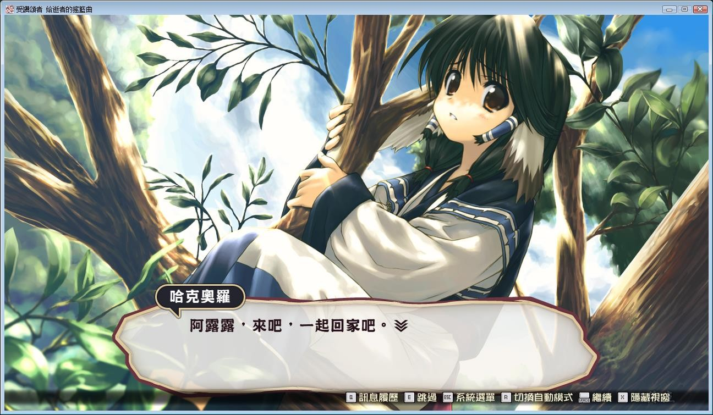

# Steam版本

# 原版汉化

《传颂之物》系列，回归原点。

扶持伙伴守护家人，揭开过去与世界的真相！

以独特的世界观、充满魅力的角色广受好评的AVG＋S、RPG《传颂之物》原作重制版在PC平台登场！

在某个世界，某座大陆。存在着拥有兽类耳朵和尾巴的各种种族。他们聚集形成村落，过着简单朴素的生活，渐渐地，甚至发展成了国家。

在大陆东北方边境的村落，亚玛由拉。少女「艾露露」带回了一名垂死的青年。身受重伤的他在妥善照顾下保住了性命，但是却失去了和自己相关的所有记忆。

青年被取名为「哈克奥罗」。随着伤势痊愈，他逐渐习惯了村落的生活。虽然在意着自己身上的谜团，「哈克奥罗」仍出手协助村落建设发展。

天生的稳重与勤勉的性格，让村落的众人都很依赖「哈克奥罗」。终于迎来了农作的收获期。村民的努力开花结果，令众人喜出望外的大丰收。但是，这项消息传入了藩主的耳中。为了夺取丰收的成果，残酷的魔手伸向了亚玛由拉。

然而，在边境发生的这起事件，成为了撼动世界的战乱序幕……

Steam官方中文版，有能力请支持正版补票

**[Steam地址](https://store.steampowered.com/app/1151450/Utawarerumono_Prelude_to_the_Fallen/)**

**游戏为论坛成员 fch1993 自购，转载请注明出处**

**传颂之物，一代人的回忆，陪我走过了差不多十个年头**
**还记得选择难度，第一场和狒狒战斗被虐的死去活来吗**
**经典神作，二三代虽然同样经典，但总感觉差强人意吧**
**游戏由PS2版移植到PC并且高清重制，全人物都有语音**
**包含Steam在售的全部16个DLC和4个暂未上架的DLC**

**注意：游戏需要保持全英文路径，否则游戏打开会报错**
**然后国区价格，只有去年一半，不像去年打折还要600**
**去年的今天，也是fch自购分享的2和3，再次感谢大佬**
**这次把中日英三个版本都压制进去了，自行选择语言吧**
**顺便一提，假面和白皇也都更新了最新版本，注意查看**

## 区别：

最主要的区别，PC原版是R18版本，Steam重制版是全年龄版

我印象中，PS2版本有新剧情，比PC版多了2场战斗和几张CG

战斗难度也降低了很多，其他画质、音效、语音啥的就不提了

2个版本都整合到了这帖，网盘里请自行选择下载

**请使用[IDM](https://www.123pan.com/s/jJprVv-3tMsH)进行下载，使用最新版[winrar](https://www.123pan.com/s/jJprVv-dtMsH)进行解压（非常重要）。**

**解压密码为终点（简体汉字）。**

**添加10%恢复记录，防止网盘抽风损坏。**

