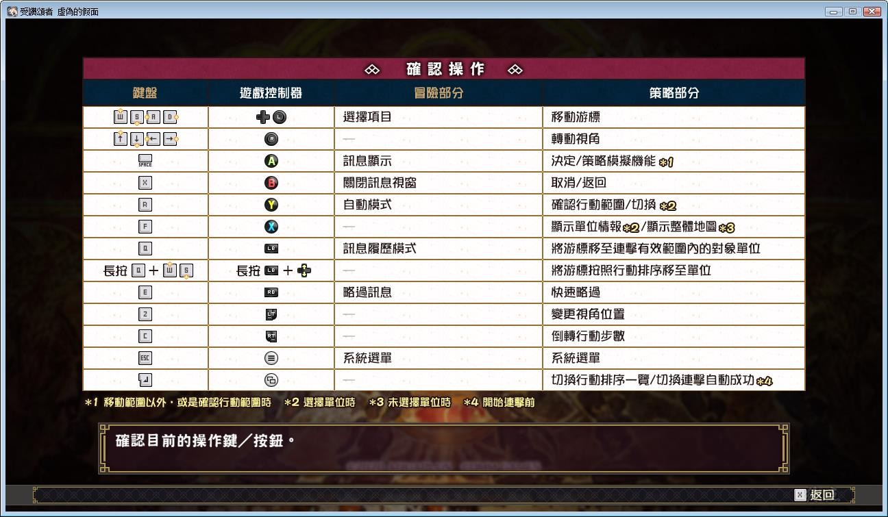
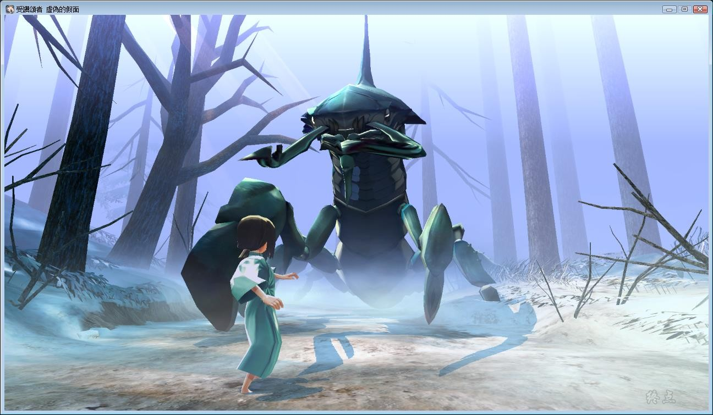
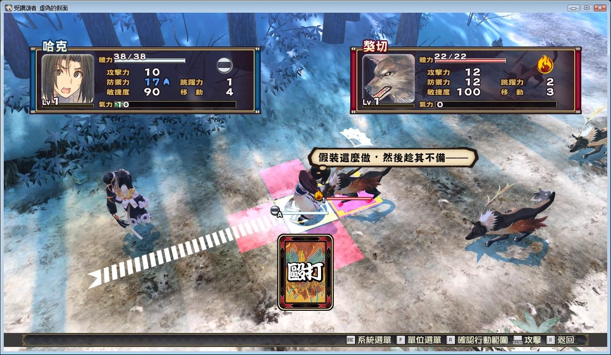

# 【关于《虚伪的假面》】

睁开双眼后看见的，是谁也未曾见过的世界…

和同伴一起驰骋于这战乱的大地吧！

因其独特的世界观和充满魅力的登场人物而深受好评的文字冒险

SRPG⸺《受赞颂者 给逝者的摇篮曲》的续编终于推出PC版！

在不知何方的雪原里醒来的青年，想不起他的名字和记忆。

他还未把握现在身处的状况，就遭受到怪物的袭撃。

幸好，他被长着兽耳和尾巴的美少女「久远」所救。

而这个邂逅带来了新的邂逅，使他的命运坎坷多变，亦令其卷进一场大战乱中……

Steam官方中文版，有能力请支持正版补票

**[Steam地址](https://store.steampowered.com/app/1149550/Utawarerumono_Mask_of_Deception/)**

游戏为 fch1993 自购，转载请注明出处。

Steam游戏需要保持**全英文路径**，否则游戏打开会报错。

~~fch的原档有中日英三个语言版本，这里只压制了中文版。~~

**2020-6-4  修改了下破解文件，DLC解锁开启了。**

资源发布时已整合收费DLC人物，不过因为破解补丁而无法使用。

**2021-1-23  更新官方中文最新版本，中日英三个版本全部整合**

**请使用[IDM](https://www.123pan.com/s/jJprVv-3tMsH)进行下载，使用最新版[winrar](https://www.123pan.com/s/jJprVv-dtMsH)进行解压（非常重要）。**

**解压密码为终点（简体汉字）。**

**添加10%恢复记录，防止网盘抽风损坏。**

