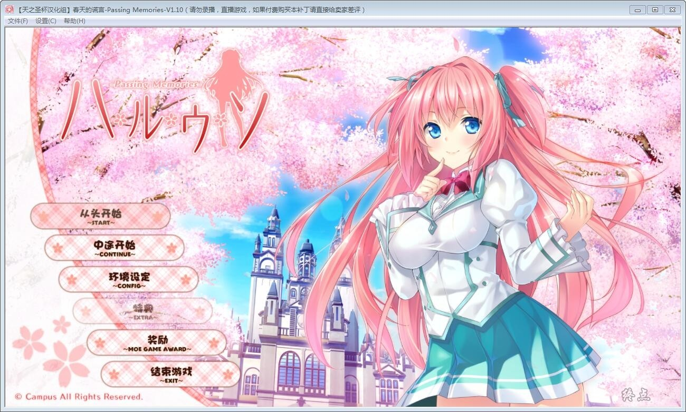
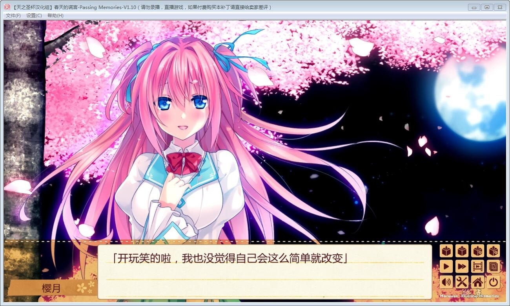
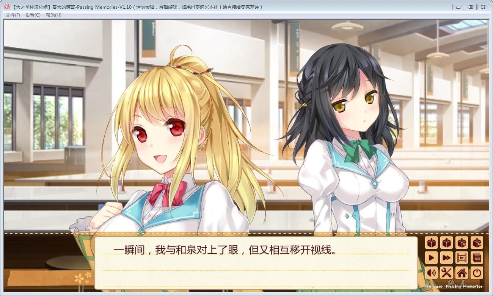
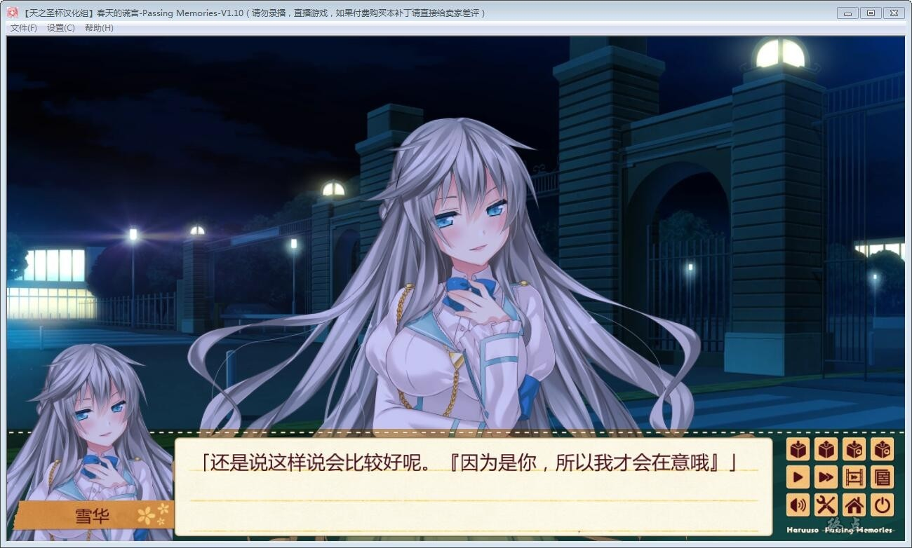
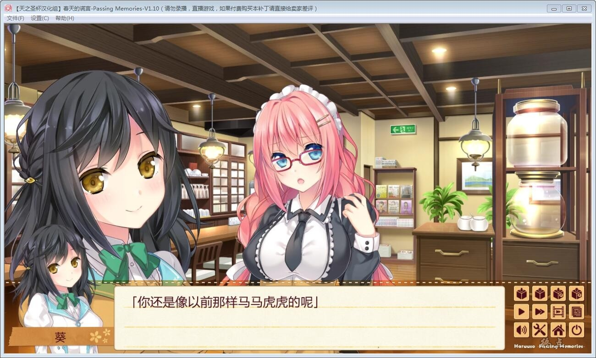
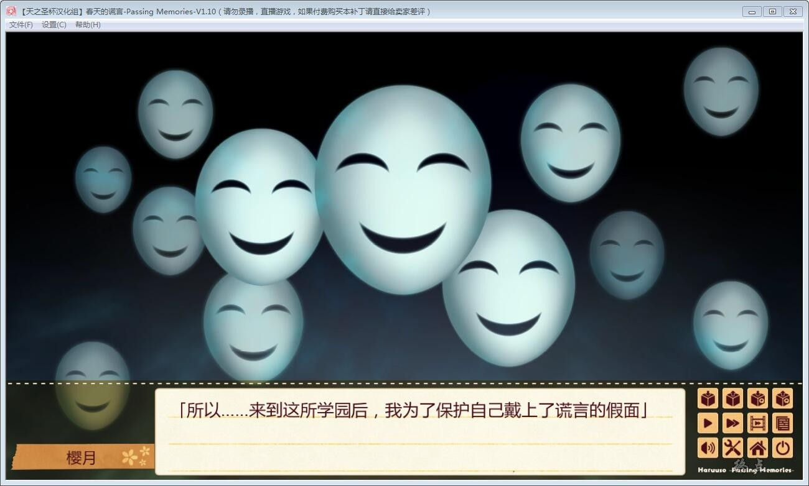
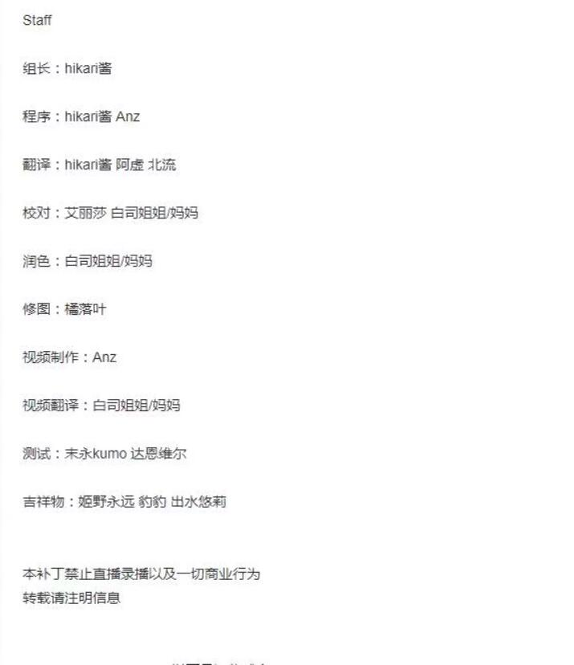

# 游戏简介

人人都有说谎的理由——

为了关心他人；

为了保护自己；

为了逃避现实；

而她是为了………

初春，樱花盛开了。

“学园问题儿”樱井宗一郎与被评为“校内第一美女”的姬野樱月偶然相遇，他看见了她被告白的场景，

但吸引他目光的却不是这个，而是从姬野樱月口中编制出的话语……

停止了数个月的命运的齿轮再次开始转动——

「樱井君，你……喜欢哪边的我呢？」

**天之圣杯汉化组的汉化作品，详情请看汉化原帖**

**[汉化原帖](https://tieba.baidu.com/p/6035542282)
**

**[1.5汉化最终补丁](https://tieba.baidu.com/p/6041485253)**

**2019-2-20  更新v1.1汉化修正补丁**

**2019-2-20  更新V1.15最终版本**

**请使用[IDM](https://www.123pan.com/s/jJprVv-3tMsH)进行下载，使用最新版[winrar](https://www.123pan.com/s/jJprVv-dtMsH)进行解压（非常重要）。**

**解压密码为终点（简体汉字）。**

**添加10%恢复记录，防止网盘抽风损坏。**

