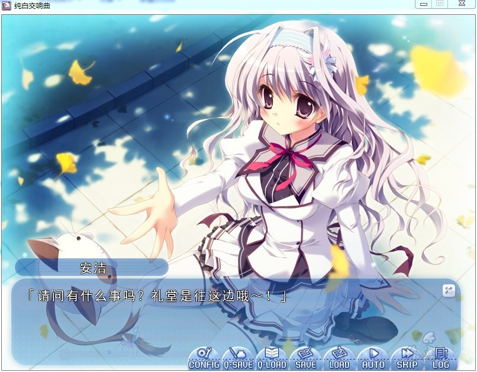

# 游戏简介

十月是一个由秋入冬的季节，为了解决社会日益少子化问题，瓜生新吾所就读的学校与同城的名门女子校“结姬女子学园”决定统合，在准备模拟统合期间，他和妹妹瓜生樱乃以及其他少数的学生作为实验性代表去就读女子学校。

瓜生新吾和妹妹瓜生樱乃在女子学校就读期间，遇到了反对改变学园的“理事长的女儿”濑名爱理；寻找主人的“野生女仆”安洁莉娜·菜夏·史威尔；喜欢动物的“温柔前辈”天羽美羽；以及不太诚实的“同学”乾纱凪等同学，瓜生新吾虽然起初对新环境有所困惑，但还是以自身的乐观与体贴态度渐渐地取得信任，并与他们成为了好朋友。

**纯白汉化组&妹乃萌汉化组的作品**

**请使用[IDM](https://www.123pan.com/s/jJprVv-3tMsH)进行下载，使用最新版[winrar](https://www.123pan.com/s/jJprVv-dtMsH)进行解压（非常重要）。**

**解压密码为终点（简体汉字）。**

**添加10%恢复记录，防止网盘抽风损坏。**

