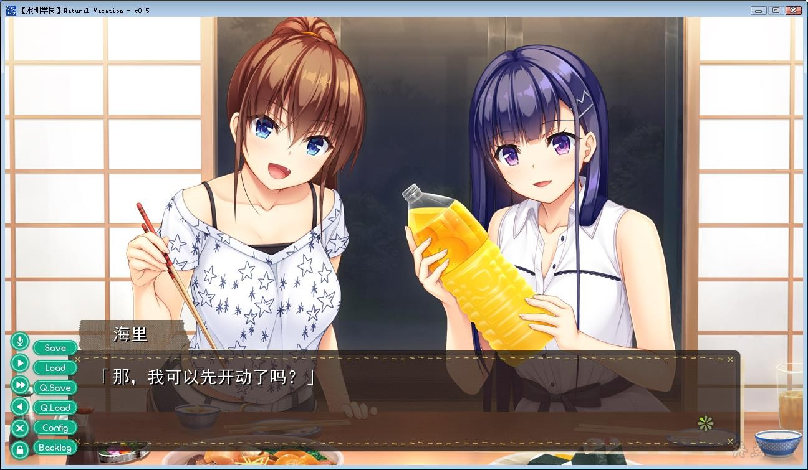

# 水明学园汉化组

# 心愿屋汉化组

# 游戏简介

*（来自2DFan）*

季节已是夏季。走下冷气充足的大巴，迎面而来的烈日与热浪使我不禁眯起了眼睛。

慢慢睁开眼睛，面前是一望无际的蓝色。

太阳照射在水面上闪闪发光，空中的云朵，将天空点缀出点点白色，拂过的清风，带来的些许海的气息。

“这就是，之后要生活的小镇啊”

父母赴海外工作的缘故，让我离开了大都市，来到了父亲的老家流水镇，之后将会和爷爷一起生活。

镇上热情的人们欢迎着我的到来，其中有两个女孩子。
这个夏天，在这个小镇，度过一个美好的暑假怎么样？

## 水明学园汉化组

**详情请看** [汉化发布帖](https://kf.miaola.info/read.php?tid=904196&sf=18e)

hibiki works在2017年底发售的纯爱作品，2018年还出过里番，Append特典打全了，内置全CG存档和攻略。

目前H未翻译完成，只翻译了遥的第2-4次给大伙们尝尝鲜，修图也没完成，等都完工了，会更新1.0版本收尾。

---

## 心愿屋汉化组  汉化作品

**2021-02-04  更新心愿屋版本，Natural Vacation，2个汉化版已整合**

**2021-02-10  重新压制，有点小瑕疵**

**2021-08-3  水明学圆汉化组，更新1.0版本**

**请使用[IDM](https://www.123pan.com/s/jJprVv-3tMsH)进行下载，使用最新版[winrar](https://www.123pan.com/s/jJprVv-dtMsH)进行解压（非常重要）。**

**解压密码为终点（简体汉字）。**

**添加10%恢复记录，防止网盘抽风损坏。**

