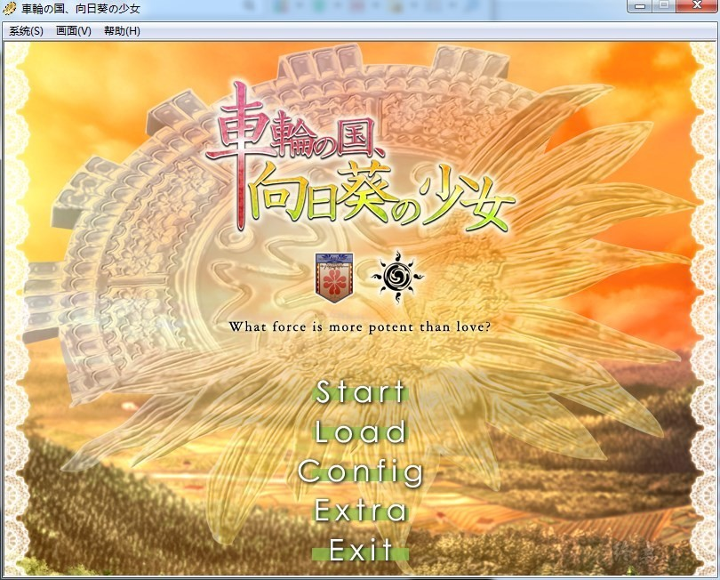
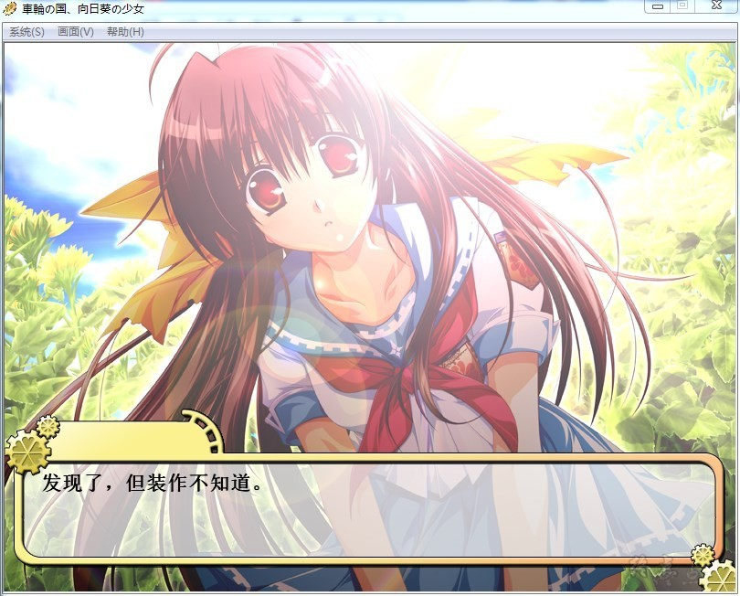
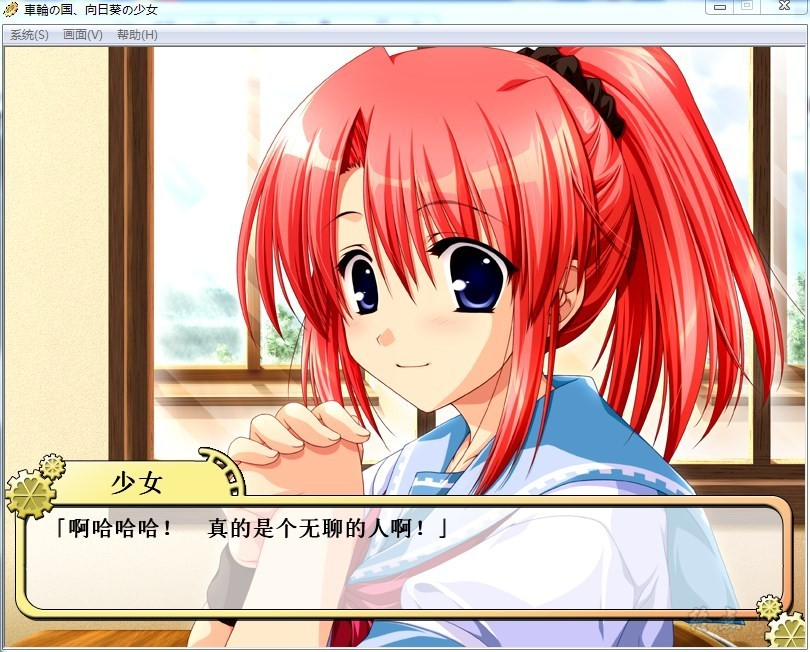
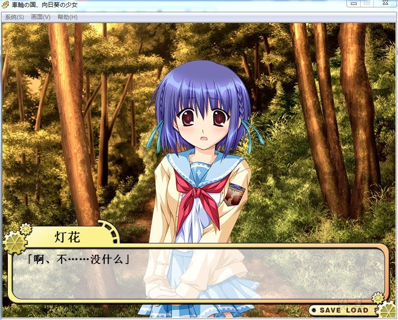
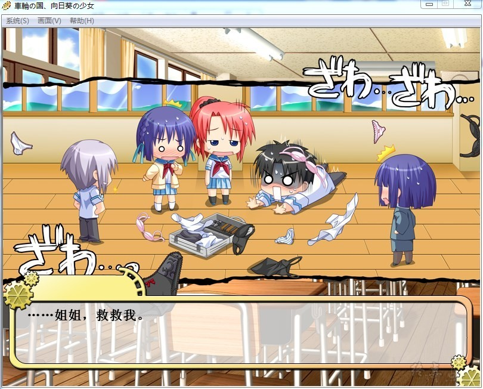
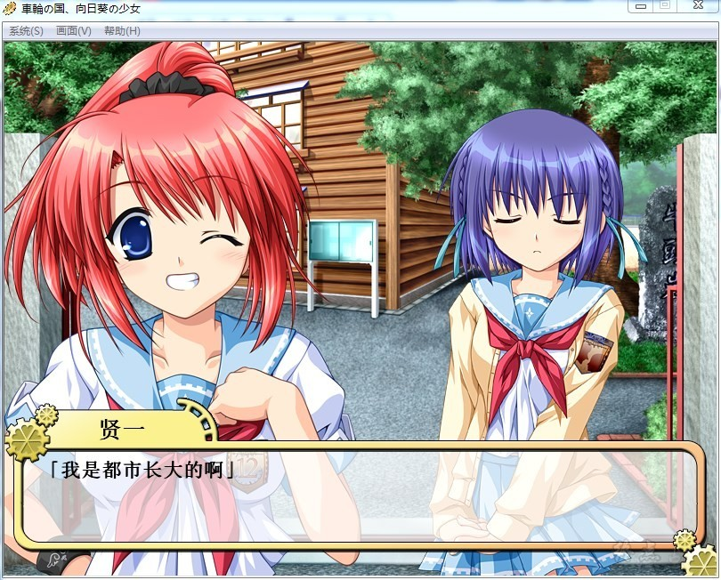

# 故事简介

主人公森田贤一是以“特别高等人”为目标的候补生，经过多年的努力和磨难之后，他准备接受特别高等人最后阶段的考试。

为此他回到七年前离开的家乡边境小镇。只要完成小镇上三个负有义务的少女的监督和更生（甦生），他就可以正式成为特别高等人。

经过几个月的艰苦努力，预期目标全部达成。然而在这个过程中，主人公一步步揭开自己的童年记忆，在取得特别高等人头衔的同时，

他必须用全部的智慧和力量与自己的过去以及国家机器做斗争。

回忆之风汉化组的作品

[汉化原帖](http://bbs.memowind.org/read.php?tid=13805)

**请使用[IDM](https://www.123pan.com/s/jJprVv-3tMsH)进行下载，使用最新版[winrar](https://www.123pan.com/s/jJprVv-dtMsH)进行解压（非常重要）。**

**解压密码为终点（简体汉字）。**

**添加10%恢复记录，防止网盘抽风损坏。**

