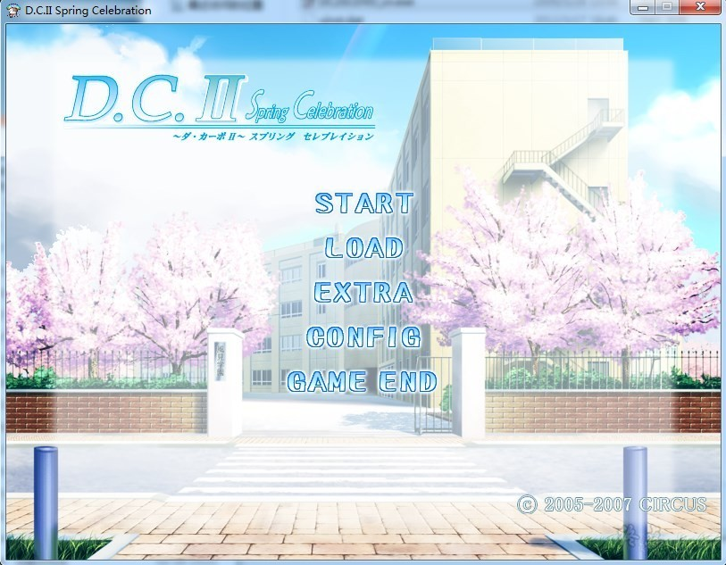
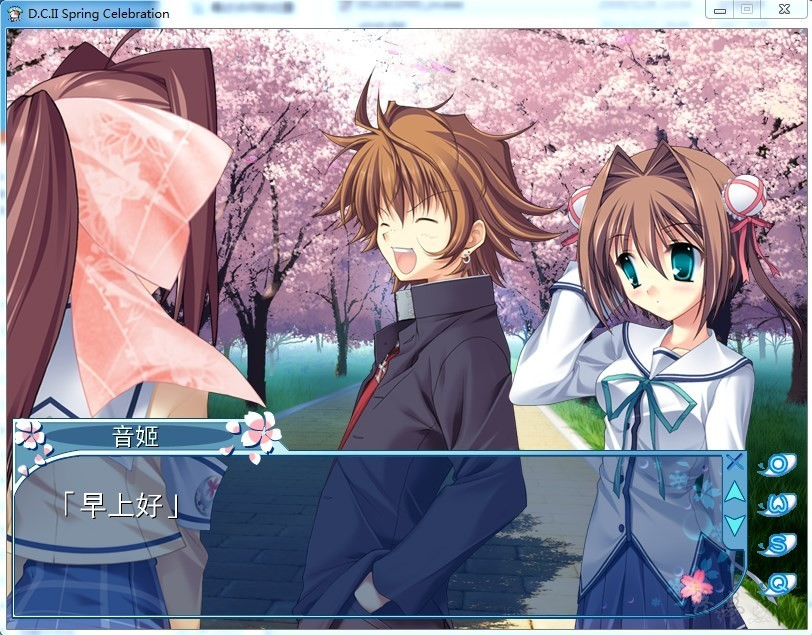
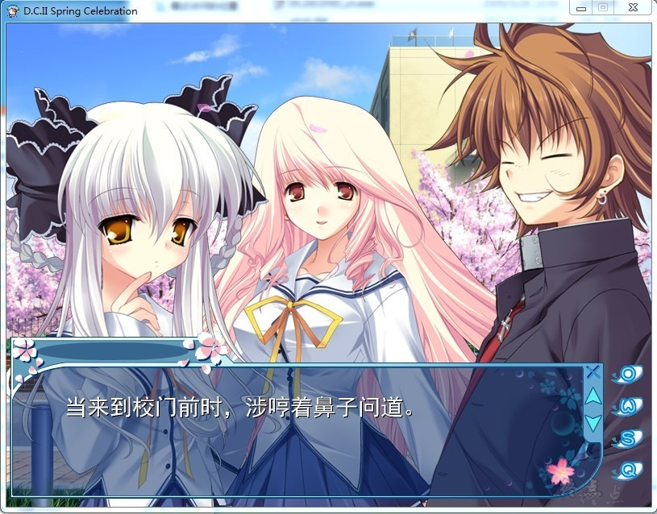
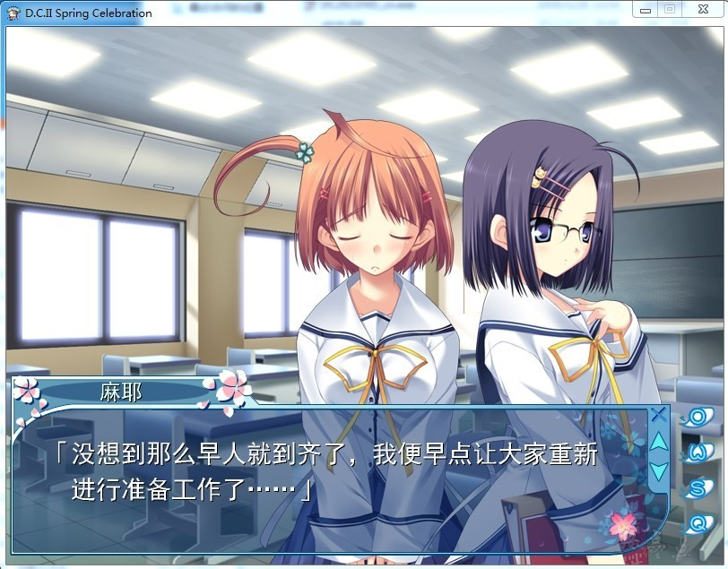

# DC2 FD

# 收录内容

## ・番外篇

描述女角色6人正篇以后生活的番外篇。为各女角各自的番外篇而兴奋吧！

## ・风见学园演剧部～毕业公演～

「于毕业PARTY时上映由风见学园演剧部自主拍摄的电影」这一设定的剧中剧。女角6人的故事也是有所不同的。

内容不单单只有悲情，里面还包括了神秘、恐怖、动作等多项元素。

## ・无敌大作战STORY

集合了作为D.C.II先行版而获得一致好评的「春风无敌大作战」演出强化版、以及全新作品「熏风无敌大作战」的双文本合集。（译注：熏风是指春天进入夏天时的回南风）

「熏风～」是插在「春风～」与D.C.II正篇之间的章节。以5月举办的『春季体育祭』为舞台所展开的又一次无敌大作战！
用令人怀念的、稍带H的恋爱喜剧风格来营造D.C.系列中首次登场的“体育祭”！

蘑菇汉化组的作品

[汉化原帖](https://bbs.sumisora.net/read.php?tid=11039888)（权限）

**请使用[IDM](https://www.123pan.com/s/jJprVv-3tMsH)进行下载，使用最新版[winrar](https://www.123pan.com/s/jJprVv-dtMsH)进行解压（非常重要）。**

**解压密码为终点（简体汉字）。**

**添加10%恢复记录，防止网盘抽风损坏。**

