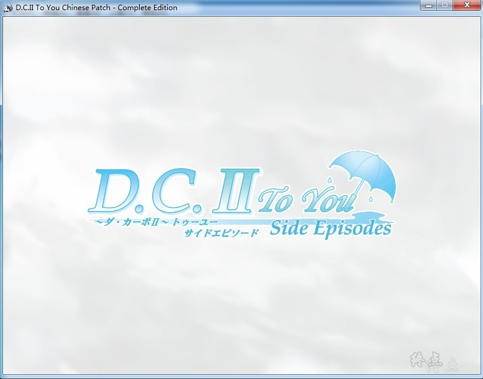
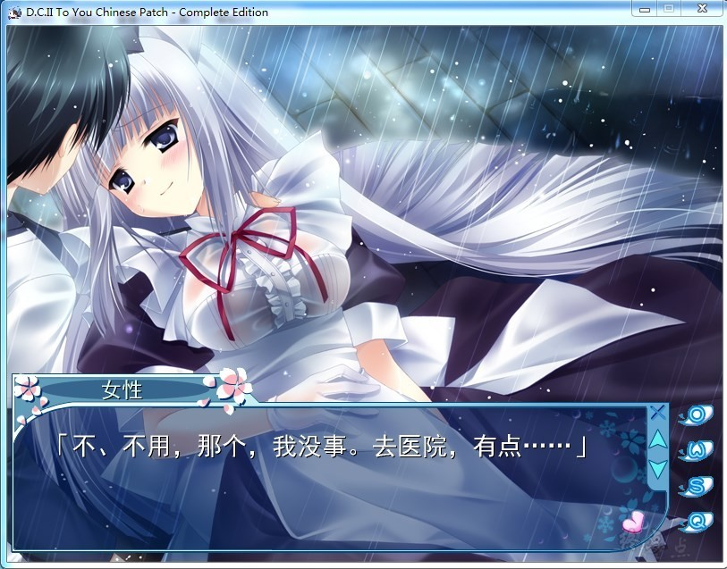
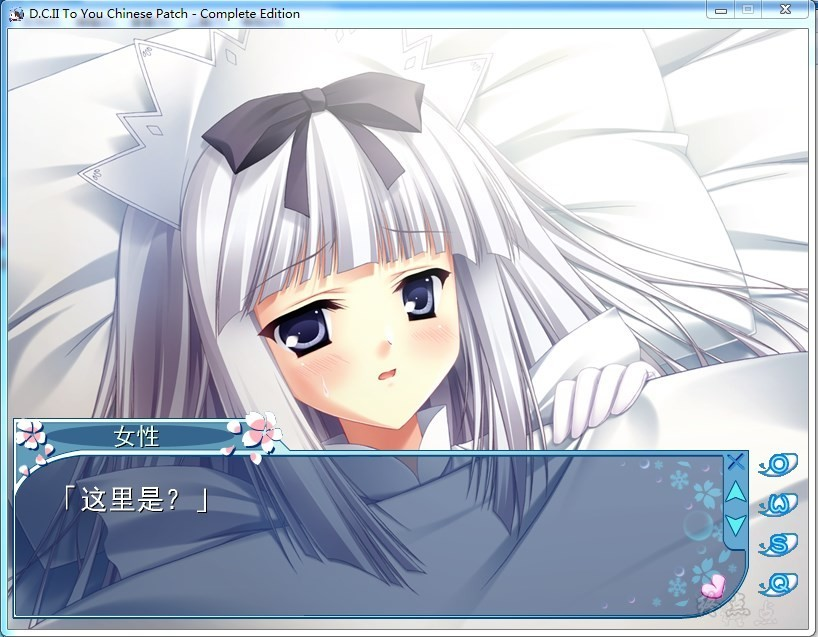
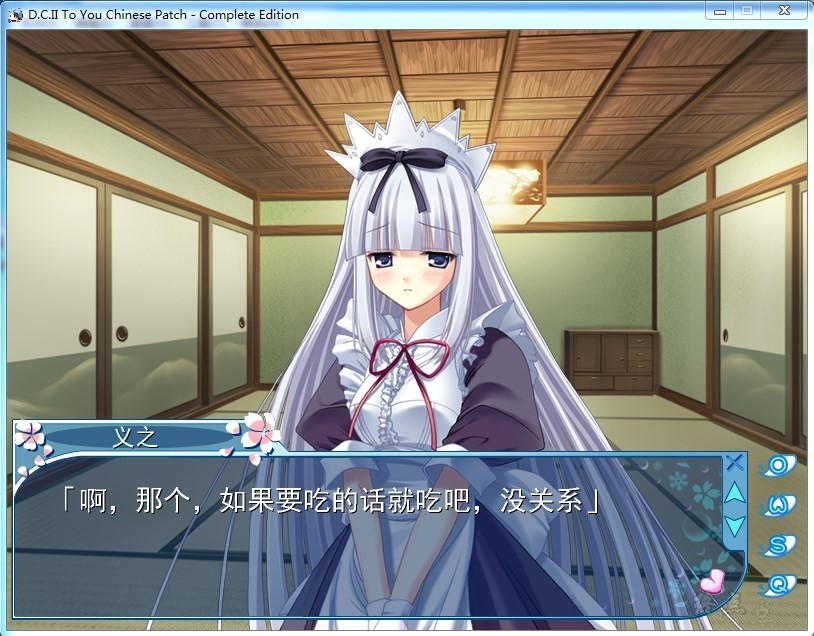

# DC2前传

# 游戏简介

## 紫阳花

故事讲述从正传开始追溯到十多年前的故事，刚刚进入风见学园两个月后，樱内义之和朝仓音姬、朝仓由梦还有纯一爷爷在朝仓家中过着平凡安稳的日子。然而雨的季节6月悄然而至。

樱内义之与那对美女姐妹生活在同一屋檐下的麻烦亦开始如理所当然般的逐一发生了。因淋着雨回家而淋湿了身体的义之，想要去洗个澡暖和一下但跑进浴室里却看到了正在沐浴而全身赤裸的音姬；在下雨的傍晚，义之估计大家都还没有回家而直接从浴室ZC来却与赤裸着身体的由梦在客厅中相遇。就这样一个个闹剧在这个充满欢乐喧闹的雨季中上演了。

然而在这样的6月某个放晴的日子里。义之、音姬、由梦三人偶尔会相约在放学后一起回家，在路上三个人在学校庭院里的一个角落发现了一朵花，是一朵在这个季节里还没有绽放的花——紫阳花的花。是音姬和由梦她们那已故的妈妈生前最喜欢的花。于是，义之想起了小时候和那位妈妈做过的一个约定。（我究竟是不是还遵守着和那个人做过的约定呢？）他望着音姬和由梦的脸庞，脑里回想起了那已逐渐淡忘的记忆，那个定下约定时的记忆。让人怀念的温暖感觉，还有一点点的心痛。和由姬一起度过的那个冬日里的记忆。

## 雪月花

故事讲述了在《初音岛Ⅱ》的正传中小恋经历了数次的擦肩而过，和义之终于顺利成为了恋人。在之后小恋离开初音岛去本岛的学校上学之前的那段日子里，两个人过着LOVELOVE的每一天。时间终于迎来了2月14日——情人节。两个人度过了如巧克力般甜蜜的一天。

此时，两个人忆起了，她们之所以能够顺利转变成恋人的关系，是靠涉、杏、茜还有衫并他们的协助。“说起来，小恋你与杏她俩是怎样要好起来的？”“咦？你不记得了吗？”这段对话使两人回想起了那时候她们刚碰面的事情。

那是发生在义之他们刚进入风见学园两个月左右的时候，在一个雨季里的故事。那时候杏与茜并非像现在这个样子，仿佛密谋着什么，在班上也很不安分。于是，算上还没有相遇的义之和衫并、涉。6个人并没有交集。这时候，风见学园举行了一次体育测验。此次的体育测验也只不过是一次平常的体育测验。然而就是这次平常的体育测验，却演变成了风见学园的一次大事件。不幸被卷入这次事件的还有来做教育实习生的高松美久子。以及风见学园学生会的名人成员宫代雪乃和矶鹫凉芽，朝仓音姬和高坂真由纪。当然非正式新闻部的家伙们也不可能那么老实。

雪月花和三个笨蛋这6个人的初次相遇和交错。可以说是为这6个人今后卷起的数次大骚动迈出了极其重要的第一步。

正午时降下的雨

故事讲述在《初音岛Ⅱ》正传中与真昼离别的半年之后。和义之一样怀着因真昼的离去而伤感心情的ミキ，自然而然地与义之成为了朋友。在绵绵飘雨的6月的一个休息日里。义之突然向ミキ问道。“话说起来真昼和ミキ的学生时代是怎样度过的？”于是ミキ告诉义之。她们两人那段温馨而又让人心痛，点缀着两人青春和离别的故事。

——那是距今十多年前的事情。一年四季都绽放的樱花，在当时来看已是很久远之前的事了。初音岛的樱花还是与其他地方一样，按四季的更替开放着。当时还是风见学园附属一年级学生的朝比奈ミキ，在初音岛上过着平稳却缺少激情的每一天。而在第二学期的某天。班主任老师宣布了一件事。那就是，本该坐在从入学开始就一直空着的那个座位上的同学终于来学校上课了。她的名字叫小鸟游真昼。
虽然因身患重病而一直在住院，不过当时的她好像已经康复出院了。听到这个消息的ミキ，内心激动不已。（她叫真昼啊！到底是个怎么样的女孩子呢？）可能是出于好奇心，ミキ生出一个将有着一段难忘邂逅的预感。于是在一周之后，两位少女相遇了并成为了十分要好的朋友。虽然两人一起度过的时间屈指可数。不过，就是在这一段短暂的日子，却绽放出了犹如正午的太阳一般散发着青春的耀眼光芒。

## 机械之心

升入风见学园附属三年级之后，义之的生活环境也改变了。因为朝仓家的家主纯一爷爷的一句话，使义之离开了一直生活的朝仓家，而住进了相邻的芳乃家。话虽如此，其实也只是搬到了隔壁。并没有发生翻天覆地的变化，用不了一个月就已经习惯了这样的生活。

然而6月这个雨淅淅沥沥下个不停的季节到来了。某个周日义之在购物街买完东西之后，回家的路上发现了一个晕倒在路旁的女孩子，一个在冲刷着泥土的雨水之中，发着高烧倒在地上的女孩子。于是义之把她带回了芳乃家，细心照料了起来。可是在恢复之后，女孩子却露出了一副想不通的表情，问义之为什么要对她做这样的事情。而对着回答说“只要还是个男人的话，当然都会这么做”的义之，女孩子一脸认真地说道。“但是，我是μ啊。而且，还坏掉了”是的，她并不是人类，而是人型机器人——μ。于是，从这天起，义之的生活开始发生了巨大的转变，和一颗酸酸甜甜的恋爱之心在一起。

神樱中文化翻译社的作品

[汉化原帖](https://bbs.sumisora.net/read.php?tid=10946974)（权限）

**请使用[IDM](https://www.123pan.com/s/jJprVv-3tMsH)进行下载，使用最新版[winrar](https://www.123pan.com/s/jJprVv-dtMsH)进行解压（非常重要）。**

**解压密码为终点（简体汉字）。**

**添加10%恢复记录，防止网盘抽风损坏。**

