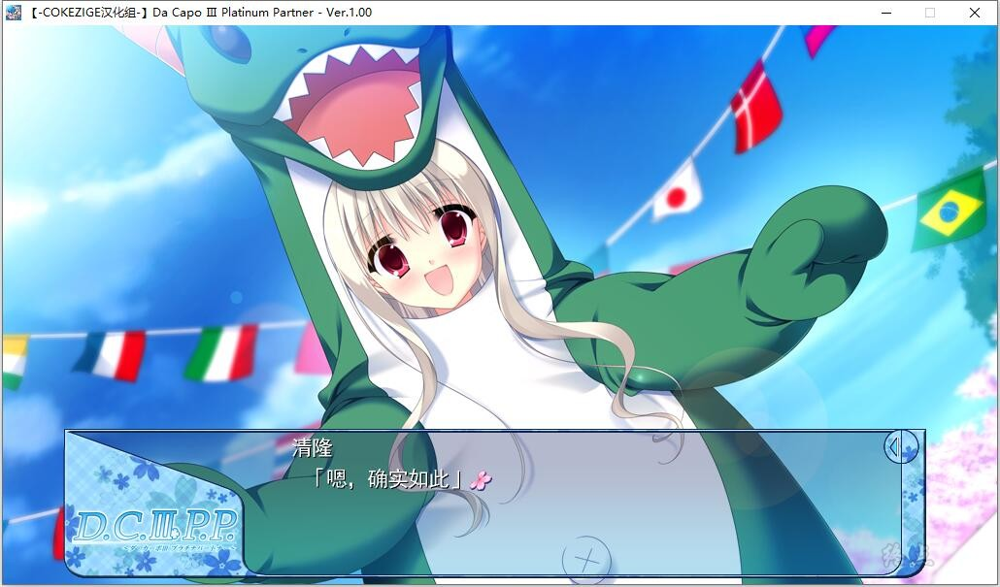

# DC3本篇下半部

# 故事简介

以樱花终年绽放而著名的初音岛。

身为初音岛上的风见学园的附属高中三年级生的芳乃清隆，和——

学园偶像却有点残念的前辈：森园立夏、

非常宠溺清隆的表姐：芳乃シャルル、

不坦率的喜欢照顾人的青梅竹马：葛木姬乃、

认真努力的天才少女：瑠川さら、

充满元气，像一只小狗一样惹人疼爱的后辈：陽の下葵——

这些成员们一起，享受着公式新闻部快乐的每一天。

——春天。

黄金周过后，风见学园的学生们为了准备已然临近的春季体育祭而喧闹着。

公式新闻部的成员们也理所当然地为了校内新闻『春季体育祭特别刊』以及和杉并率领的非公式新闻部对抗而热闹着。

春季体育祭结束后，快乐的学生生活也依然在持续着。

暑假时以合宿的名义大家一起外出旅行、秋天则有修学旅行和文化祭，冬天则有风见学园的特产圣诞派对在等着。

度过着如梦似幻的一年，再次迎来春天之时，清隆是否会和某个人构筑起特殊的关系呢？

——寻找最佳伙伴的一年间的故事，在此开幕！

*（介绍来自2dfan）*

COKEZIGE汉化组的汉化作品，详情请看汉化原帖

[汉化原帖](https://tieba.baidu.com/p/7630198577)

**2022-02-21 更新汉化V1.2版。**

**请使用[IDM](https://www.123pan.com/s/jJprVv-3tMsH)进行下载，使用最新版[winrar](https://www.123pan.com/s/jJprVv-dtMsH)进行解压（非常重要）。**

**解压密码为终点（简体汉字）。**

**添加10%恢复记录，防止网盘抽风损坏。**

