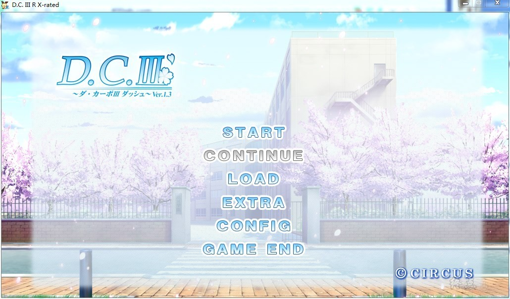
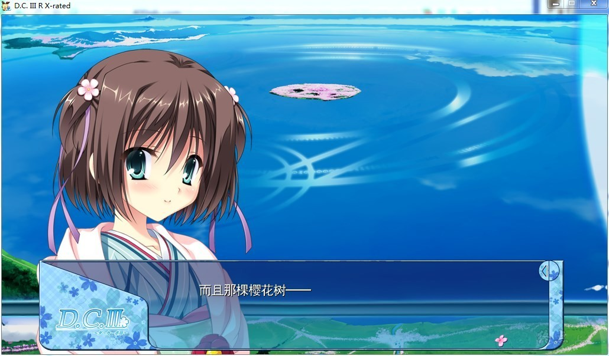
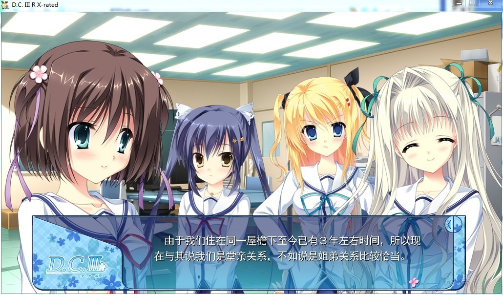
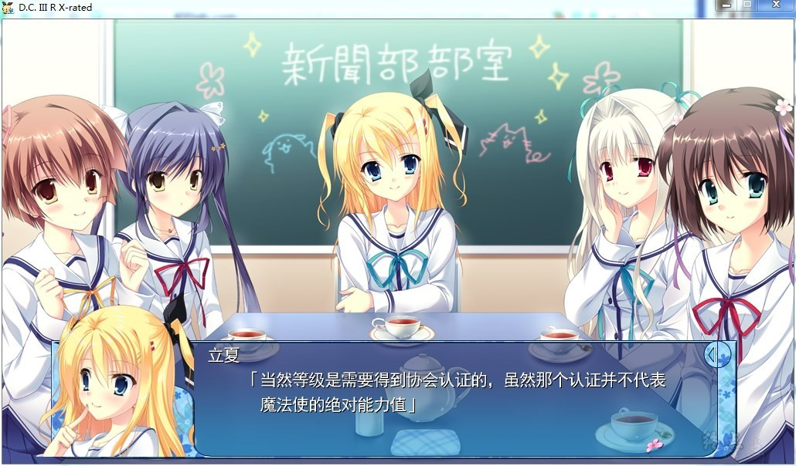
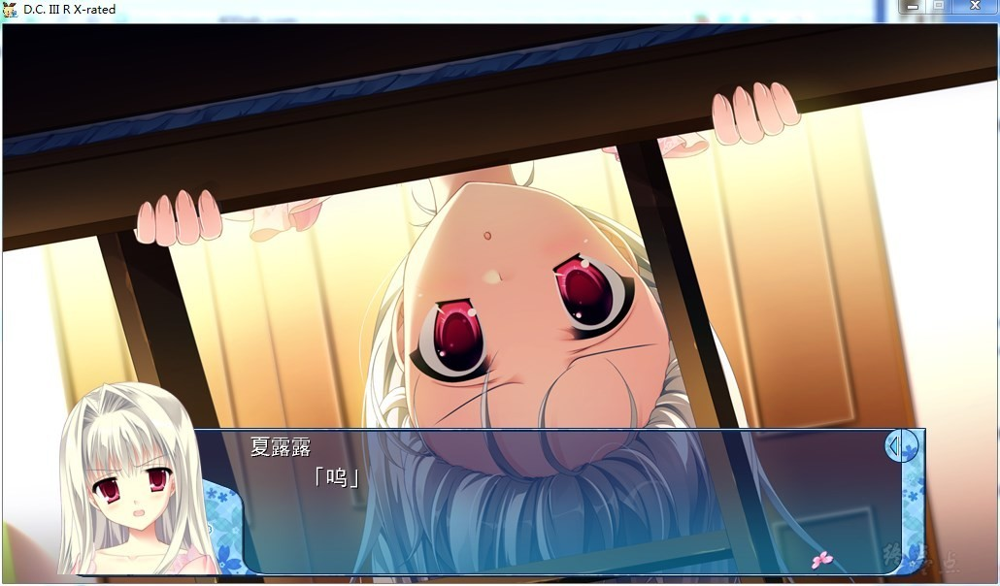
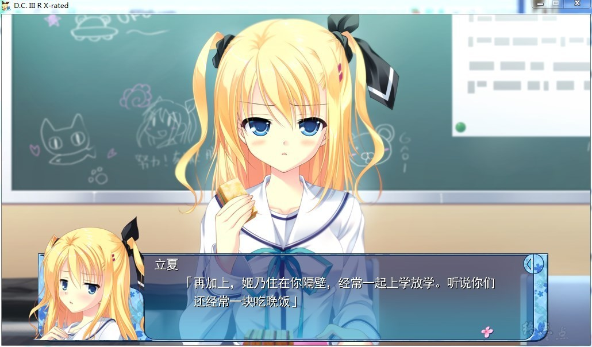

# DC3本篇上半部     初版2012年

# 游戏简介

## 初音岛篇

一年四季樱花盛开，这已经成为了遥远的过去。

现在的初音岛作为一个四季分明自然丰富的岛屿被广为人知。

风见学园位于初音岛上。

风见学园付属二年生的芳乃清隆，和他的前辈——人称学园偶像的森园立夏，妹妹般的青梅竹马葛木姫乃，混血表姐芳乃シャルル等五位女孩子一起在新闻部活动。

虽说是新闻部，现在的初音岛也不像从前那样充斥着不可思议的氛围，所以并没有出现什么事件让他们能够报道的，他们只是在社团教室闲散地度过着每一天。

——就在这个冬季的某日。

明明还是冬季，初音岛的樱花却如同约好一般盛开。

让人感到惊异的是，新闻部的成员们同时收到一封匿名邮件。邮件的内容是：

『樱花盛开时，在约定之处——』

后半段文字溶掉了看不清楚。但是，却让人觉得意味深长。而且，回信时间居然是1951年。

「这是从过去发来的邮件哦！大家不觉得是在说现在的状况吗？约定之处是在哪里？在那里发生着什么？而且，说到底为什么樱花会突然盛开的？我们新闻部要将谜题解开哦！」

新闻部部长森园立夏充满活力地如此宣言。

清隆他们进行着谜题的调查。不会枯萎的樱花树，就像是被招唤一样来临了。

在它的旁边，站着一名女性。明明是首次见面，感觉上却是非常非常地熟悉。

「那么能请你听我说吗？」

神秘的女性开始说起了往事。那是在100年以上的往时的伦敦，她与清隆他们相遇以及离别的故事。

「讲述一个、就像是Da Capo一样在重复着的、如同梦境般的梦境的、开端的故事」

## 風見鶏篇

然后，是由一位谜一般的女性来描述的，另一个故事——

日本屈指可数的魔法师家族之一，葛木家的长男清隆和妹妹姫乃一起，远赴英国伦敦的一所通称为『风见鶏』的王立魔法学园留学。

在异国他乡，出现在清隆和姫乃面前的是被浓雾包围的伦敦街道，和蔓延在地下的巨大学园都市。

由3个岛屿结成的学园都市，浮在地底湖上，排列成新月一般的形状。

想要在这样的好环境中学习魔法，来自世界各地的未来魔法师们聚集在这里。

在这里和许多朋友邂逅，清隆一边对新环境感到迷茫，一边渡过着愉快的学园生活。

就像是Da Capo一样重复着，满溢着，如同梦境般的日子……

清隆在某一天，与リッカ一起走在伦敦的街道上。

在巨大的钟塔之下，两人遇上了一名少女。拿着小小的樱花树枝的这个少女，丧失了大部分的记忆。

然后经过检查，获悉了拥有魔力的少女，暂时被安置在风见鶏。

——清隆有一个受到父亲所嘱托的愿望。

要实现这个愿望，则必须成为风见鶏的学生会成员。为此，清隆参加了学生会的选举。

此刻，女王的委托到访。

有一班正运用魔法的力量伤害着人民的人——

为了防范事件于未然，清隆一行奔走于雾深的伦敦街头。

丧失记忆的神秘少女，以及整年挥之不去的雾。还有她所持有的魔法樱花的树枝。

清隆他们的命运的齿轮开始运转。

就像是Da Capo一样重复着的、相遇与离别的故事。

**蘑菇汉化组的汉化作品，**

更新0.8汉化，全线汉化，H部分未汉化，其余剧本未汉化

[汉化原帖](http://bbs.north-plus.net/read.php?tid-290238.html)

**2020-8-27 制作步兵版本，做了一键启动，原版和步兵可一键切换，默认步兵。**

**兼容汉化版的步兵补丁由论坛成员ColorfulWorld制作。使用了MangaGamer版的CG。详情请看 [四周年活动帖](https://bbs.zdfx.net/thread-432503-1-1.html)**

**请使用[IDM](https://www.123pan.com/s/jJprVv-3tMsH)进行下载，使用最新版[winrar](https://www.123pan.com/s/jJprVv-dtMsH)进行解压（非常重要）。**

**解压密码为终点（简体汉字）。**

**添加10%恢复记录，防止网盘抽风损坏。**

