# DC2本篇     初版2006年

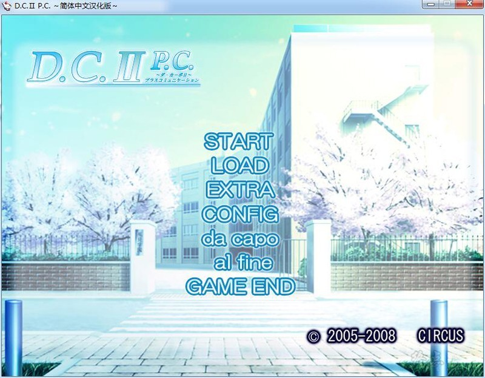

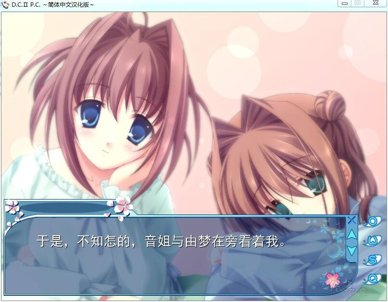

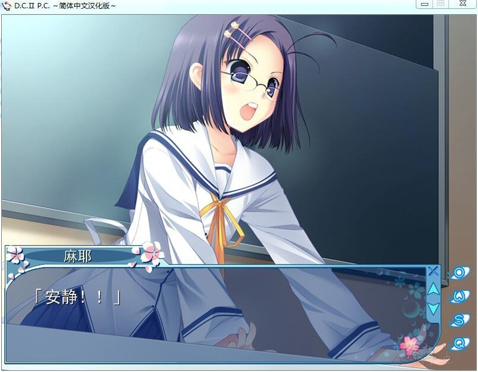

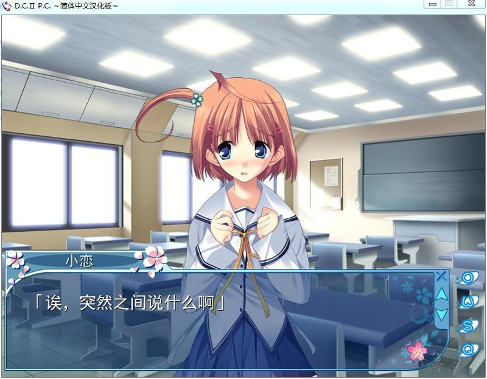

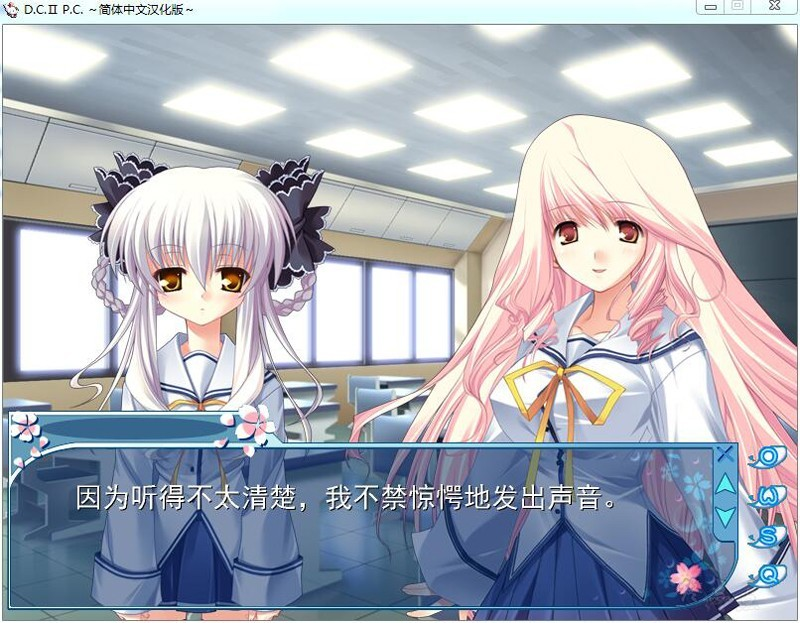

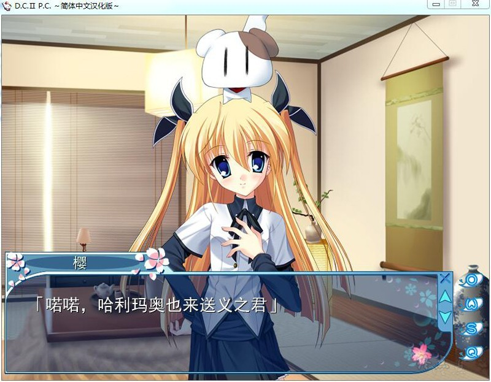

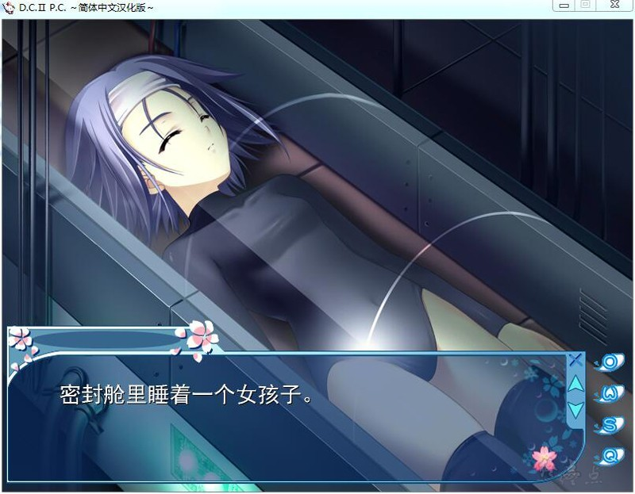

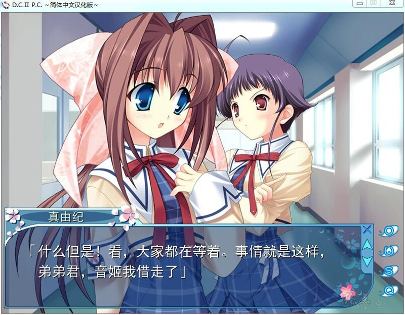

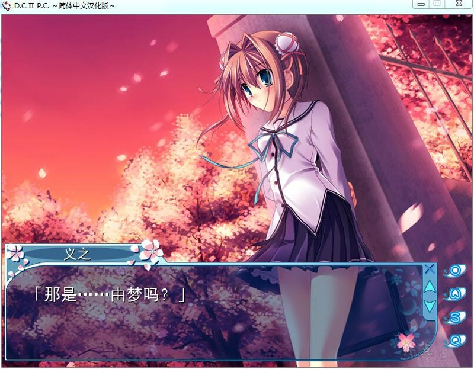

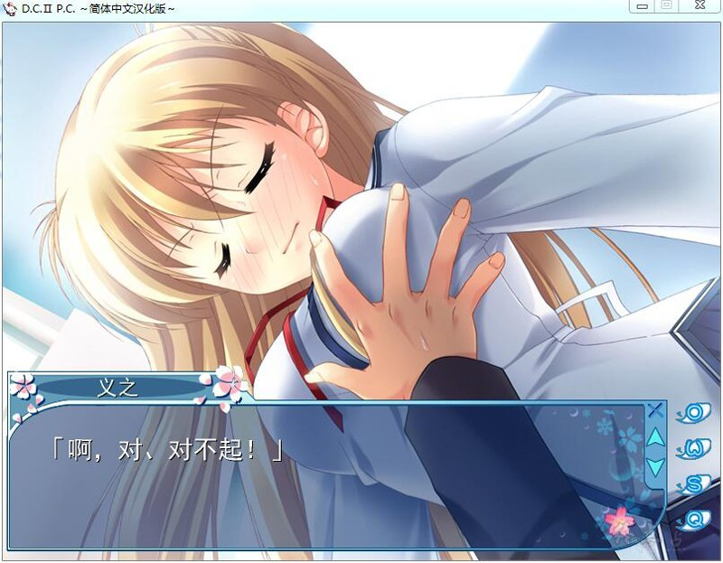

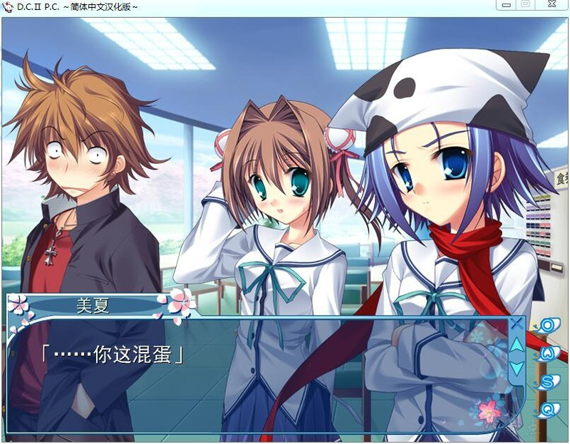

# 游戏简介

《初音岛》的53年之后，粉红色的樱花绽放的小岛，无数的樱花在空中飞舞，终年不绝。整个岛都覆盖在粉红的花海里，时间是冬季。地面有厚厚的积雪，空中飘着纯白的雪花。这是一个吐出的气会变成白雾，让人不想从被窝里出来的季节。义之看着像在春天里盛开的樱花树，总感觉到有什么东西改变了，遥望着慢慢飘落的樱花，少年想着即将来临的春天，生活在樱花不会枯萎的平凡世界里的少年，拥有凭空变出点心，这既不平凡也不非凡的能力，在雪花和樱花混合着纷纷飘落的冬季学院里，他和她们邂逅的时候在一名小小的魔法师用最后的魔法乞援的时候，一个快乐又温馨的故事就要开始了。

神樱中文化翻译社的作品

[汉化原帖](https://bbs.sumisora.net/read.php?tid=10992472)（权限）

**请使用[IDM](https://www.123pan.com/s/jJprVv-3tMsH)进行下载，使用最新版[winrar](https://www.123pan.com/s/jJprVv-dtMsH)进行解压（非常重要）。**

**解压密码为终点（简体汉字）。**

**添加10%恢复记录，防止网盘抽风损坏。**

