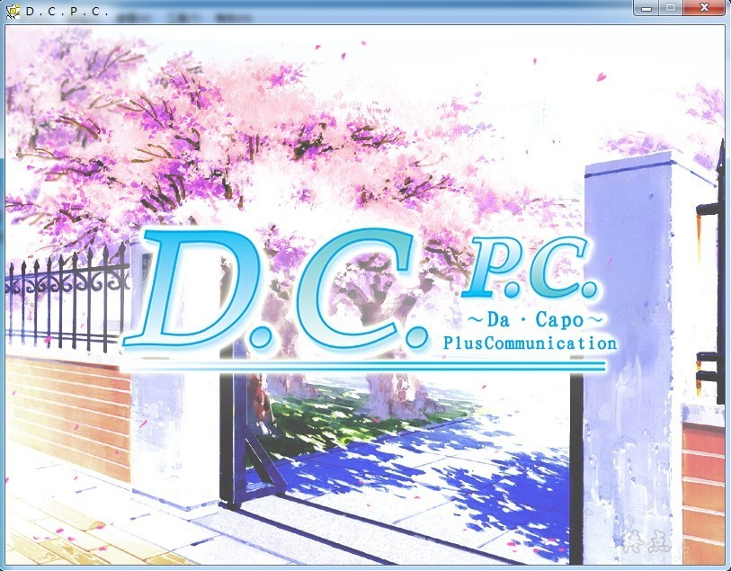
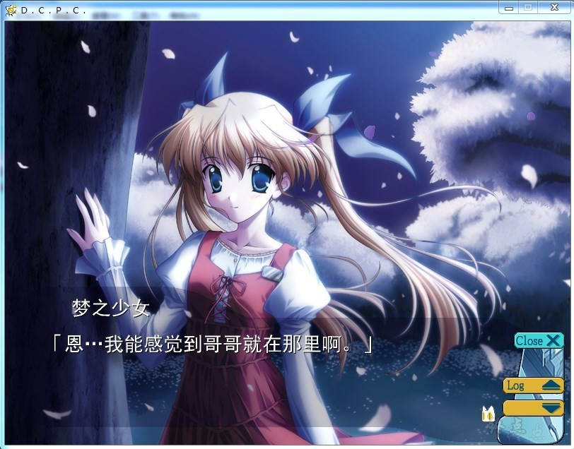

# DC1本篇     初版2002年

# 故事简介

在冰冷的空气中，有时会静静的落下樱花瓣。

有时也会狂暴的落下樱花瓣。

真的让人有一种奇妙的舒服的感觉。

世界一片寂静。

花瓣像天使的羽毛一样飘舞着，永远，永远。

**──这就是DACAPO不断反复的世界──**

长着在一年之中开满花的樱花树的不可思议的初音岛。

是一个有着“不会枯萎的樱花”的粉红色的世界。

在这里中心的风见学园。

有一个没有背负任何使命，但却持有从手掌中变出日本点心，在梦中可以看见他人梦拥有这两个小小的力的男孩子。

既不能说他平凡，也不能说他是不平凡……。

这样的他，在快要毕业时与学园中女孩们相遇了。

学园的偶像，迷糊的前辈，转校生的巫女、拿着人偶的少女……。

编织成许多相遇的故事。既有快乐，也有悲伤。

像樱花般飞舞的爱之梦就这样开始了。

妹乃萌汉化组的作品

**2022-11-6 更新步兵补丁，感谢等雨来的制作，默认为步兵，自带切换bat，因原步兵版缺线路，会有部分CG依然为骑**

**请使用[IDM](https://www.123pan.com/s/jJprVv-3tMsH)进行下载，使用最新版[winrar](https://www.123pan.com/s/jJprVv-dtMsH)进行解压（非常重要）。**

**解压密码为终点（简体汉字）。**

**添加10%恢复记录，防止网盘抽风损坏。**

