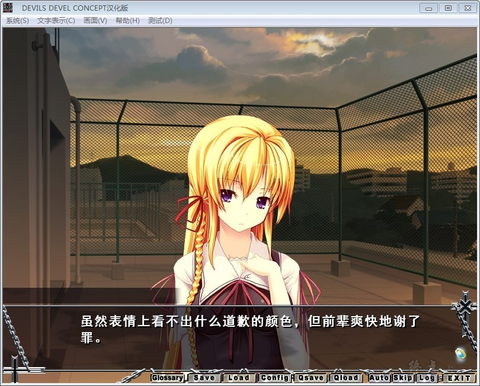

# 游戏简介

人类、怪物、禽兽——

「世界」不会容纳它们……

不为人知地发生奇怪事件的城市「鹤伎町」。

那里是各种各样的「灾厄」、「诅咒」、以及与其因缘纠缠的人物们聚集的战场。

被称为『缘者』的特异能力者们。以及，他们的先祖──『恶魔』。

仿佛被不可视的漩涡吞噬一般，他们聚集于此，然后，互相残杀。
时雨楚良是一个身为缘者的少年。

数年前父母双亡，现在一边过着独身生活、一边就读于私立白岭学园的他的日常，被平稳与安逸、以及破坏点缀着。

与友人们的平凡学园生活。每晚都会做的不可思议的梦。与出现在夜晚的城市的恶魔的死斗。

他持有的「契约」，将他诱往悲剧与斗争与杀戮的地狱。

然后，他将与之邂逅。与新的「契约」。与其持有者的少女们。

恋爱。

从属。

隶属。

背德。

欲望。

不知情爱为何物，身为坏掉人类的他，在与少女们的「契约」之中，会得到什么，又会失去什么呢。

俄而在那「契约」的尽头，他将与之邂逅。

与那最后的恶魔……

**蘑菇汉化组 + r514783的汉化作品**

[汉化原帖](http://blog.sina.com.cn/s/blog_96ad75660102vmdc.html)

**请使用[IDM](https://www.123pan.com/s/jJprVv-3tMsH)进行下载，使用最新版[winrar](https://www.123pan.com/s/jJprVv-dtMsH)进行解压（非常重要）。**

**解压密码为终点（简体汉字）。**

**添加10%恢复记录，防止网盘抽风损坏。**

