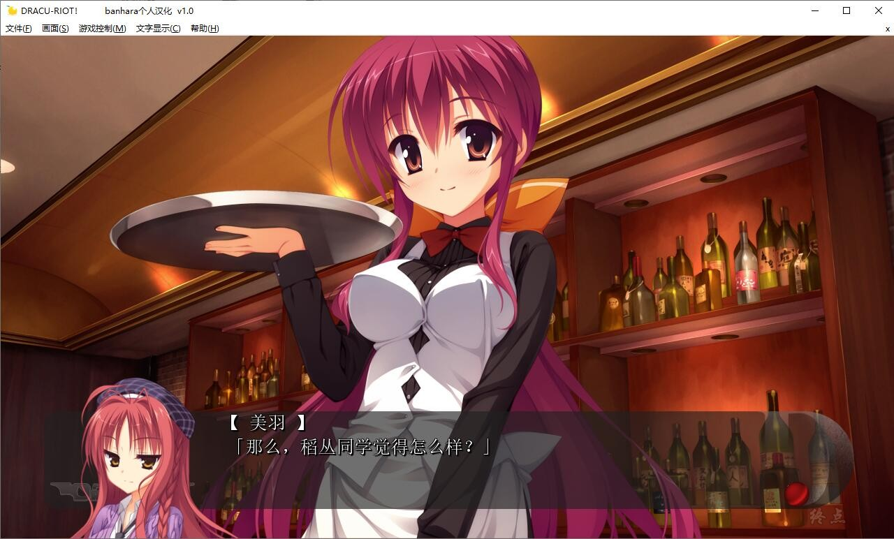

# 原汉化版

# 个人汉化版

# 游戏简介

联合改革特别区——海上都市 アクア・エデン

那是日本唯一的特别岛屿，赌场和妓院都是合法经营。

某个胸怀大志的学生登上这座小岛，而他的目的就是“脱离童贞行列”。

至于他的好友，亦即本作主人公六连佑斗却全然不知他的目的，只是一心想着和朋友去海上都市玩个痛快。

才进入都市，佑斗就目击到诱拐事件！

无法视而不见的佑斗当即见义勇为——谁知糊里糊涂就成了“吸血鬼”
虽说那不过是接下来华丽物语的小小开头罢了。

半夜三更才授课的学校，在夜黑风高的晚上悠然散步的同学（吸血鬼）们……

至今不曾体验过的超常识展开着实让人心跳不已。

于是乎，在吸血鬼与人类共存的海上都市里，甜蜜又带着淡淡忧伤的夜之物语就此拉开帷幕。

**2022-3-9，更新 banhuara 个人汉化版本**，[发布地址](https://tieba.baidu.com/p/7753131738)

**2022-3-10，更新汉化修正**

**请使用[IDM](https://www.123pan.com/s/jJprVv-3tMsH)进行下载，使用最新版[winrar](https://www.123pan.com/s/jJprVv-dtMsH)进行解压（非常重要）。**

**解压密码为终点（简体汉字）。**

**添加10%恢复记录，防止网盘抽风损坏。**

