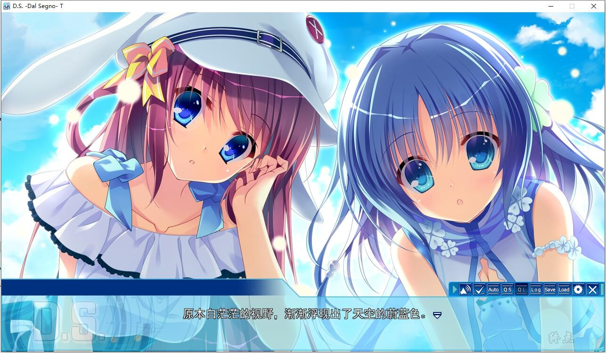

风南岛...... 舒适、凉爽的乐园，这里有着永恒的夏日。

主角作为一名转校生踏上了这个乐园之岛，迎接他的是熠熠生辉的天空，以及充满活力的乐园管理者：天，一个少女型人工智能。

在经历了一段曲折的历程后，故事便开始了：他在宿舍安顿了下来，而那里有新的朋友在等待着他。

朝宫阳茉莉：被称为残念美人，来来往往中略显孤独。

邑崎遥月：聪慧知性的代表，身兼学生会会长的要务。

神月依爱：自称魔王之女，但意外地有普通的一面。

藤白乃绘里：总是想表现得很成熟，但总被你笑话（是你的表妹）

还有那个以给予大家幸福为己任的女孩：天。

你将如何在乐园中创造属于你的幸福？

全新的恋爱物语，即将开始......

**已打补丁**

[STEAM地址](https://store.steampowered.com/app/638930/Dal_Segno/)

游戏为终点论坛自购，转载请注明终点论坛，谢谢配合

如有能力，还请支持正版

**请使用[IDM](https://www.123pan.com/s/jJprVv-3tMsH)进行下载，使用最新版[winrar](https://www.123pan.com/s/jJprVv-dtMsH)进行解压（非常重要）。**

**解压密码为终点（简体汉字）。**

**添加10%恢复记录，防止网盘抽风损坏。**

