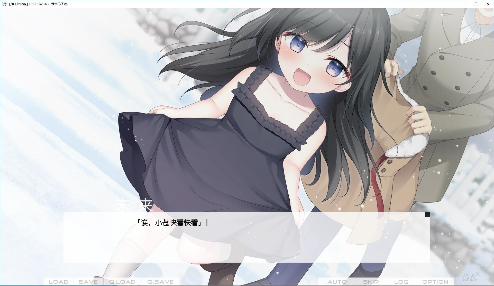
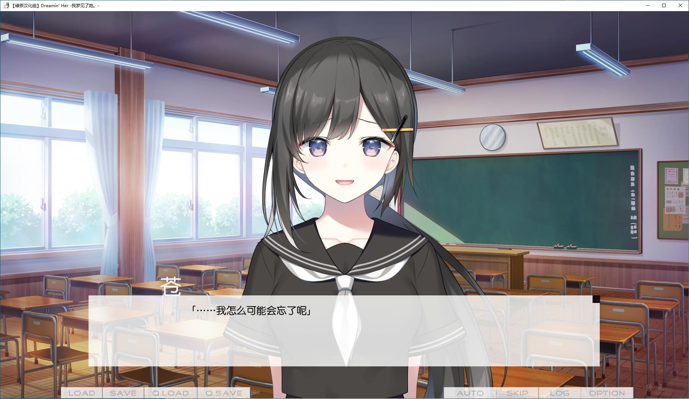
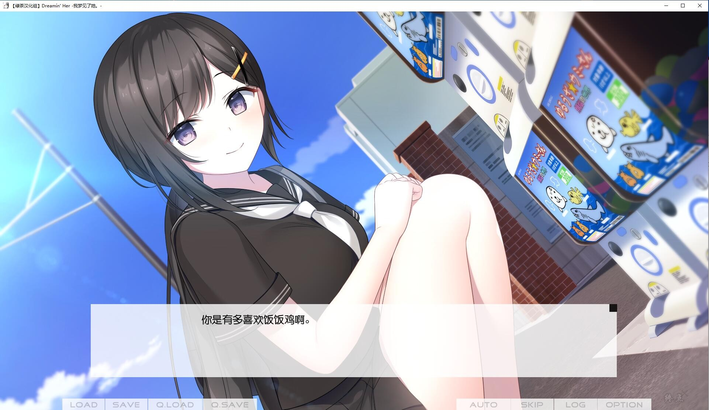
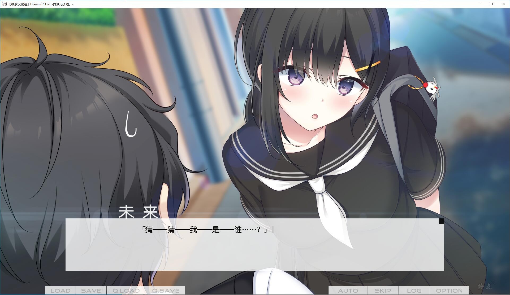
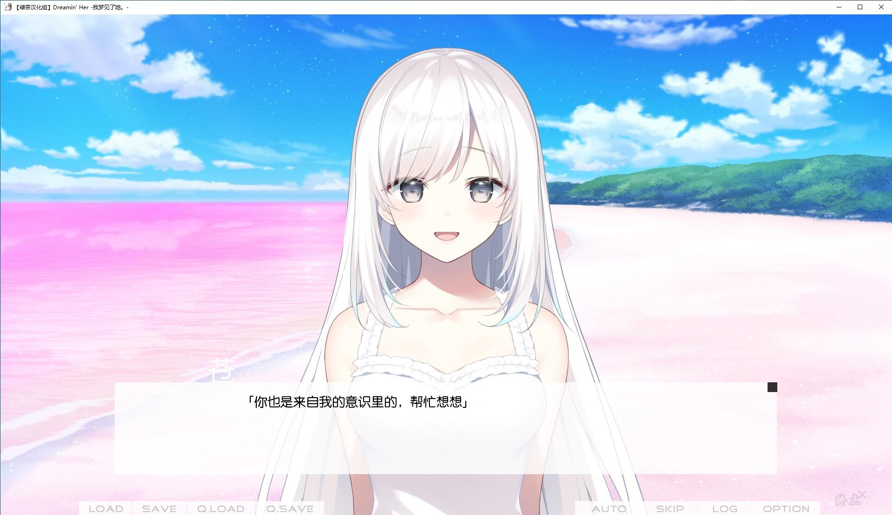

# 故事介绍

纷纷簌簌兮，万里绒花。可怜梦中人，在水一方。

五十岚苍感到筋疲力竭。

背负着母亲的期望，正在悬梁刺股欲跃龙门。

当成兴趣的小说也无法提笔。

高中三年级的夏天，开始怀疑自己的人生意义。

慰藉他心灵的是，青梅竹马七濑未来。

与她在一起的时光，给苍带来了莫大的平静。

然而，未来毫无理由就离开了他。

万念俱灰的苍，突然在梦境中遇到了“她”。

波光粼粼的海面。

桃粉色的沙滩上，一位少女佇立着。

梦中的她，犹如七濑未来的复刻品。

梦境开始照进现实……

*（介绍来自2dfan）*

绿茶汉化组的汉化作品
[汉化原贴](https://tieba.baidu.com/p/7869696997)

2022-6-22更新汉化1.01

**请使用[IDM](https://www.123pan.com/s/jJprVv-3tMsH)进行下载，使用最新版[winrar](https://www.123pan.com/s/jJprVv-dtMsH)进行解压（非常重要）。**
**解压密码为终点（简体汉字）。**
**添加10%恢复记录，防止网盘抽风损坏。**