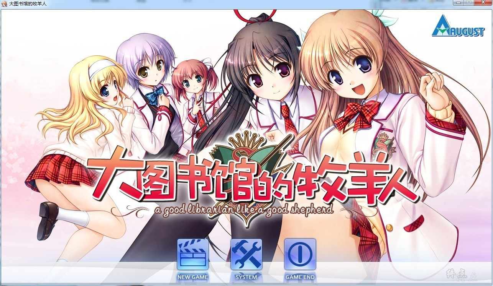
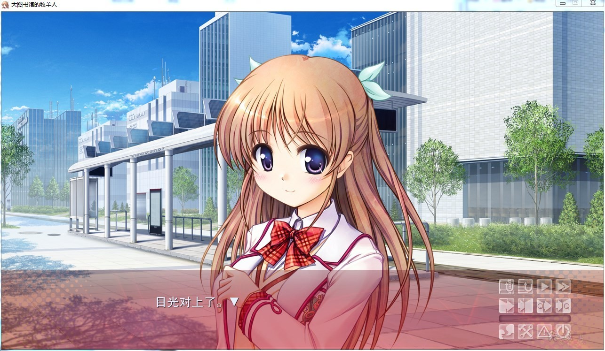
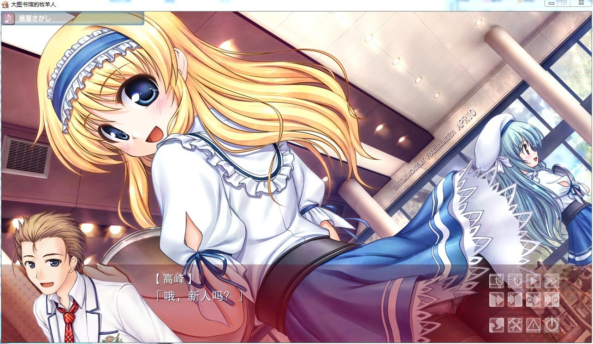
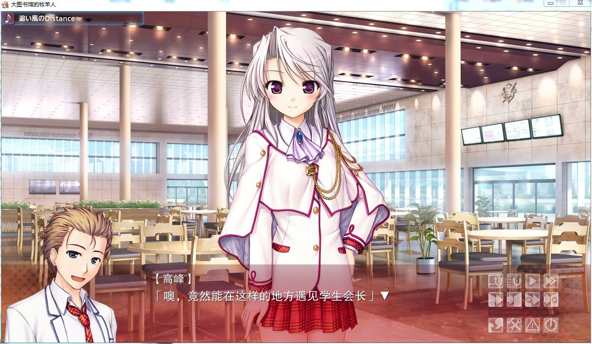
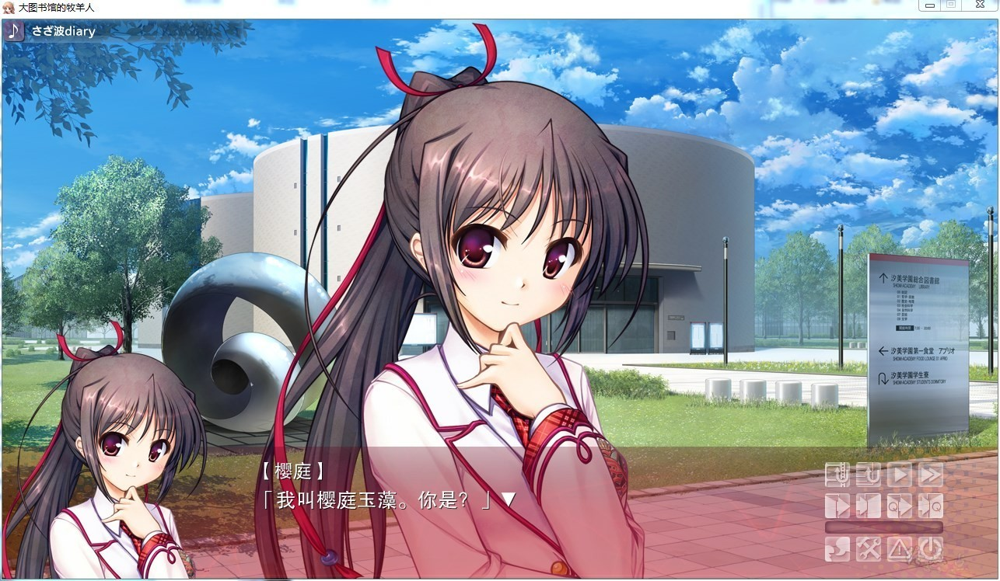
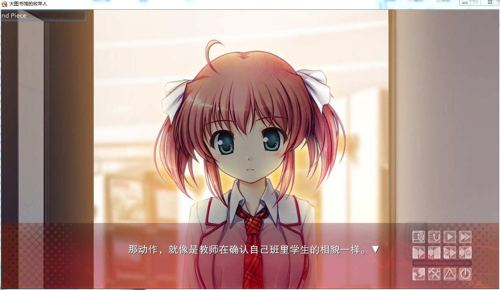
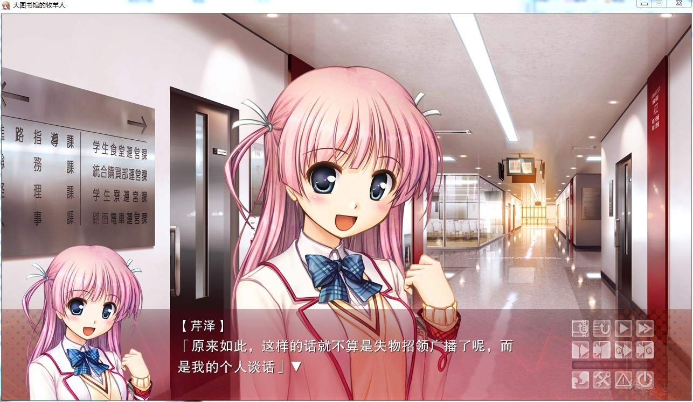
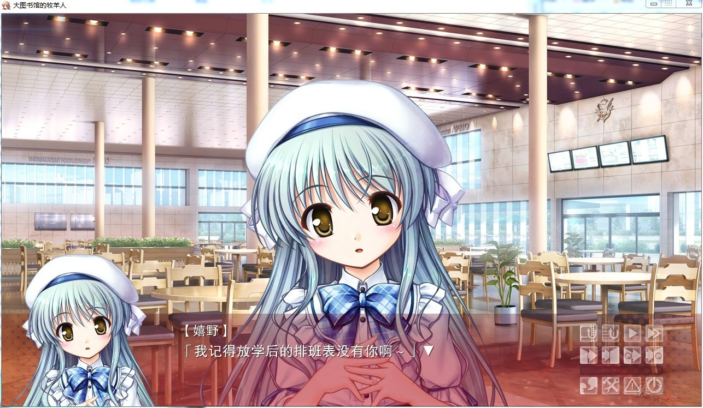

# 游戏简介

乘坐从大城市出发的低速直达电车。

在被海风浸染的绿色平原上，有一座城市。其核心是，私立汐美学园。不只是学习成绩优秀的人，只要在某一个方面有一技之长的人都能被聚集到学园来。如明星般闪耀的人才，大概有五万左右。带着自由与希望，学生们今天也是昂首阔步。

在这块广大学园中矗立着的、被称为“睿智之城”的图书馆的最深处。理应被寂静所支配的阅览室，却有人的声音传出。占据了这间部室的是6名学生。前几天，还没有过任何交集的他们，不知为什么聚集在了这里。这其中的理由，还没有人知道。在这笑容之中的故事，正在被他们一页一页地翻开...

杏子御津爱护同好会的汉化作品

[汉化原帖](https://bbs.sumisora.net/read.php?tid=11045568)

**请使用[IDM](https://www.123pan.com/s/jJprVv-3tMsH)进行下载，使用最新版[winrar](https://www.123pan.com/s/jJprVv-dtMsH)进行解压（非常重要）。**

**解压密码为终点（简体汉字）。**

**添加10%恢复记录，防止网盘抽风损坏。**

