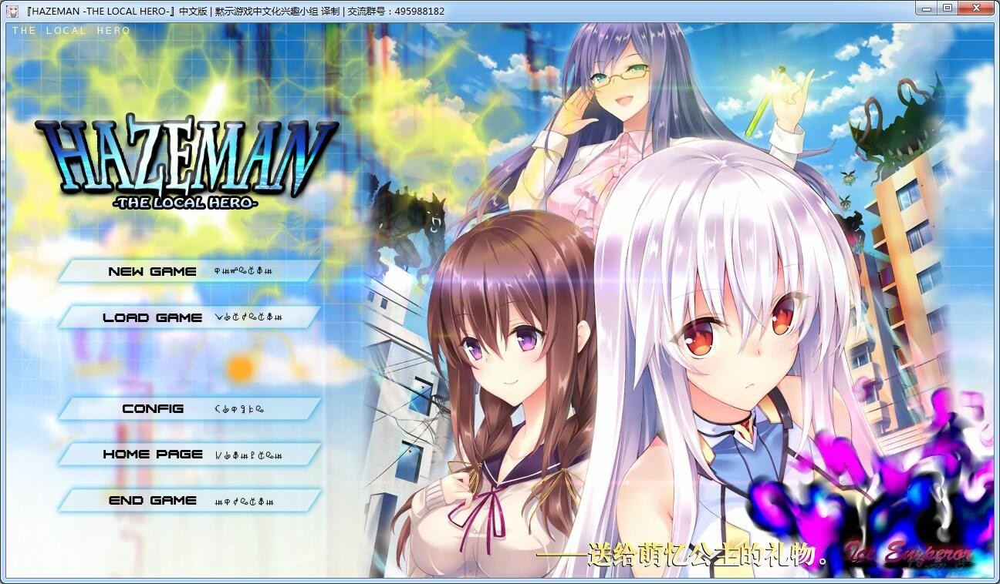
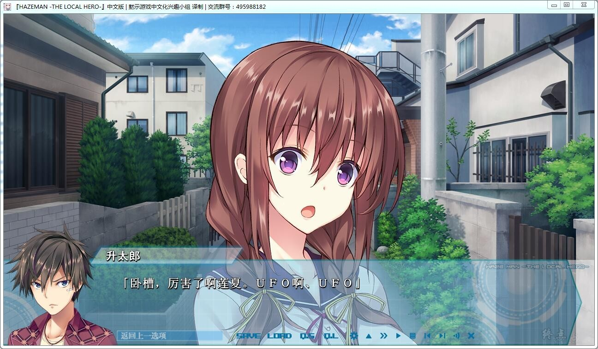
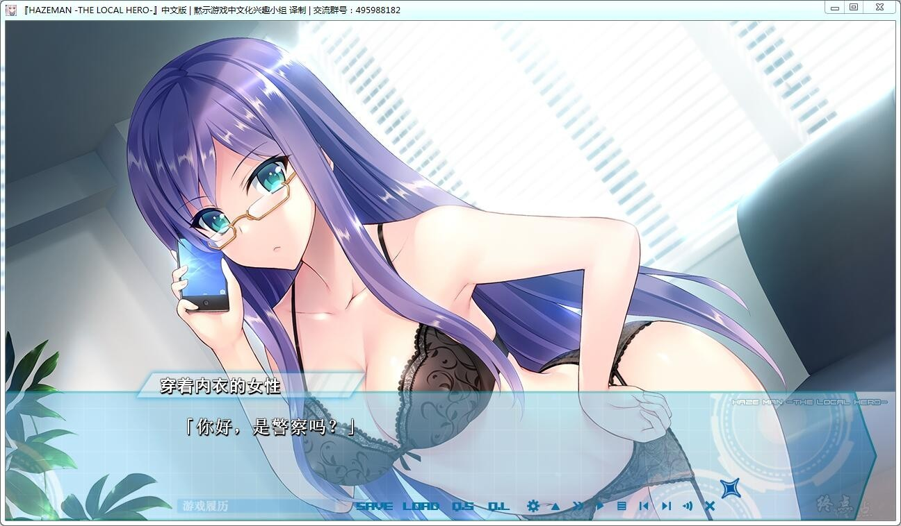
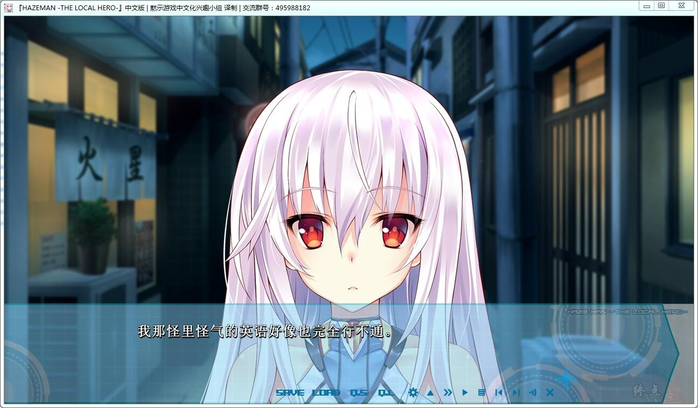
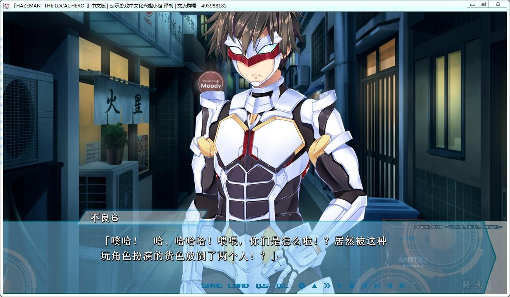

# 游戏简介

同时兼顾着数份打工，每日为了勉强维持三餐而奔波劳碌的男人・大地升太郎。

虽身怀高深格斗技术却无法在工作上大展拳脚，

每天只是一边守望着自己的幼驯染宫寺莲夏，一边谨慎度日。

原以为会一成不变的日常……

然而在某天，一个巨大的转机造访了他。

与地球外的知性生命体的首次见面——

因在小混混的刀下挺身保护了、自称是来自佩雷鲁（ペレル）星球的法菈＝佩雷鲁莉兹，

升太郎的人生发生了天翻地覆的变化。

她有着一种称为“Muudo（ムウド）”的合体能力。

合体对象除了身体能力会飞跃般地提升、获得绝大的力量以外，

法菈还会变形为铠甲、来守护升太郎的身体……

获得了看似在日常生活中完全没必要的能力的升太郎，

却在接下来和同样自称是来自佩雷鲁星球的、法菈的同胞・吉鲁＝佩雷鲁莉兹形成了对立关系。

吉鲁所带来的怪人们每日都和升太郎一行上演着夸张华丽的战斗行为。

同时在佩雷鲁压倒性的技术力下，如此巨大的骚动却只有他们所住的上沢商店街的人们才能认知。

此外，在升太郎所属的会社的社长・三日月透子的手腕下，

这种战斗行为渐渐地作为一种英雄秀、被当作了本镇的一大节目来宣传。

升太郎和法菈的英雄名该叫什么？必杀技的名字呢？和吉鲁的战斗的结局则是？

以及最重要的是，作为节目的效果又会如何呢！？

黙示汉化组的汉化作品，更新了完整汉化，详情请看汉化原帖

[汉化原帖](https://tieba.baidu.com/p/5838360442)

**请使用[IDM](https://www.123pan.com/s/jJprVv-3tMsH)进行下载，使用最新版[winrar](https://www.123pan.com/s/jJprVv-dtMsH)进行解压（非常重要）。**

**解压密码为终点（简体汉字）。**

**添加10%恢复记录，防止网盘抽风损坏。**

