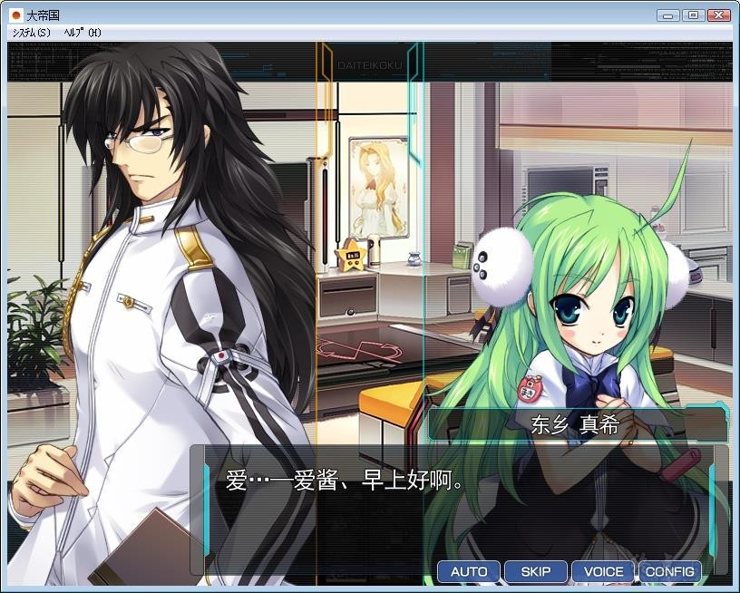

# 游戏简介

*（来自2DFan）*

第二次宇宙大战 开幕----

万众期待的Alicesoft名作[大]系列第三弹！

随着『大悪司』、『大番長－Big Bang Age－』的舞台不断扩大，现在居然实现了进军宇宙的大跃进！

似乎在某个地方发生过的 宇宙银河被各国的企图卷起层层漩涡，宇宙战舰和怪兽大乱斗的异常残酷的宇宙大战揭开了序幕！

玩家在系列作中所熟悉的地域压制型SLG系统得到了改进，玩家可以充分享受到高自由度且更残酷的战斗所带来的乐趣！

更为壮阔的故事情节，以及在个性鲜明的角色的交涉中加入H元素，即便是海外玩家和非alicesoft的fans都不能转移视线的杰作！

# 故事介绍

统一宇宙历0年以前，人类在广阔的宇宙中的一部分星域建立了各自的独立国家。

通常航行到其他星域需要数百年以上时间、和其他国家的接触事实上是不可能的。

统一宇宙历0年エイリス帝国对[星域内存在的奇异空间]的研究取得了进展，利用该空间可以一瞬间就移动到其他星域。

被命名为ワープゲート的空间将至今为止各自被孤立的众多星域连接了起来。

这也被称为大航海时代的开始。

将数个星域作为领土被建立起国家的人类重复着侵略和征服、臣服与灭亡、星域网络图——也就是世界地图被重复划分着势力范围。

然后、统一宇宙历939年。

三个大国的首脑为了各自的理由而渴求战争、为开战做着准备。

世界最大的国家・エイリス帝国议会通过了由エイリス帝国来镇压混乱的世界并予以统治的世界管理计划。

世界最古老的国家・日本帝国由于和中帝国之间旷日持久的战争而使国力空虚、逐渐成为了大国眼中的一块肥肉。

席卷整个世界的战火点亮了整个宇宙。

大帝国吧汉化组 × KingCore汉化组 联合出品

[**汉化原帖**](https://tieba.baidu.com/p/5638554429)

**好多人反馈说太难不会玩，我找了个 大帝国红本攻略 和 全CG全回想全成就汉化版存档，**
**打包把游戏重压了一遍，有需要的自取。**

**请使用[IDM](https://www.123pan.com/s/jJprVv-3tMsH)进行下载，使用最新版[winrar](https://www.123pan.com/s/jJprVv-dtMsH)进行解压（非常重要）。**

**解压密码为终点（简体汉字）。**

**添加10%恢复记录，防止网盘抽风损坏。**

