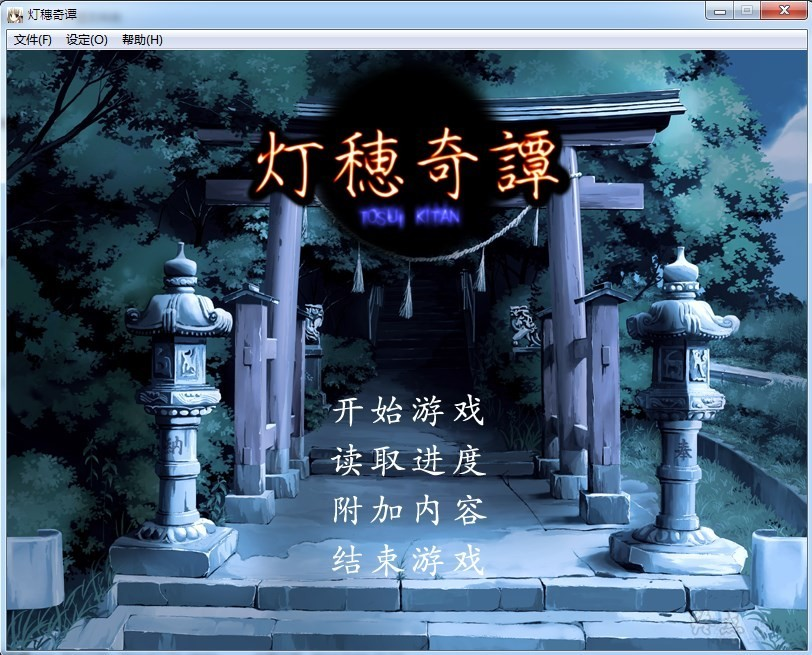
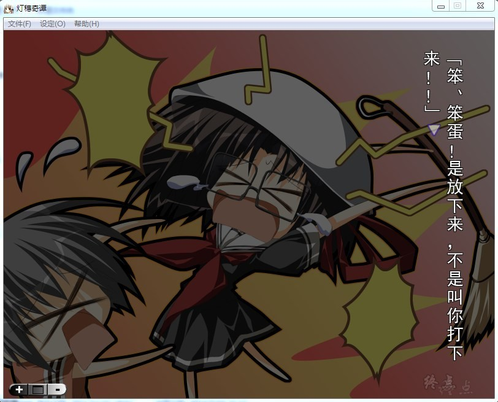
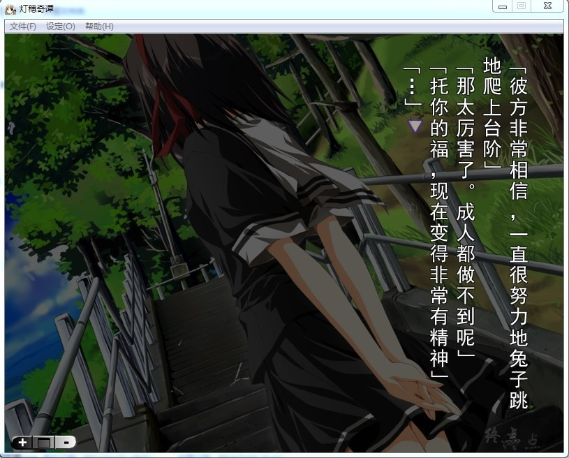
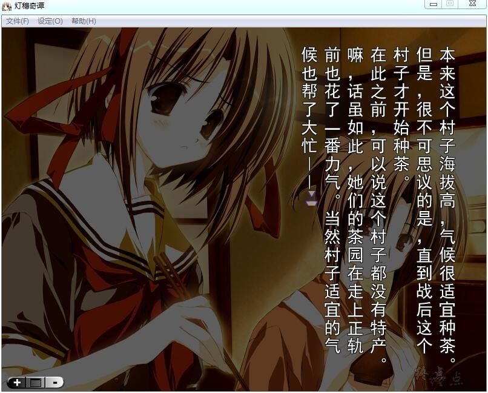
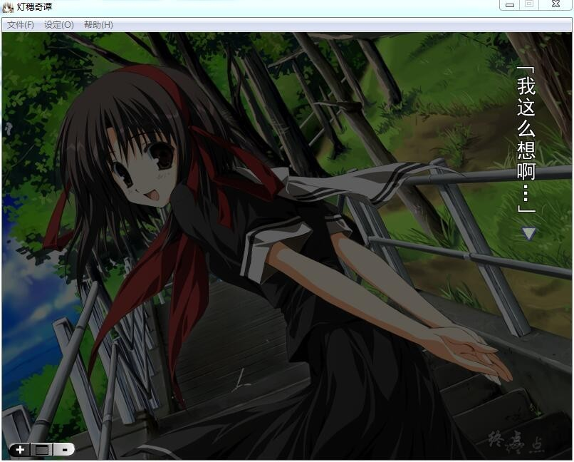
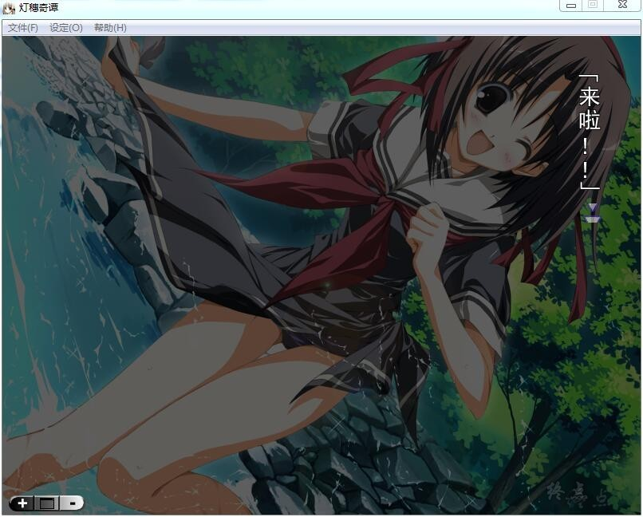
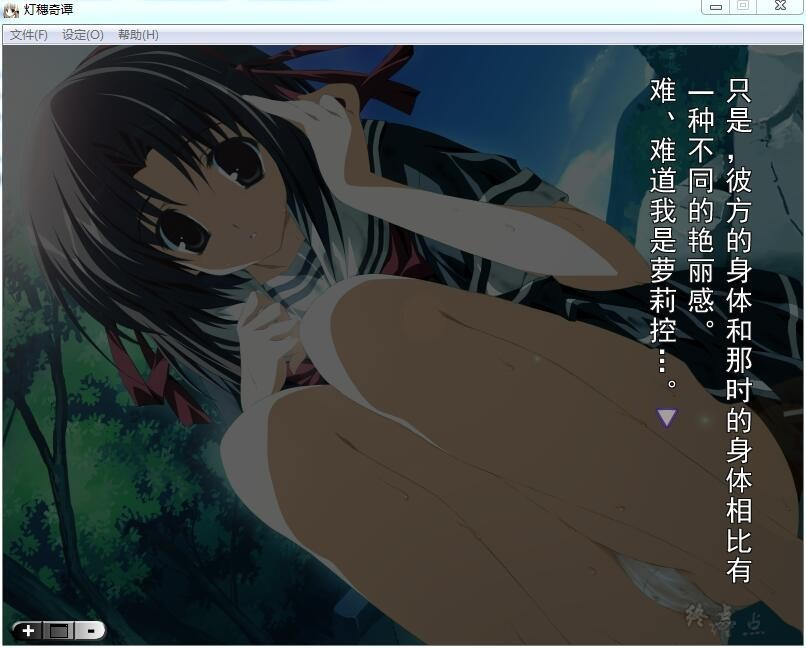
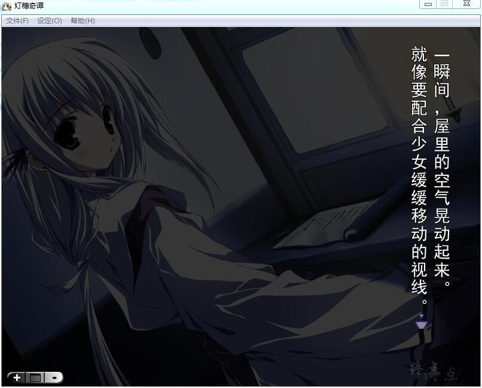

# **游戏简介**

　　联系着久远日子的夏季的体温。

　　灯火在招摇着，向着虚幻与现实的缝隙。

　　搬家后久别十年，主人公永井桐人回到了自己出生成长的山村。

　　目的是把村子留下来的家完全拆除。与成长了的青梅竹马加茂彼方相遇，久违地将身心浸透于乡下的悠闲生活，在城市生活中日渐疲劳的心仿佛被浸润了似的变得安定。

　　然而，夜间，偶然看到两只萤火虫，无意中追随其而去的桐人，被引导至了村子供奉的神社。

　　在那里感受到的是年少时连微尘都感受不到的深沉的黑暗。

　　从那天起，乡下见惯的景色完全改变了。深渊中渗出的污浊空气慢慢侵蚀着桐人的心灵。他的心灵逐渐被虚妄支配，为了维持自身需要时间与内心斗争。

　　在那其中--本应无人的神社--与一名少女相遇。

　　在那一瞬间，已经熟识的世界出现了巨大的龟裂。

　　他将被埋藏在村子里的禁忌吞噬。

　　村里遗留的迷之风俗。

　　“夜里不能发出大的声音”

　　“夜里不能与人争斗”

　　“在没有月亮的夜里，女性不能在人前现身”

　　姓氏全部相同的村民。

　　在神社中被供奉的“祠大人”

　　夏日阳光的背后，连月光都无法到达的世界。

　　映照在那眼中的无数的灯火，指引向何处，又在诉说着什么--。

**请使用[IDM](https://www.123pan.com/s/jJprVv-3tMsH)进行下载，使用最新版[winrar](https://www.123pan.com/s/jJprVv-dtMsH)进行解压（非常重要）。**

**解压密码为终点（简体汉字）。**

**添加10%恢复记录，防止网盘抽风损坏。**