# 汉化版

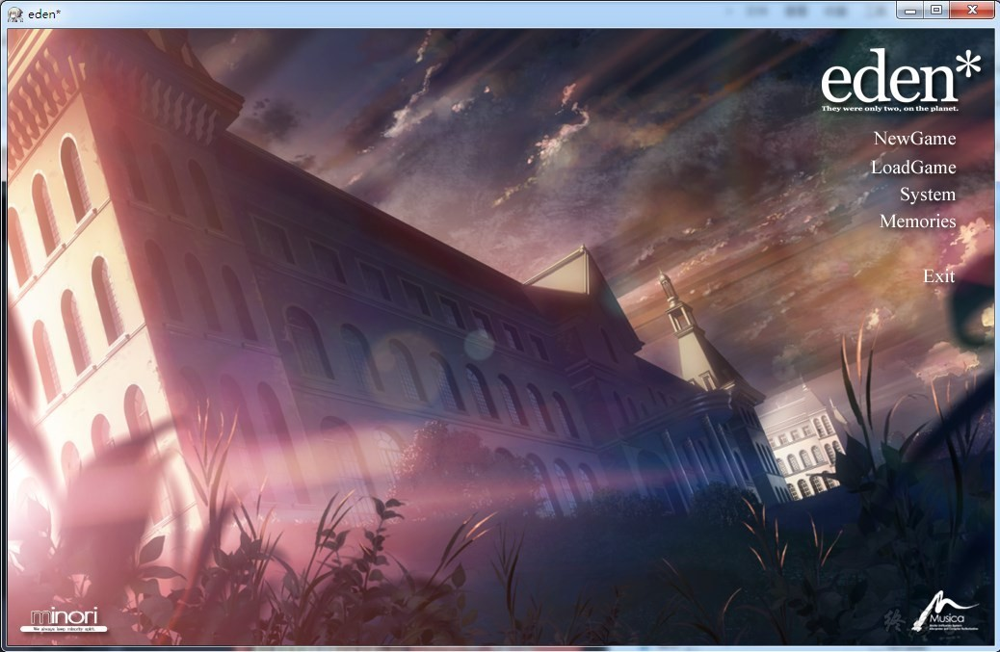

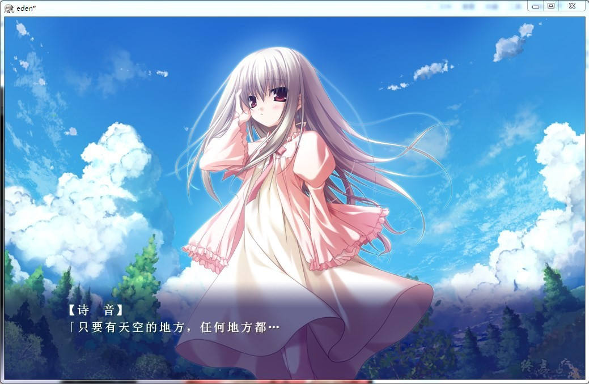

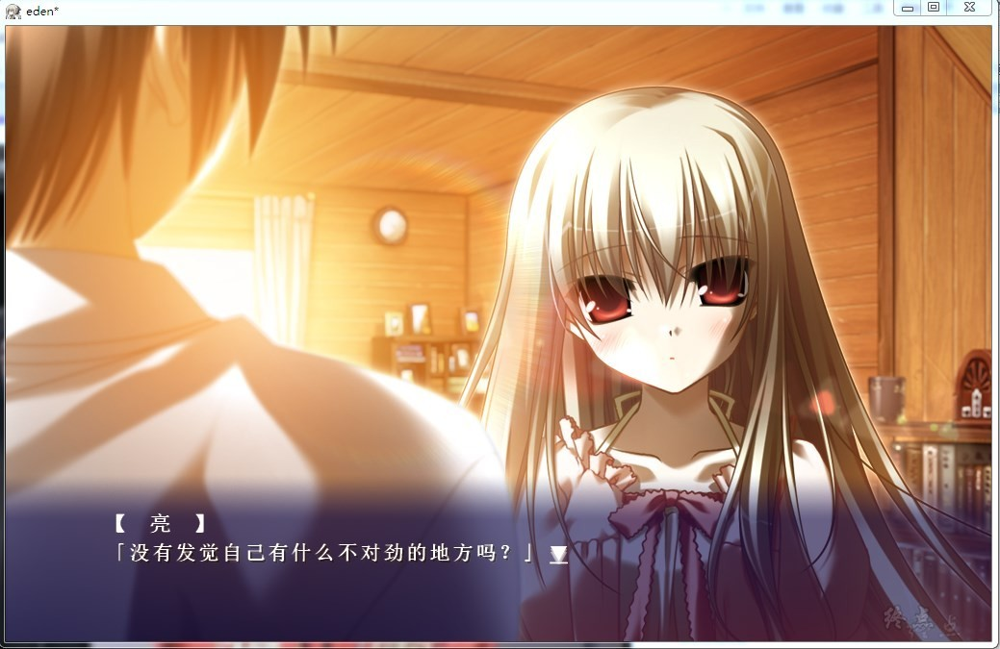

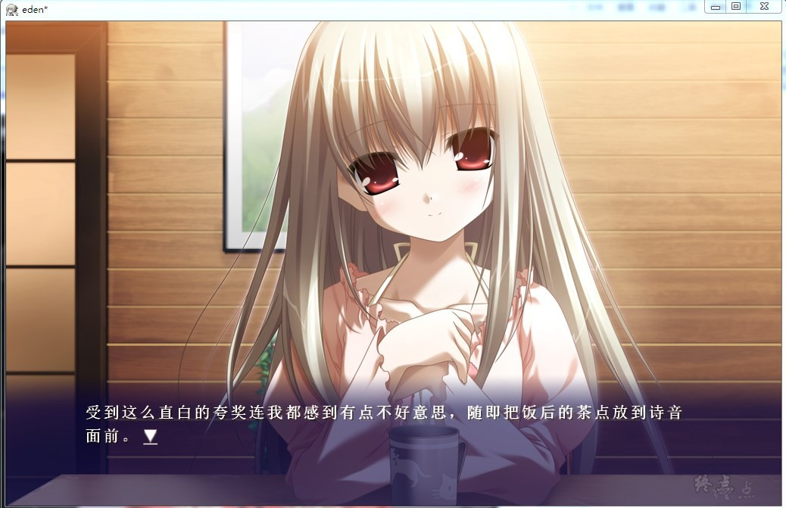

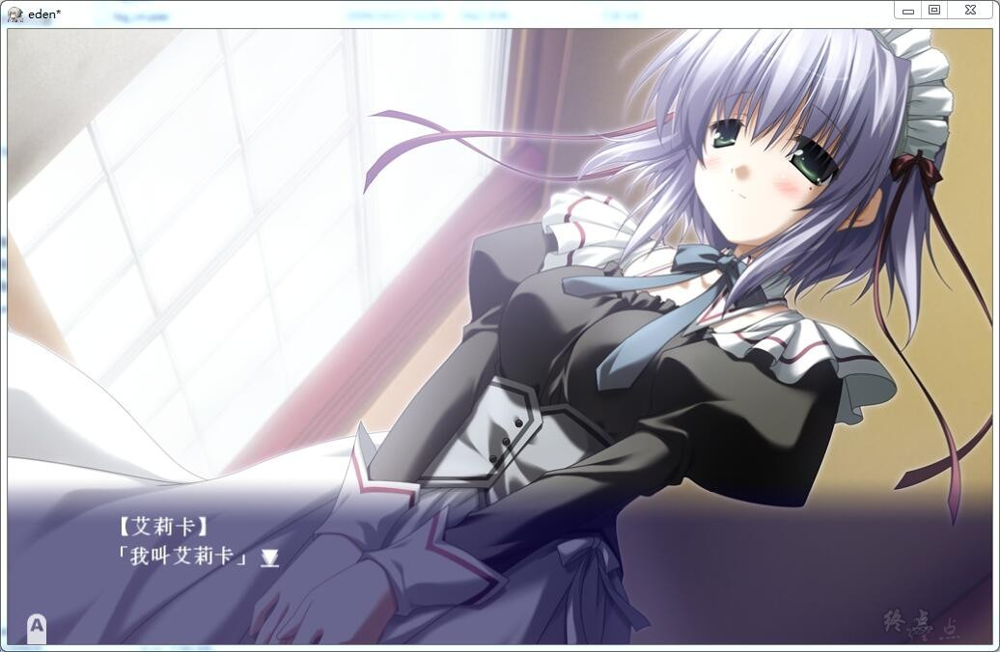

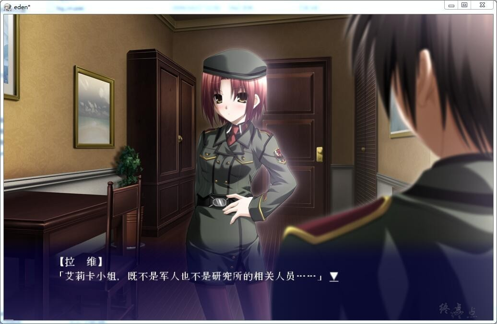

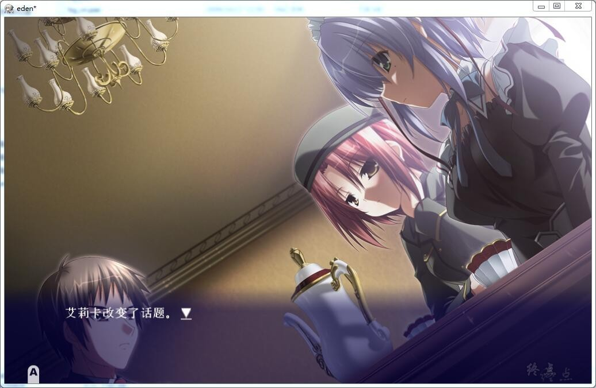

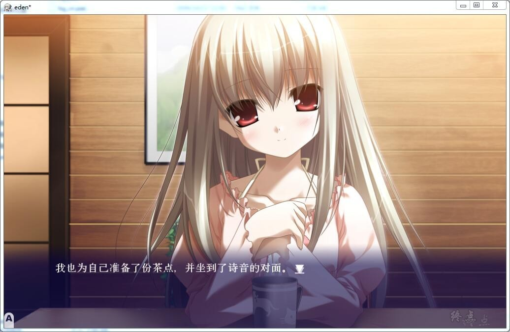

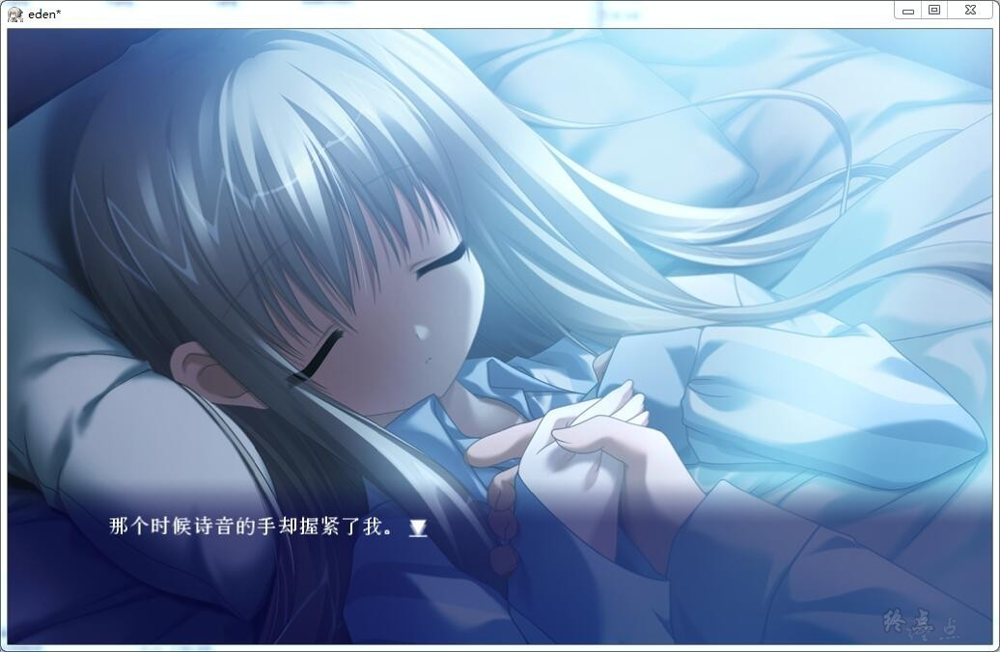

# 官方中文

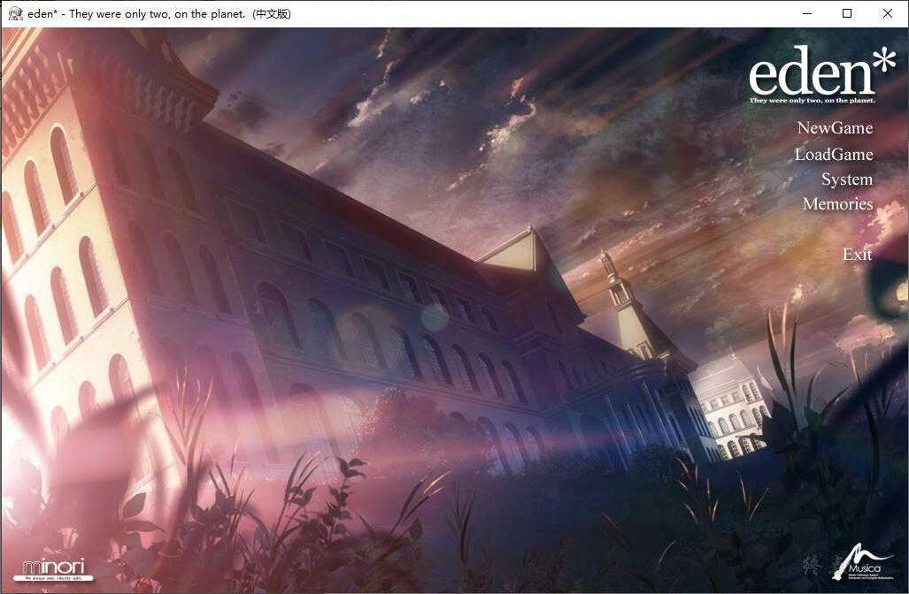

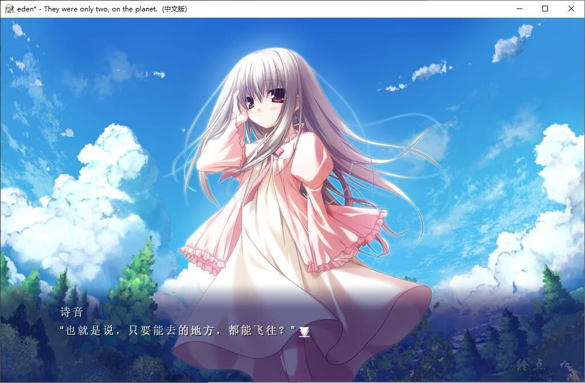

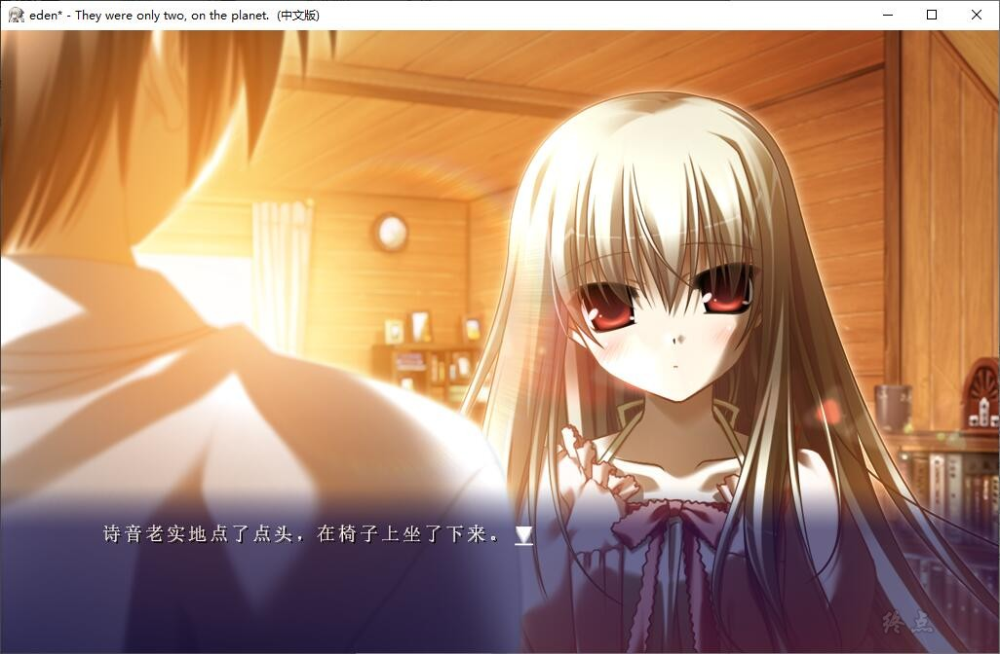

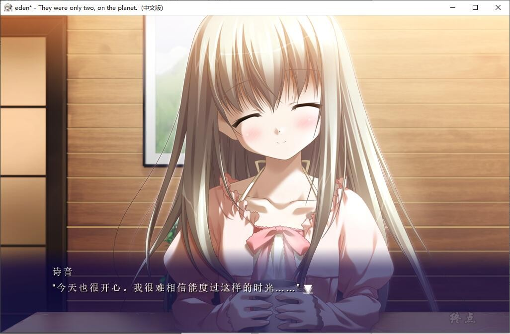

# 游戏简介

——Eden* They were only two,on the planet——那是地球最后的恋爱故事。

遥远未来的故事。

突然出现在火星附近的被后世称为「破灭之星」的巨大的能量堆积体。

在能量堆积体的影响下，地球开始发生气候异常和地壳变动。

以此为契机各地勃发战争与恐怖主义行为，世界受到了破灭性的打击。

地球逐渐荒芜，距离灭亡的时间甚至不足百年。

为了避免死亡，各国政要提出：

将实施两个计划来挽救人类。

第一，建立“地球统一政府”。

第二，实施“Felix计划”。

他们以完成地球脱出为最优先目标，打出了牺牲小我完成大我的方针。

强制性整顿人才。以军事镇压妨碍世界政府设立的国家与团体。

此外，以压倒性的武力镇压由于人种、宗教、食物、能源产生的所有问题。

他们通过制造出能使计划的实现成为可能的超人类解决了本不可能在一百年内实现的这个计划――实施了基因改良、获得了高超智能与几乎长生不老的肉体的新人类「Felix」。

其后99年的时光流逝——

有一个作为地球脱出计划的中心成员活跃的Felix的少女。

将作为人类的一切献给了研究，结束了工作的她留在空无一人的地球，渴望着平稳地度过余生。

然后，还有一个统一军派遣到她身边的青年。

他的工作是守护少女，以及，拘束她的自由。

故事开始于2人的邂逅。

燃尽了一切的星球与少女之间的小小的故事。

---

## 游戏版本说明

游戏有三个版本，原版，mini高质量，mini版，

原版需要点击eden_Launcher.exe运行游戏，不兼容PM补丁

mini高质量版，点击eden_cn.exe运行游戏，兼容PM补丁，原版画质

mini版，点击eden_cn.exe运行游戏，兼容PM补丁，压缩画质，音质，体积较小

---

2022-10-14 更新 官方中文，DLC为单独文件夹eden PLUS MOSAIC（R18未官中化）

2023-5-26 更新 DLC官方中文，DLC为单独文件夹eden PLUS MOSAIC（R18官中汉化）

**请使用[IDM](https://www.123pan.com/s/jJprVv-3tMsH)进行下载，使用最新版[winrar](https://www.123pan.com/s/jJprVv-dtMsH)进行解压（非常重要）。**

**解压密码为终点（简体汉字）。**

**添加10%恢复记录，防止网盘抽风损坏。**

