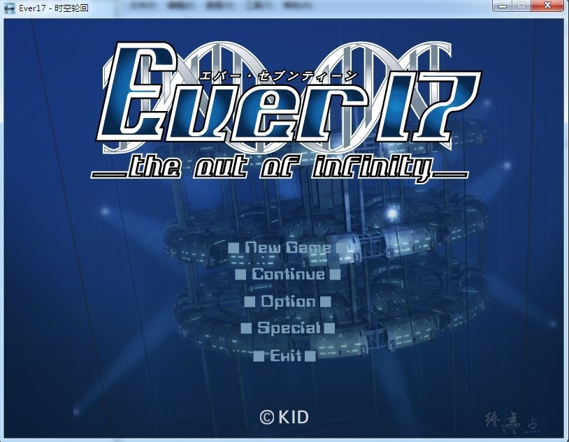
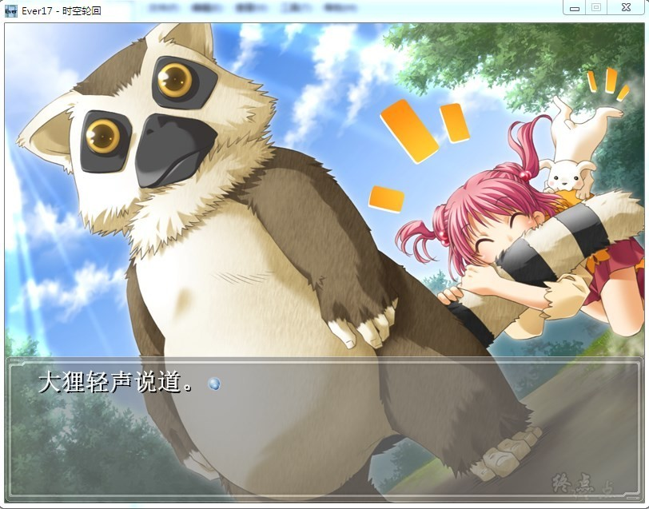
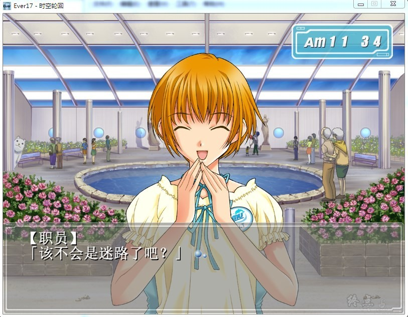
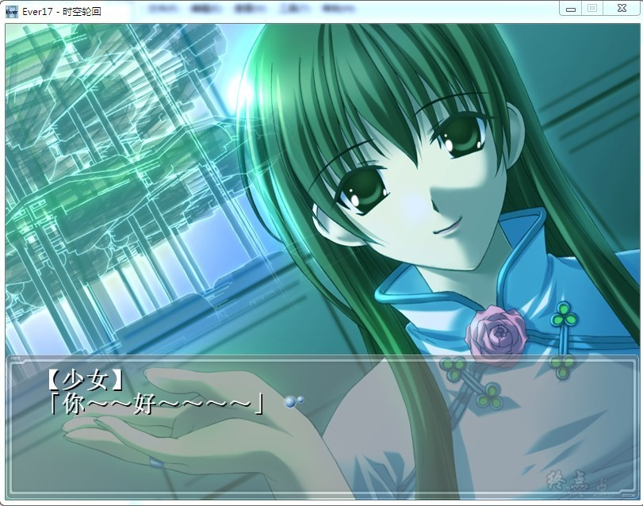

# 游戏简介

公元2017年5月1日，12点51分。

浮在水下51米深的海洋游乐园“LeMU”中。

7名男女突然被封闭在其中。

食物、水、氧气，在逐渐地减少。

生活在深海中的神秘的病毒Tief blau，在贪婪地窥视。

LeMU的壁墙被深海的水无情地挤压。

看起来是支撑不了几日的样子了。

厚厚的玻璃窗外，是深邃的黑暗……

在封闭的空间，有限的时间内

7个人不断地寻找着出路。

他们相互帮助，相互鼓励。

克服不断出现的各种危机，之间的情谊也不断加固。

不知道这应该是爱情还是友情。

然而，在感情不断加深的同时，死的期限也在不断逼近。

事件的全貌在逐渐地被揭开。

在无数多个的可能性中。一点一点地被揭开。

所有的事实，都在向着一个方向聚集。

对生的渴望……对死的恐惧……

无法想象的绝境中，等待着的到底是一个什么样的结局？

在这里又能够获取什么呢？

失去的将会是什么？

在睁开的双瞳中——

最后，到底一直在看着的，是什么？

**请使用[IDM](https://www.123pan.com/s/jJprVv-3tMsH)进行下载，使用最新版[winrar](https://www.123pan.com/s/jJprVv-dtMsH)进行解压（非常重要）。**

**解压密码为终点（简体汉字）。**

**添加10%恢复记录，防止网盘抽风损坏。**

