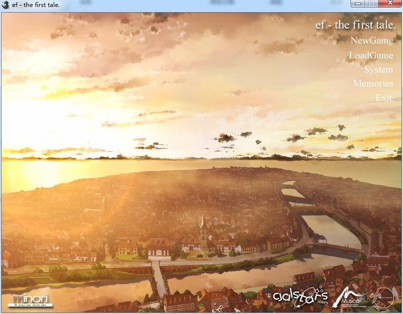
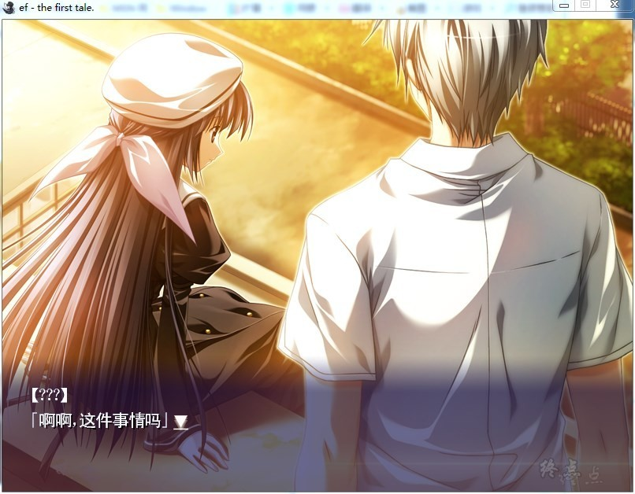
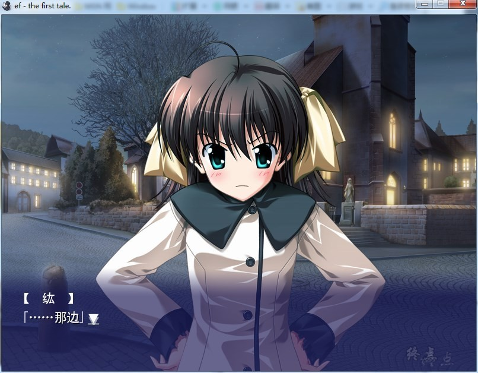
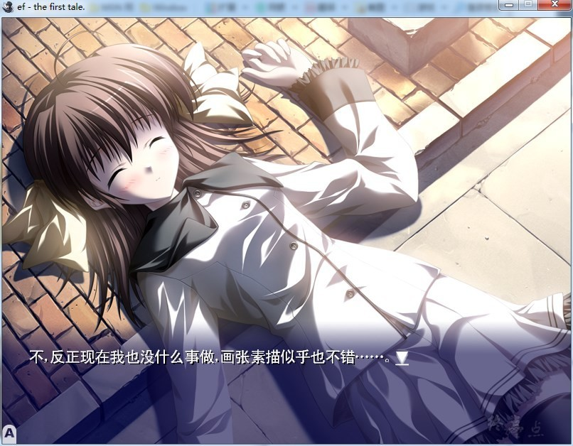
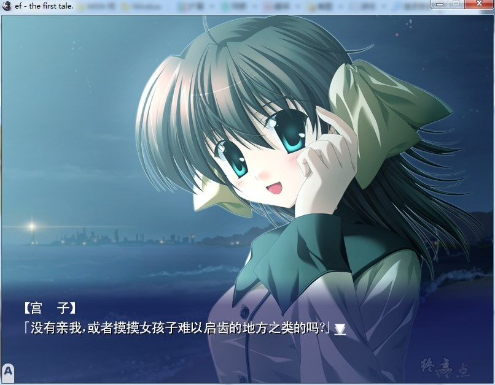
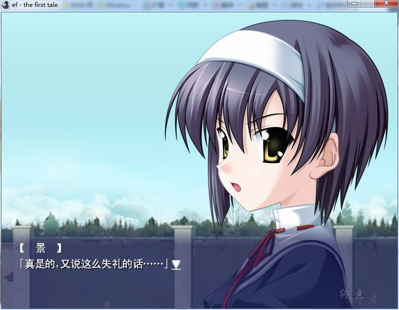
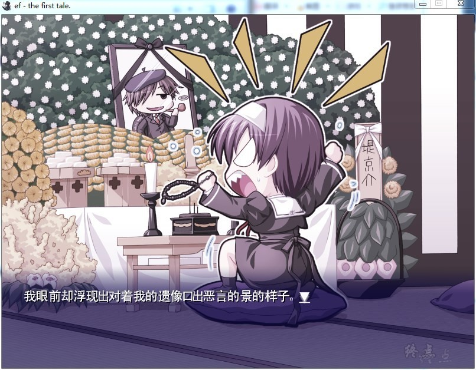

# 游戏简介

从前，有一个古老的城市名叫音羽。音羽，诗一般的名字，恰到好处地描绘了ef的整个故事内涵。

音乐，羽毛。美丽的城市，无尽的乐趣。在这座童话般美丽的城市中，发生着一个个传说。曾经发生过一场强烈的地震，一对对恋人被迫分离。

通过目前为止的美少女游戏所没有的全新演出而引起话题的游戏，『はるのあしおと（春天的足音）』的公司minori继该作之后的交互式小说最新作。

『ef - a fairy tale of the two.』――这个故事讲述的是，两个篇章。既是学生又是画家的青年広野紘和在偶然的机会下彼此相遇的女孩宮村みやこ，以及紘的青梅竹马景和紘的死党京介，把描述穿插在他们之间的“成长”的故事定义为标题“ef”，此为第一部。

接着场景转为双胞胎的妹妹千尋、不擅长与人交往的青年蓮治、职业小提琴手久瀬等人彼此之间的接触，以及与全篇相关的ミズキ、火村、優子等人物穿插于故事中，将这所有的一切汇为一个故事描述，此为第二部。

所谓『ef - the first tale』，便是相当于收录第一部的前篇。

## **注意杀毒拦截，点击ef_first_cn.exe，运行汉化游戏**

**请使用[IDM](https://www.123pan.com/s/jJprVv-3tMsH)进行下载，使用最新版[winrar](https://www.123pan.com/s/jJprVv-dtMsH)进行解压（非常重要）。**

**解压密码为终点（简体汉字）。**

**添加10%恢复记录，防止网盘抽风损坏。**

