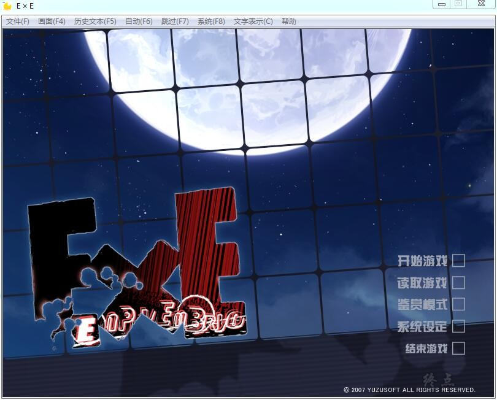
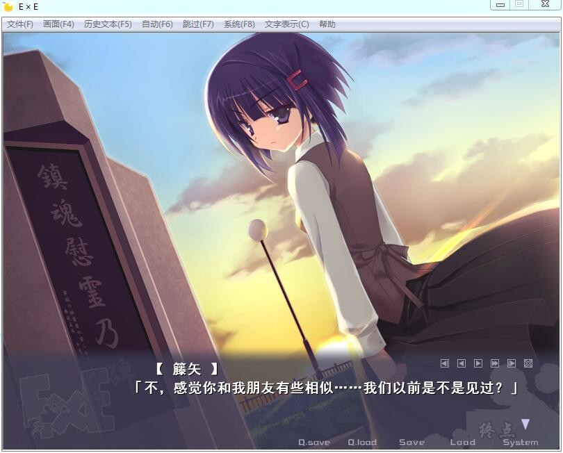
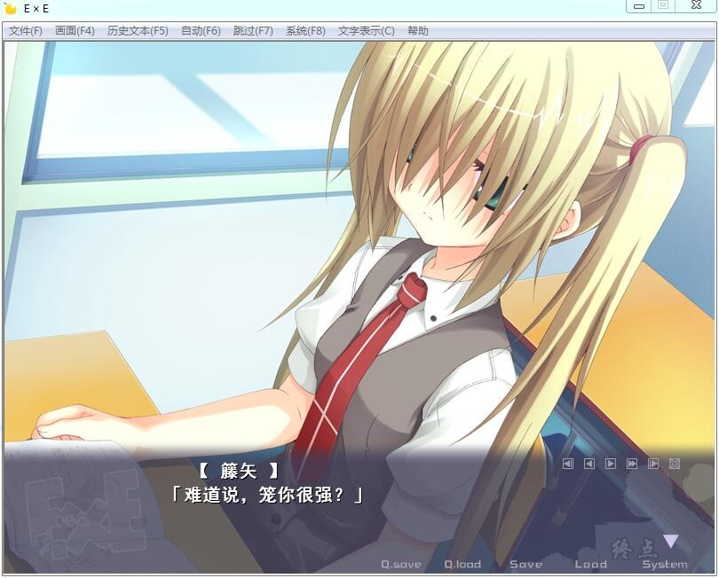
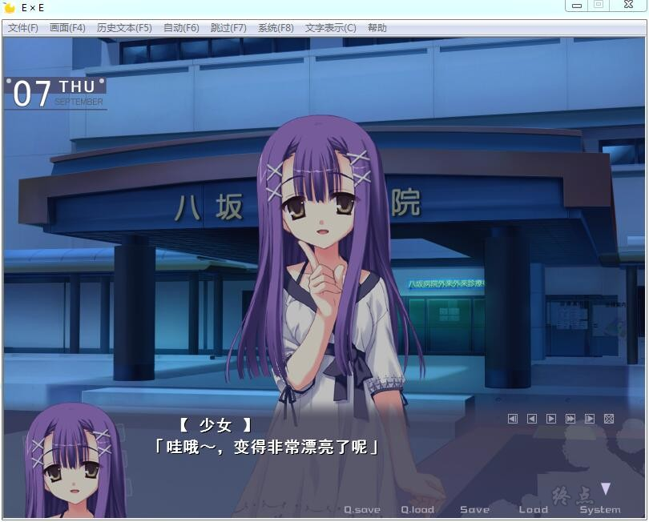
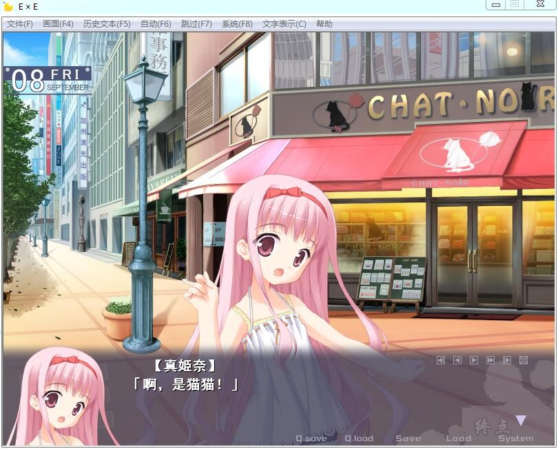
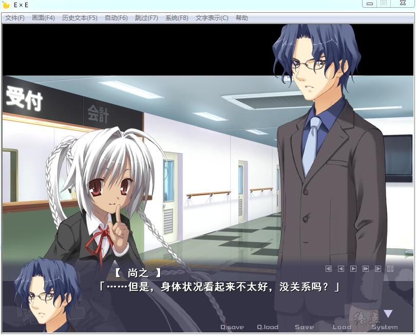
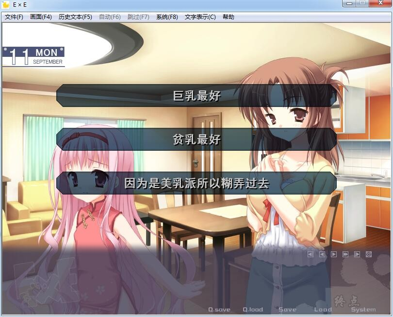
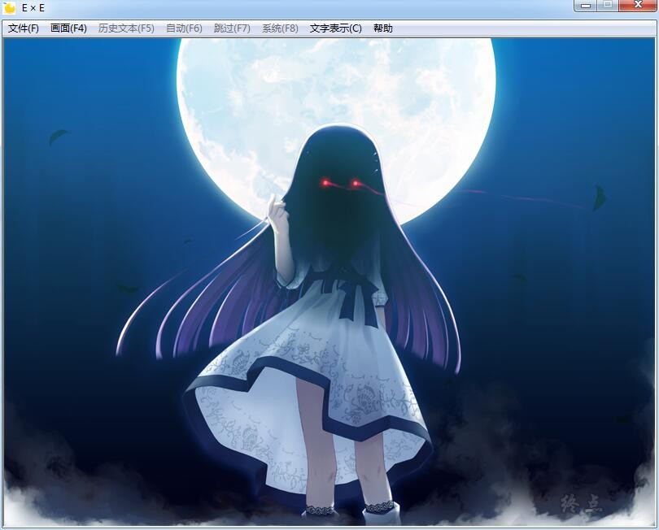

# 游戏简介

可是，他的心至今仍被深深地刻上了失去了母亲的那场事故的回忆。
燃烧得旺盛的火焰，什么都不能做的还是孩子的自己，和失去了母亲的这样的过去。

一边怀抱着那样的悲伤，一边与妹妹真姫奈和像姐姐一样的白峰沙耶快乐地生活着。

那样的某日——

一如往常的籐矢看见了一个曾经见过其面容的女性。

那怎么看都是除了伏見鈴乃以外就没见过的女性。

籐矢无论如何也在意着那个女性的事，追赶着那个身姿。

而且，见到了面的女性，没错，是自己的母亲。

与那个母亲对话着的籐矢，在哪里感觉到了不协调感。

对那样的籐矢，鈴乃边笑边袭击而来。

被自己的母亲突然袭击，无法反抗，生命岌岌可危。

突然出现在那里的拿着日本刀的女性救了籐矢一命。

应该死了的母亲活着的理由，目的和那个行动。

而且，与母亲有关联的所说的研究……

全部都不知道且困惑的同时，在籐矢的胸中某种心情正在沸腾。

如果妈妈活着……要是现在还……

——与怀抱着的悲伤和过去对峙的伏見籐矢，为了寻求真实而迈出了脚步。

织部学园同好会的汉化作品，注意杀毒会拦截汉化，

而且补丁不兼容XP，兼容win7和win10 但是听说不兼容win10 64位，还有待研究

详情请看汉化原帖

吐槽一句，最后那个图，和KEY社的一部作品CG很像呀

[汉化原帖](https://tieba.baidu.com/p/5057697968)

**请使用[IDM](https://www.123pan.com/s/jJprVv-3tMsH)进行下载，使用最新版[winrar](https://www.123pan.com/s/jJprVv-dtMsH)进行解压（非常重要）。**

**解压密码为终点（简体汉字）。**

**添加10%恢复记录，防止网盘抽风损坏。**

