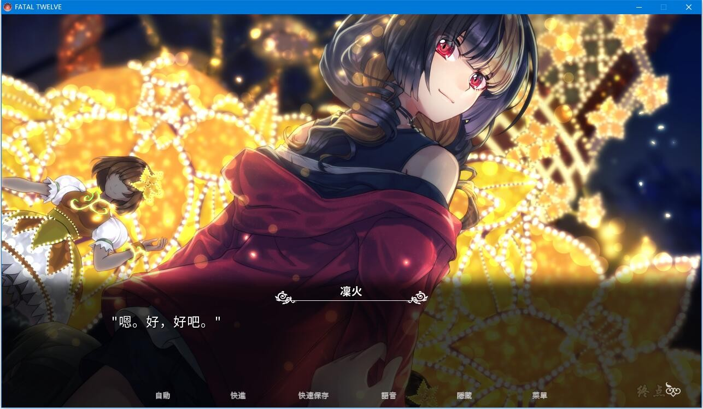

《FATAL TWELVE》是一部充满谋杀和悬疑情节的作品。在游戏中，一共有12个职业和性别不同的人，他们都设定即将死去。他们都在一个名为“女神的选择”的仪式中挣扎，不过只有一个人能够逃离既定的死亡命运。

# 游戏推荐介绍

*来自[百度贴吧](https://tieba.baidu.com/p/5639554327)*

Fatal Twelve是steam上新出（3.30）的含百合的视觉小说。我觉得这游戏素质挺好的。抛开百合部分，角色的背景故事和发展还有剧情都挺不错的。游戏时间也在20+小时以上（我收齐全结局花了23小时）。目前只有日文和英文，将来会有中文补丁。英文老实说个人不是很推荐，跟日文对不上号的地方也有。特别是人物称呼的翻译真的很让我抓狂。能读日文当然还是建议玩日文版（现在想玩的话）。

简单来说这个是生存类型的游戏。主角狮子舞凛火在和后辈日辻直未去自家开的咖啡馆的路上在电车里遇到kb袭击，为了保护后辈直未而死。本来应该死去的她却被卷入一个叫“女神的选定”的仪式。凛火在梦中世界被女神告知，因她和另外十一个人很巧的在同一时间死亡，她得到一次能重生的机会----如果能在每周举行一次，总共十二周的选定内抹消另外十一人的存在的话。更巧的是，有一个参与者是她的朋友未岛海晴。海晴在醒来后的世界里告诉凛火，她愿意为了她死。凛火为自己到底该怎么做而感到迷茫...差不多就是这样的开端。

设定上参与者每个人都有三张代表自身的过去，现在，未来的卡片，分别对应自己的名字，死因和迷恋。除此之外最开始还有被随机分配到的三张别人的卡。只要收集到某一个参与者的名字，死因和迷恋，并且在梦中世界选择她/他，就能让她/他的命运回归到原本的样子（死）。仔细说起来太麻烦了，还请各位在游戏里体验。并不会有让玩家自己选择消灭哪个参与者的情况，所以不理解规则也不要紧吧。

来说百合的话题吧。如果前面说的还不够明显，未岛海晴爱着狮子舞凛火。也就只有凛火本人并不知道这点，所以我还以为这是那种“女二默默喜欢女主为女主奉献，女主一直当她是亲友”这种的游戏。没想到海晴在游戏某一结点跟凛火正式告白了。真是让人心跳加速的真挚告白啊，有种千歌音告白的感觉。

往后女主给的答复关系到游戏分支，还是先不说吧。游戏一共七个结局，就我个人感觉只有真结局比较愉快一点（姑且算是进入恋人关系）。其他结局大多也都各有各的滋味就是了，个人推荐收集全部结局。

我觉得这游戏很尊的地方是告白的结果在真结局里不是由玩家来选择而是凛火自身的选择这点。

虽然还想说很多关于角色和人物关系发展的话，特别是海晴这个角色和她跟凛火的后辈直未之间的纠葛，很有意思。在因嫉妒直未跟凛火走的很近而隐藏不住自己妒火同时，海晴并不会否认她对凛火的重要性和她自身的能力。但是我很懒就不说太多了。

总之大家要是能抽出时间和钱，就来玩这部作品吧。作为为数不多的百合不是主线但是是很重要的一部分，并没有故意“捉弄”玩家搞成似亲友似百合的情节。除了退场早的角色，大多角色不管所谓善恶都有闪光点，没有把角色纯粹分成正义或者的情况。剧情上好像也没有什么大Bug，让人紧张期待的地方也有（我觉得）。不冲着百合部分的玩家也可以享受吧。前期主角的样子可能有点让人恼火，但是从她发现自己的迷恋以及从海晴的告白中获得勇气后，她的举动确实不愧对自己“狮子舞凛火”的名字。

终点论坛自购，转载自终点论坛

如有能力，还请支持正版

[steam地址](https://store.steampowered.com/app/620210/Fatal_Twelve/)

**2020-4-4 更新游戏版本，添加切换语言功能，在设置里切换语言**

**请使用[IDM](https://www.123pan.com/s/jJprVv-3tMsH)进行下载，使用最新版[winrar](https://www.123pan.com/s/jJprVv-dtMsH)进行解压（非常重要）。**

**解压密码为终点（简体汉字）。**

**添加10%恢复记录，防止网盘抽风损坏。**

