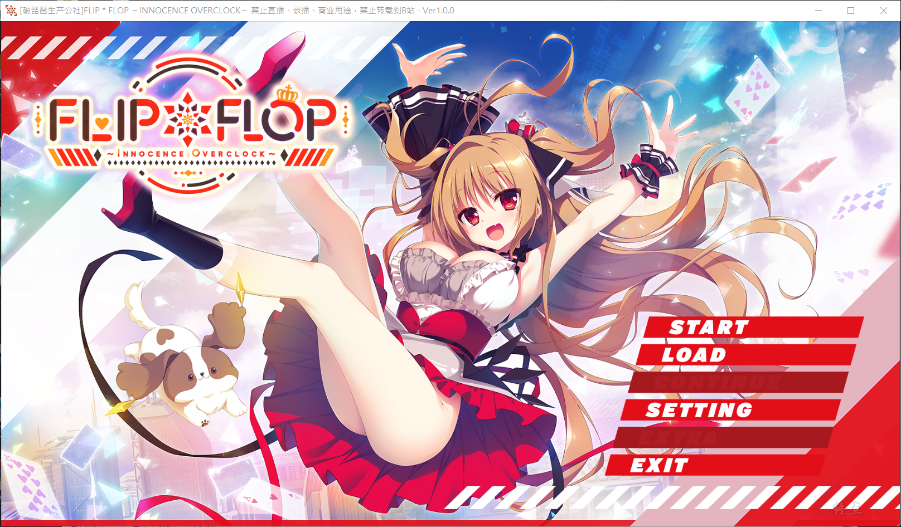

# 故事简介

能触碰到你――居然是这么温暖、令人喜悦的事情呢。

这是一个全息个人AI助理『Tink』像现在智能手机一样普及的年代。

在这个时代、年轻人还是一如既往的讴歌着青春――

从乡下搬到大城市的主人公有一部祖父留下的「过时旧手机」，

却从中召唤出了一个完全真人大小，就算是在这个时代也难以想象的「AI助理」之女王。

还有虽然身为学生，但也是新进Tink开发者的谜之天才美少女，致力于结合纳米机器人打造出前所未有的「AI助理」。

开朗活泼，发育良好的青梅竹马、

和自信满满有些狂放的世界一流企业千金小姐、

主人公将与她们并肩解决身边发生的种种难题。

相遇、相识、相拥、相爱、逐渐坠入爱河。

这也是、谁都会有的、一幕普通的青春故事。

**中文化由破琵琶生产公社制作**

[汉化原帖](https://popipa.org/release/ffio.html)

[最终用户许可协议](https://pan.t-satoru.top/ode5/Galgames/POPIPA-l10n/FFIO)

Flip*Flop系列第一部，伊织是唯一可攻略女主。

**2023-4-23 更新1.1汉化版本**

**请使用[IDM](https://www.123pan.com/s/jJprVv-3tMsH)进行下载，使用最新版[winrar](https://www.123pan.com/s/jJprVv-dtMsH)进行解压（非常重要）。**

**解压密码为终点（简体汉字）。**

**添加10%恢复记录，防止网盘抽风损坏。**

