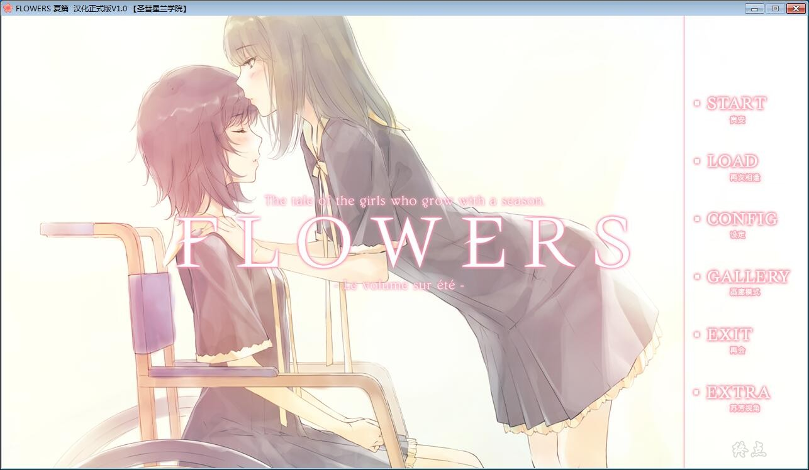
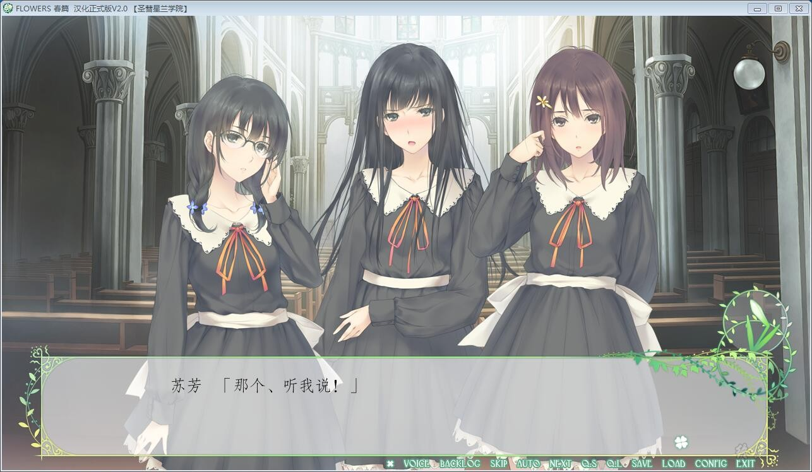
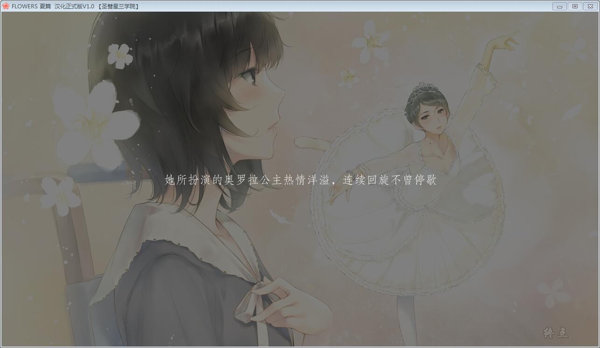
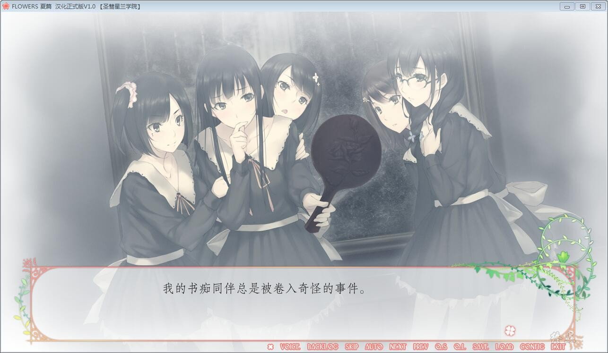
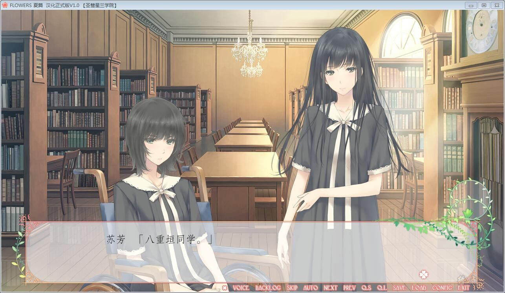
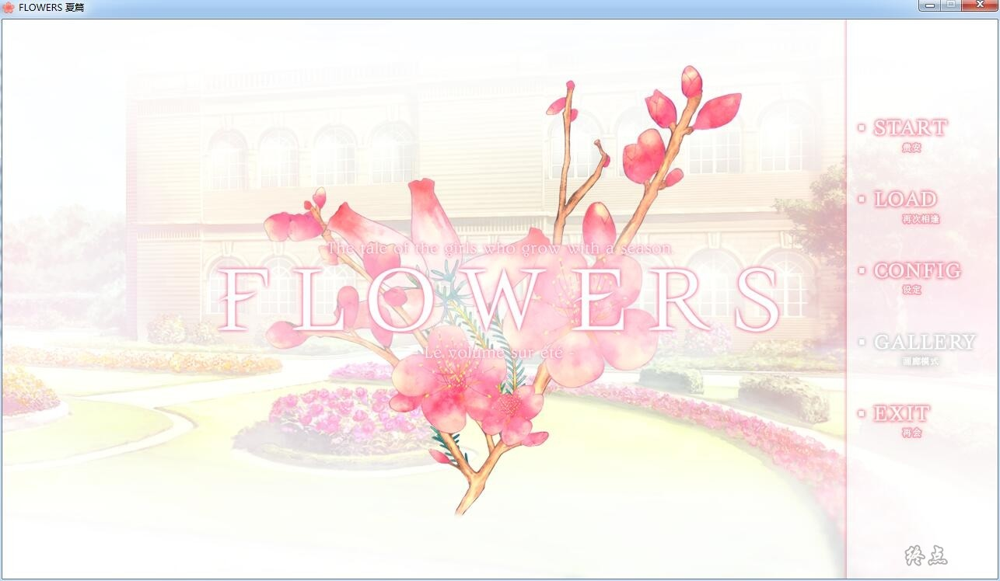
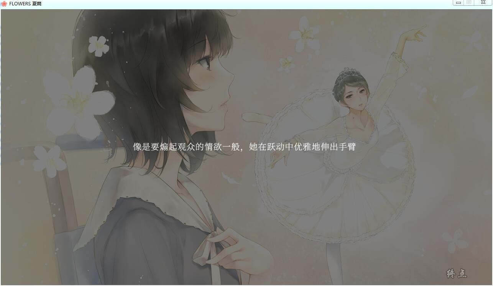
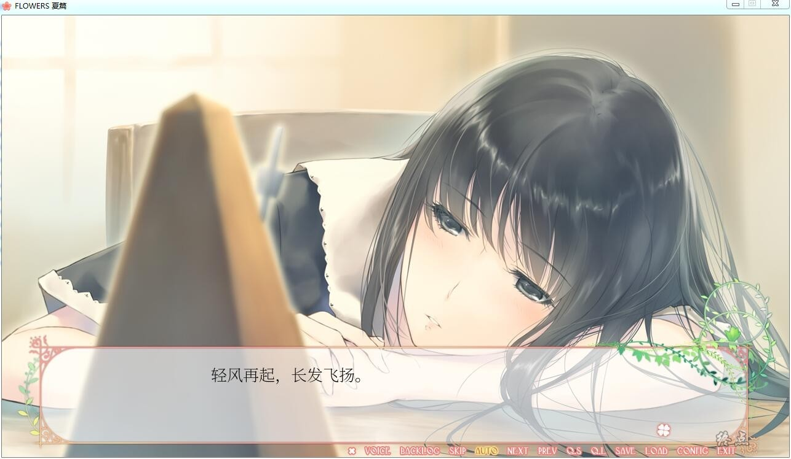
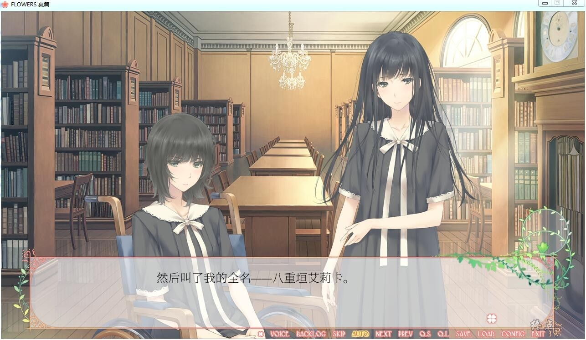

# 游戏介绍

FLOWERS系列是，春、夏、秋、冬一年四季所组成的清水百合推理故事。

这次圣彗星兰学院献上的是四季中的夏季——八重垣小姐与她的amitié的故事。

内心布满伤痕的少女，白羽苏芳。

在春季与自己的友人相遇、相识，并结为恋人。

然而，匂坂真由理，这个与她互相认可的存在，却仓促地离她而去。

看着失魂落魄的白羽苏芳，同为书痴的八重垣艾莉卡心如刀绞。

难道就没有治愈她的方法吗？思考之余，圣彗星兰学院已迎来初夏——一个少女转学至此。

少女名为——考崎千鸟。

在这场糟糕的邂逅中，少女对八重垣艾莉卡说道：

“你这个卑鄙之人。”

夏季的学院中又发生了几件离奇的事件。

八重垣艾莉卡将与amitie考崎千鸟一同，向这些谜团发起挑战。

# 汉化版

**首先汉化组声明是禁止转载，终点没有拿到授权，如果不喜欢硬盘，不用回复
**

**请点击下面的汉化原帖下载补丁，然后自己去下本体，二者结合使用**

[**汉化原帖**](http://weibo.com/ttarticle/p/show?id=2309404019715633772905)

- ## **补丁使用方法**

### 第一步：

**关闭360等防毒软件**（重要！！ 杀毒软件与补丁不共戴天！！ 就算加入信任列表，若姿势不对还是会把补丁删掉。

以后玩游戏时也务必记得把360等防毒软件关闭，或者将整个游戏及汉化文件全部添加入信任列表。）

### 第二步：

安装FLowers春篇/夏篇本体游戏**（本组不提供游戏本体下载，请自行购买正版）**。

### 第三步：

将汉化补丁exe文件复制到 游戏根目录下，双击鼠标左键，将所需文件原地解压（需要管理员权限）。

若程序提示需要管理员权限，请单击“确定”，此后程序会自动安装Flowers.ttf字体至系统fonts文件夹，

另外，在游戏根目录下，也会释放一个Flowers.ttf字体。请务必不要删除根目录下的字体文件。

### 第三步：

 双击Flowers_CHS.exe 即可启动游戏。若此时字体显示不正常，出现字体肥大、特殊字符显示有误、文本漏字现象的，

请手动安装（双击）游戏根目录下的 Flowers.ttf字体 （需要管理员权限） 。如果此时字体已经正常，则无需进行此步。

**如果打开游戏出现文本框空白，不显示文本的，请重新启动计算机。**

此补丁可与原版游戏共存。直接点击FLOWERS.exe 可运行日文原版，但二者的存档和配置文件互不兼容。中文版存档和配置信息在save_chs 文件夹下，

日文版存档和配置信息在save 文件夹下。

**详细的注意事项请去原帖查看**

**还有使用XP用户的同学，请去原帖查看注意事项**

### 已经更新了2.0汉化版本

# 官方中文

19年2月5日更新官中版本

steam版本为自购，转载请注明出处

如有能力还请支持正版

**请使用[IDM](https://www.123pan.com/s/jJprVv-3tMsH)进行下载，使用最新版[winrar](https://www.123pan.com/s/jJprVv-dtMsH)进行解压（非常重要）。**

**解压密码为终点（简体汉字）。**

**添加10%恢复记录，防止网盘抽风损坏。**

